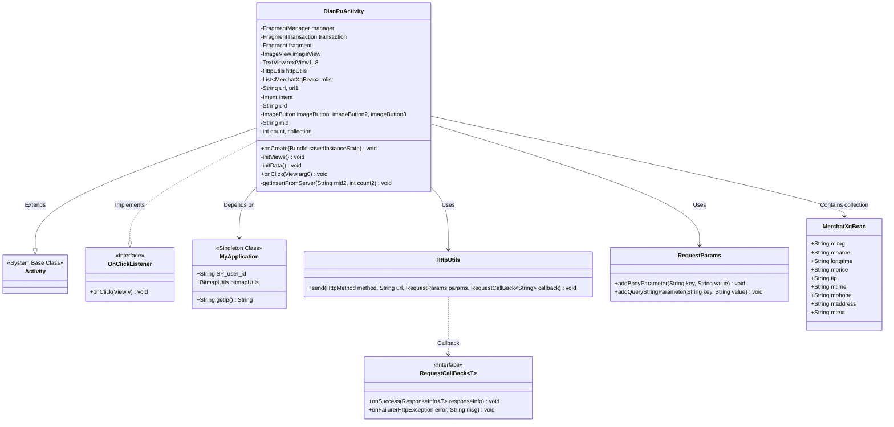
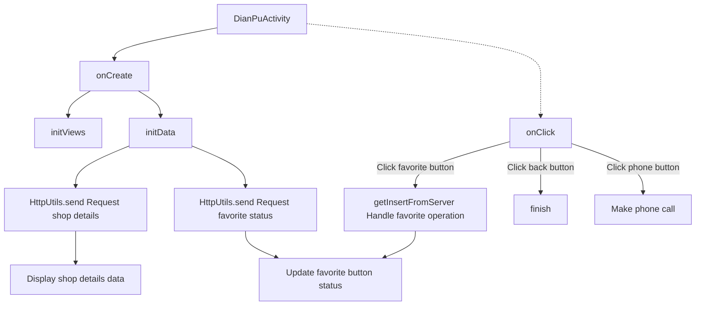

# Basic Information

|      |      |
|------|------|
| Name | DianPuActivity |
| Language | .java |
| Code Path | happycat/src/com/happycat/DianPuActivity.java |
| Package Name | com.happycat |
| Dependencies | ['java.lang.reflect.Type', 'java.util.ArrayList', 'java.util.LinkedList', 'java.util.List', 'com.example.happucat.R', 'com.google.gson.Gson', 'com.google.gson.reflect.TypeToken', 'com.happycat.Bean.MerchatXqBean', 'com.happycat.global.GlobalContacts', 'com.happycat.util.MyApplication', 'com.lidroid.xutils.HttpUtils', 'com.lidroid.xutils.exception.HttpException', 'com.lidroid.xutils.http.RequestParams', 'com.lidroid.xutils.http.ResponseInfo', 'com.lidroid.xutils.http.callback.RequestCallBack', 'com.lidroid.xutils.http.client.HttpRequest.HttpMethod', 'android.R.integer', 'android.R.string', 'android.net.Uri', 'android.os.Bundle', 'android.app.ActionBar', 'android.app.Activity', 'android.content.Intent', 'android.support.v4.app.Fragment', 'android.support.v4.app.FragmentManager', 'android.support.v4.app.FragmentPagerAdapter', 'android.support.v4.app.FragmentTransaction', 'android.support.v4.view.PagerAdapter', 'android.support.v4.view.ViewPager', 'android.util.Log', 'android.view.Menu', 'android.view.View', 'android.view.View.OnClickListener', 'android.widget.ImageButton', 'android.widget.ImageView', 'android.widget.LinearLayout', 'android.widget.RadioGroup', 'android.widget.TextView', 'android.widget.Toast'] |
| Brief Description | DianPuActivity is a store details page that includes merchant information display, favorite function, and phone call feature. It retrieves merchant data via HTTP requests and displays it, supporting favorite status toggling and phone calls. |

# Description

DianPuActivity is an Android Activity class designed to display merchant details. It includes multiple TextViews and ImageViews for showing merchant information such as name, business hours, price, phone number, address, etc. It sends a POST request via HttpUtils to fetch merchant data, parses the JSON response using Gson, and updates the UI accordingly. The class also implements a favorite feature, toggling the favorite state based on the count value and sending corresponding requests to the server. Click event handling includes returning to the homepage, favoriting/unfavoriting merchants, and making phone calls. During initialization, the ActionBar is hidden, and the layout is set to dianpu.xml.

# Class Summary

| Name   | Type  | Description |
|-------|------|-------------|
| DianPuActivity | class | DianPuActivity is an Android shop details page that includes merchant information display, favorite functionality, and phone calling. It retrieves merchant data via HTTP requests and displays it, supports adding/removing favorites, and allows users to make phone calls by clicking a button. |

## Class DianPuActivity

|      |      |
|------|------|
| Access Modifier | public |
| Type | class |
| Name | DianPuActivity |
| Description | DianPuActivity is an Android shop details page that includes merchant information display, favorite functionality, and phone calling. It retrieves merchant data via HTTP requests and displays it, supports adding/removing favorites, and allows users to make phone calls by clicking a button. |

### UML Class Diagram

This code implements a shop details page (DianPuActivity) with main functionalities: 1) Fetching and displaying shop details via HTTP requests; 2) Handling user favorite/unfavorite operations; 3) Providing phone call functionality. The class diagram illustrates core class relationships, including inheritance with Android system components, dependencies with network request classes, and associations with the data model MerchatXqBean. Special attention is given to boundary cases like network callbacks, user interactions, and state management.

### Internal Method Call Graph

This code implements a shop details page (DianPuActivity) on the Android platform, with main functionalities including: 1) Initializing UI elements; 2) Fetching and displaying shop details data from server; 3) Handling user favorite operations; 4) Providing back and phone call features. The flow starts from onCreate, sequentially initializes views and data, retrieves shop information and favorite status via HTTP requests, and finally processes user interaction events. Special attention should be paid to the bidirectional toggle logic of favorite status and asynchronous callback handling of network requests.

### Field List

| Name  | Type  | Description |
|-------|-------|------|
| textView8 | TextView | Declared 8 TextView variables: textView1 through textView8. |
| manager | FragmentManager | Fragment manager instance. |
| collection | int | Declare two private integer variables: count and collection. |
| transaction | FragmentTransaction | Fragment Transaction Operation Example. |
| intent | Intent | Declare an Intent object |
| httpUtils | HttpUtils | Declaration of HttpUtils utility class instance. |
| mlist | List<MerchatXqBean> | Defined a list named mlist that stores objects of type MerchatXqBean. |
| uid=MyApplication.SP_user_id+"" | String | The code snippet will convert the global variable SP_user_id to a string and assign it to uid. |
| url1 | String | Declare two private string variables url and url1. |
| mid | String | Declaration of string variable mid |
| imageButton3 | ImageButton | Three ImageButton controls are defined: imageButton, imageButton2, and imageButton3. |
| fragment | Fragment | Declaration of Fragment object instance. |
| imageView | ImageView | Declare a variable named imageView of type ImageView. |

### Method List

| Name  | Type  | Description |
|-------|-------|------|
| onCreate | void | The onCreate method of Android Activity, hide the ActionBar and initialize the layout and data. |
| initData | void | The method `initData` utilizes the XUtils framework to fetch merchant details and favorite status from the server. It retrieves merchant data via a POST request, parses the JSON response, and updates the UI to display the merchant information. Simultaneously, it checks the favorite status and sets the favorite button icon based on the result. Errors are logged if the operation fails. |
| initViews | void | Initialize view components: 1 ImageView, 8 TextViews, 3 ImageButtons, and set click listeners. |
| onClick | void | Click Event Handling: Return to the homepage to close the current page; toggle the favorite button state and submit to the server; the dial button launches the phone app to call the specified number. |
| getInsertFromServer | void | The method `getInsertFromServer` sends a POST request to the server with parameters including `mid`, `uid`, and `count`. Based on the response, it updates the UI: a successful favorite action displays a starred icon and a prompt, canceling a favorite displays an empty star icon and a prompt, and an unlogged-in state prompts for login. No action is taken upon failure. |

