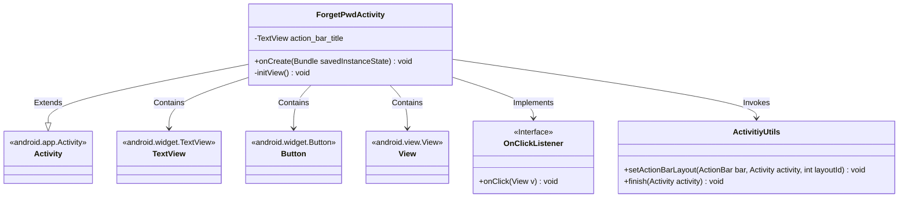
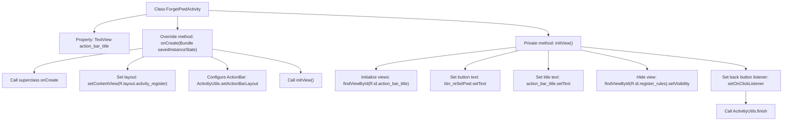

# Basic Information

|      |      |
|------|------|
| Name | ForgetPwdActivity |
| Language | .java |
| Code Path | happycat/src/com/happycat/ForgetPwdActivity.java |
| Package Name | com.happycat |
| Dependencies | ['com.example.happucat.R', 'com.happycat.util.ActivitiyUtils', 'android.app.Activity', 'android.os.Bundle', 'android.view.View', 'android.view.View.OnClickListener', 'android.widget.Button', 'android.widget.TextView'] |
| Brief Description | ForgetPwdActivity is the Android password recovery page, which initializes the view and sets the title, button text, and back click event. |

# Description

ForgetPwdActivity is a class that inherits from Activity, designed to implement the password recovery functionality. In the onCreate method, it sets the activity_register layout and title_bar_login title bar layout, and calls initView to initialize the views. Within the initView method, it sets the title text to "Recover Password," changes the register button text to "Reset Password," hides the registration rule view, and sets a click event for the back button, which triggers the ActivitiyUtils.finish method to close the current Activity when clicked.

# Class Summary

| Name   | Type  | Description |
|-------|------|-------------|
| ForgetPwdActivity | class | ForgetPwdActivity is the Android password recovery page, which initializes the view to set titles and buttons, hides the rule terms, and provides a back button to close the page. |

## Class ForgetPwdActivity

|      |      |
|------|------|
| Access Modifier | public |
| Type | class |
| Name | ForgetPwdActivity |
| Description | ForgetPwdActivity is the Android password recovery page, which initializes the view to set titles and buttons, hides the rule terms, and provides a back button to close the page. |

### UML Class Diagram

This code demonstrates an Android ForgetPwdActivity class primarily designed for implementing a password recovery interface. The class inherits from the base Activity class, contains UI components such as TextView and Button, and utilizes the ActivitiyUtils utility class for layout configuration and activity termination. Within the initView() method, it initializes view elements and sets click listeners, where the button text is modified to "Reset Password", the title is set to "Recover Password", and the registration rule view is hidden. The overall class structure clearly reflects typical design patterns of Android activity components.

### Internal Method Call Graph

This code illustrates an Android `ForgetPwdActivity` class primarily designed for password recovery functionality. The flowchart clearly outlines the complete process from Activity creation to UI initialization: first invoking the superclass onCreate method, then setting the layout and ActionBar style, followed by initializing view components including configuring button text, title text, and hiding specific views, and finally setting a click listener for the back button to close the current Activity. The entire workflow demonstrates typical Android Activity lifecycle and UI operation logic.

### Field List

| Name  | Type  | Description |
|-------|-------|------|
| action_bar_title | TextView | Private text view control for displaying titles. |

### Method List

| Name  | Type  | Description |
|-------|-------|------|
| onCreate | void | The onCreate method of Android Activity initializes views and layouts, and sets up the title bar. |
| initView | void | Initialization interface: Set the title to "Forgot Password," the button text to "Reset Password," hide the registration rule view, and add a back button click event to close the current activity. |

