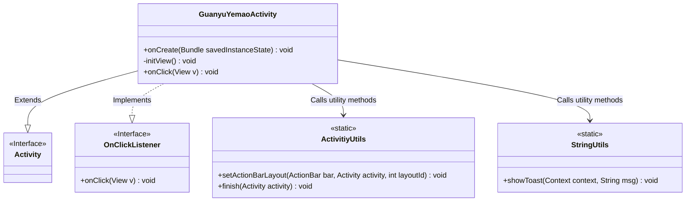
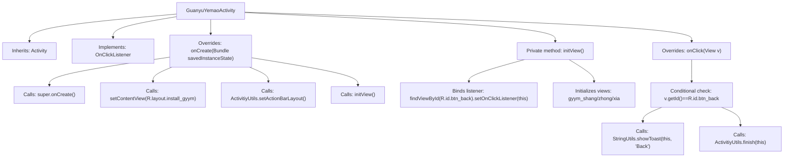

# Basic Information

|      |      |
|------|------|
| Name | GuanyuYemaoActivity |
| Language | .java |
| Code Path | happycat/src/com/happycat/GuanyuYemaoActivity.java |
| Package Name | com.happycat |
| Dependencies | ['com.example.happucat.R', 'com.happycat.util.ActivitiyUtils', 'com.happycat.util.StringUtils', 'android.app.Activity', 'android.os.Bundle', 'android.view.View', 'android.view.View.OnClickListener'] |
| Brief Description | The Android activity class GuanyuYemaoActivity implements click listeners, initializes views, and sets up the back button functionality. |

# Description

This code describes an Android Activity class named GuanyuYemaoActivity, primarily used to implement the "About Night Owl" interface functionality. The class extends Activity and implements the click listener interface. In the onCreate method, it sets the layout file install_gyym.xml and configures a custom title bar using ActivitiyUtils. The initView method initializes the back button and three interface elements (top, middle, bottom) as views. In the click event handling, clicking the back button displays a "Back" prompt and closes the current Activity. The class mainly accomplishes interface initialization and basic interaction functionalities.

# Class Summary

| Name   | Type  | Description |
|-------|------|-------------|
| GuanyuYemaoActivity | class | This is an Android activity class GuanyuYemaoActivity that implements click listening. During initialization, it sets the layout and title bar, binds the back button click event, and displays "Back" when clicked before closing the activity. |

## Class GuanyuYemaoActivity

|      |      |
|------|------|
| Access Modifier | public |
| Type | class |
| Name | GuanyuYemaoActivity |
| Description | This is an Android activity class GuanyuYemaoActivity that implements click listening. During initialization, it sets the layout and title bar, binds the back button click event, and displays "Back" when clicked before closing the activity. |

### UML Class Diagram

This code illustrates an Android Activity class `GuanyuYemaoActivity` that extends the base `Activity` class and implements the `OnClickListener` interface. The class primarily contains view initialization logic and click event handling, utilizing utility classes `ActivitiyUtils` and `StringUtils` for action bar configuration and Toast notification functionality. The activity includes a back button initialization and three view elements, where clicking the back button triggers a prompt display and closes the current activity. The class diagram clearly depicts inheritance relationships, interface implementations, and dependencies on utility classes.

### Internal Method Call Graph

This flowchart describes the lifecycle and interaction logic of GuanyuYemaoActivity. During Activity startup, it sequentially executes onCreate to initialize the layout and views, where the initView method binds a click listener for the back button and initializes three UI elements. When the user clicks the back button, the onClick event is triggered, displaying a toast message and closing the current Activity. The entire process clearly demonstrates the complete handling chain from UI initialization to user interaction.

### Field List

| Name  | Type  | Description |
|-------|-------|------|

### Method List

| Name  | Type  | Description |
|-------|-------|------|
| onClick | void | When clicking the back button, display a "Back" prompt and close the current activity. |
| onCreate | void | The onCreate method of Android Activity: calling the parent class method, setting the layout file, customizing the title bar, initializing views. |
| initView | void | Initialize the view method, set up the click listener for the back button, and bind the three view components. |

