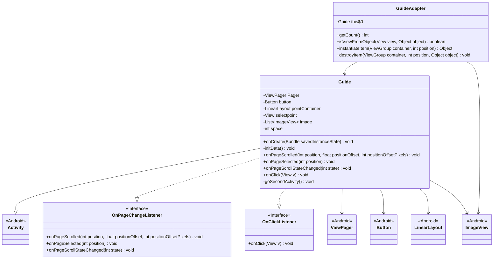
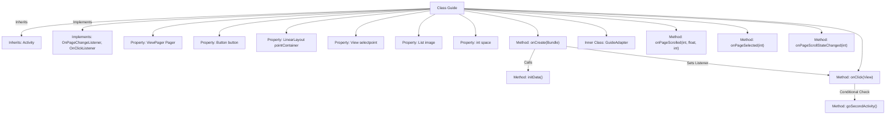

# Basic Information

|      |      |
|------|------|
| Name | Guide |
| Language | .java |
| Code Path | happycat/src/com/happycat/Guide.java |
| Package Name | com.happycat |
| Dependencies | ['java.util.ArrayList', 'java.util.List', 'javax.security.auth.PrivateCredentialPermission', 'com.example.happucat.R', 'com.happycat.util.CacheUtils', 'android.app.Activity', 'android.content.Intent', 'android.os.Bundle', 'android.support.v4.view.PagerAdapter', 'android.support.v4.view.ViewPager', 'android.support.v4.view.ViewPager.OnPageChangeListener', 'android.view.View', 'android.view.View.OnClickListener', 'android.view.ViewGroup', 'android.view.ViewTreeObserver.OnGlobalLayoutListener', 'android.view.Window', 'android.widget.Button', 'android.widget.ImageView', 'android.widget.ImageView.ScaleType', 'android.widget.LinearLayout', 'android.widget.RelativeLayout', 'android.widget.RelativeLayout.LayoutParams'] |
| Brief Description | Implementation of Android guide pages, including ViewPager swiping, dot indicators, and button navigation functionality. The adapter manages image resources and listens for page switches to update UI states. |

# Description

The code describes an Android guide page Activity, which includes a ViewPager to display multiple guide images, with a dot indicator and a launch button at the bottom. The main functions include: loading three images into the ViewPager during initialization and setting up the dot indicator layout; listening to page swipe events to update the selected dot position in real time; displaying a launch button on the last page, which jumps to the main interface and marks it as not the first launch when clicked. It uses a custom PagerAdapter to manage image views, calculates dot spacing to achieve smooth sliding effects, and overall implements the standard application guide flow functionality.

# Class Summary

| Name   | Type  | Description |
|-------|------|-------------|
| Guide | class | The Guide class implements the guide page functionality, including a ViewPager to display images, a dot indicator, and a jump button. The dot position is dynamically adjusted during swiping, and finally, clicking the button redirects to the main interface while marking it as not the first login. |

## Class Guide

|      |      |
|------|------|
| Access Modifier | public |
| Type | class |
| Name | Guide |
| Description | The Guide class implements the guide page functionality, including a ViewPager to display images, a dot indicator, and a jump button. The dot position is dynamically adjusted during swiping, and finally, clicking the button redirects to the main interface while marking it as not the first login. |

### UML Class Diagram

This code describes the implementation of an Android guide page. The Guide class inherits from Activity and implements the OnPageChangeListener and OnClickListener interfaces. The main functionalities include displaying multiple guide images through ViewPager, showing indicator dots at the bottom (which move dynamically with page scrolling), and displaying a "Start" button on the last page. The GuideAdapter, as an inner class, handles the page management of ViewPager. The initData() method initializes image resources and indicator dots, onPageScrolled() implements the animation effect of the indicator dots, and onPageSelected() controls the button display logic. Overall, it implements a complete guide page functionality, including page switching listeners, click event handling, and navigation logic.

### Internal Method Call Graph

The flowchart illustrates the structure of the Guide class and its key method invocation relationships. This class inherits Activity and implements two listener interfaces, containing UI component properties such as ViewPager and Button. Core logic initializes views and data in onCreate, manages image display via GuideAdapter, handles page swipe events and button clicks, and ultimately navigates to another page through goSecondActivity. Methods interact through listeners and conditional checks.

### Field List

| Name  | Type  | Description |
|-------|-------|------|
| space | int | Private integer variable space. |
| selectpoint | View | Private view variable selectpoint |
| Pager | ViewPager | Private View Pager Control Pager |
| image | List<ImageView> | Declare a private list of ImageView objects with the variable name image. |
| pointContainer | LinearLayout | Declare a private linear layout variable pointContainer. |
| button | Button | Declare a private button variable named button. |

### Method List

| Name  | Type  | Description |
|-------|-------|------|
| onCreate | void | Android Activity Initialization: Hide title, set layout, bind ViewPager, buttons, and indicator dots, listen for layout completion to calculate spacing. |
| onPageScrolled | void | Method override, handling page scrolling: Calculate and set the left margin based on position and offset, then update layout parameters after rounding. |
| initData | void | Initialization data method: Load image resources into the ImageView list, add dot indicators, set up the ViewPager adapter, and configure page change listeners. |
| onPageSelected | void | Functionality: Controls button display based on page position. Shows the button if on the last page, otherwise hides it. Uses a ternary operator to simplify conditional logic. |
| onPageScrollStateChanged | void | Empty implementation method for page scroll state changes. |
| onClick | void | When the button is clicked, jump to the second activity. |
| goSecondActivity | void | The method `goSecondActivity` saves the non-first login state and navigates to `MainActivity`. |

