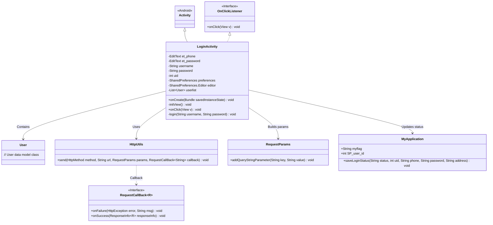
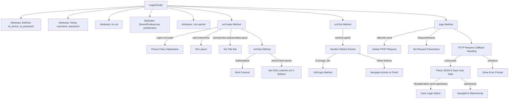

# Basic Information

|      |      |
|------|------|
| Name | LoginActivity |
| Language | .java |
| Code Path | happycat/src/com/happycat/LoginActivity.java |
| Package Name | com.happycat |
| Dependencies | ['java.lang.reflect.Type', 'java.util.ArrayList', 'java.util.List', 'android.R.string', 'android.app.Activity', 'android.content.Intent', 'android.content.SharedPreferences', 'android.os.Bundle', 'android.util.Log', 'android.view.View', 'android.view.View.OnClickListener', 'android.widget.Button', 'android.widget.EditText', 'android.widget.Toast', 'com.example.happucat.R', 'com.google.gson.Gson', 'com.google.gson.reflect.TypeToken', 'com.happycat.Bean.User', 'com.happycat.Bean.goodsclassify', 'com.happycat.global.GlobalContacts', 'com.happycat.util.ActivitiyUtils', 'com.happycat.util.MyApplication', 'com.happycat.util.StringUtils', 'com.lidroid.xutils.HttpUtils', 'com.lidroid.xutils.exception.HttpException', 'com.lidroid.xutils.http.RequestParams', 'com.lidroid.xutils.http.ResponseInfo', 'com.lidroid.xutils.http.callback.RequestCallBack', 'com.lidroid.xutils.http.client.HttpRequest.HttpMethod'] |
| Brief Description | This is an Android login page code that includes phone number and password input fields, implementing login, registration, and forgot password functionalities. During login, it verifies user information, redirects to the main page upon success while saving the user state, and displays an error message upon failure. |

# Description

The code defines an Android login interface class named `LoginActivity`, which extends `Activity` and implements the click listener interface. The class includes input controls for phone number and password fields, as well as variables related to user information storage. In the `onCreate` method, the interface layout and view components are initialized, and click listeners are set for multiple buttons. Click event handling covers functionalities such as returning, registration, forgot password, and login. During login, input validity is verified, and an HTTP POST request is used to interact with the server for user authentication. Upon successful login, the user state is saved, and the app navigates to the main interface; otherwise, an error message is displayed. The entire process involves `SharedPreferences` storage, Gson parsing, and global state management.

# Class Summary

| Name   | Type  | Description |
|-------|------|-------------|
| LoginActivity | class | This is an Android login interface code that includes phone number and password input, registration, and forgot password features. It verifies user information through HTTP requests, and upon successful login, it redirects to the main page and saves the user's state. |

## Class LoginActivity

|      |      |
|------|------|
| Access Modifier | public |
| Type | class |
| Name | LoginActivity |
| Description | This is an Android login interface code that includes phone number and password input, registration, and forgot password features. It verifies user information through HTTP requests, and upon successful login, it redirects to the main page and saves the user's state. |

### UML Class Diagram

This code implements an Android login interface with core functionalities including: initializing view components, handling user click events, validating login credentials, and interacting with servers via HTTP requests. The LoginActivity extends Activity and implements the OnClickListener interface, encompassing key features such as user input processing, network requests (using HttpUtils), data parsing (Gson), and state persistence (MyApplication). The class diagram illustrates dependency relationships between components, particularly highlighting the interaction pattern between the network request module and callback mechanism.

### Internal Method Call Graph

Flowchart Description: This flowchart illustrates the complete Android login process, starting from the initialization of LoginActivity, including view binding and event listener setup. The core flow covers button click event distribution (actions like back/register/login), with a focus on the network request triggered by the login button: constructing parameters, sending a POST request, handling successful responses (parsing JSON data and navigating to the main interface), and failure handling (displaying error prompts). The entire process demonstrates data flow and state management from UI interaction to network communication.

### Field List

| Name  | Type  | Description |
|-------|-------|------|
| et_password | EditText | Define two EditText control variables: et_phone and et_password. |
| password | String | Declare a string variable password |
| userlist = new ArrayList<User>() | List<User> | Create a dynamic array to store user objects. |
| username | String | Declare a string variable username. |
| preferences | SharedPreferences | Define the SharedPreferences object 'preferences' for storing lightweight key-value pair data. |
| uid | int | The integer variable uid is used to store a unique identifier. |
| editor | SharedPreferences.Editor | SharedPreferences.Editor is used to modify SharedPreferences data, providing editing operations for key-value pair storage. |

### Method List

| Name  | Type  | Description |
|-------|-------|------|
| onCreate | void | The onCreate method of Android Login Activity: calls the parent class method, sets the layout, customizes the title bar, and initializes views. |
| initView | void | Initialize the view method, bind the phone number and password input fields, and set up click event listeners for the five controls. |
| onClick | void | Click the back button to close the current page; click the registration, forgot password, or registration button on the login page to navigate to the corresponding page; click the login button to verify the input and proceed with login. |
| login | void | Login function: Retrieve username and password, verify via POST request, redirect to main interface upon successful authentication while saving user information, display error message upon failure. |

