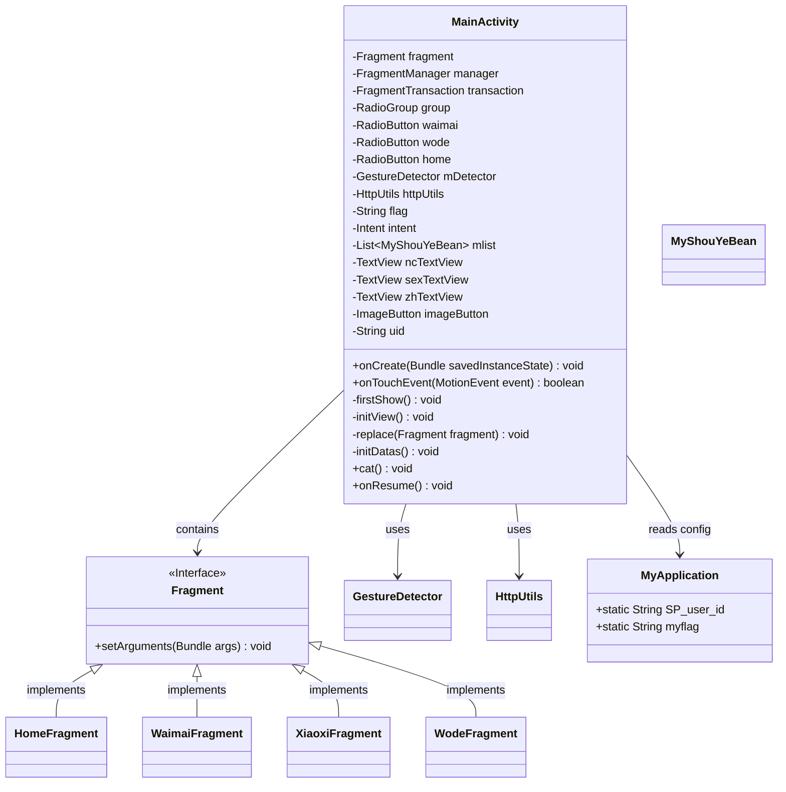
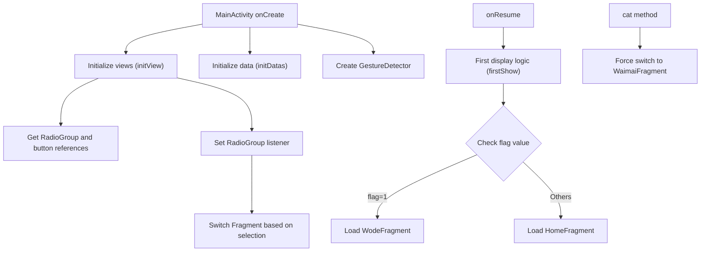
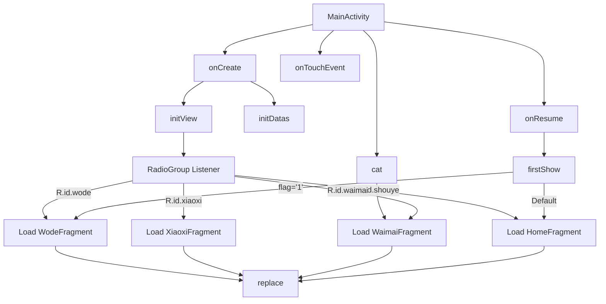

# Basic Information

|      |      |
|------|------|
| Name | MainActivity |
| Language | .java |
| Code Path | happycat/src/com/happycat/MainActivity.java |
| Package Name | com.happycat |
| Dependencies | ['java.util.List', 'com.example.happucat.R', 'com.happycat.Bean.MyShouYeBean', 'com.happycat.global.GlobalContacts', 'com.happycat.util.DanjiUtils', 'com.happycat.util.MyApplication', 'com.happycay.fragments.HomeFragment', 'com.happycay.fragments.WaimaiFragment', 'com.happycay.fragments.WodeFragment', 'com.happycay.fragments.XiaoxiFragment', 'com.lidroid.xutils.HttpUtils', 'android.os.Bundle', 'android.app.ActionBar', 'android.content.Intent', 'android.support.v4.app.Fragment', 'android.support.v4.app.FragmentActivity', 'android.support.v4.app.FragmentManager', 'android.support.v4.app.FragmentTransaction', 'android.util.Log', 'android.view.GestureDetector', 'android.view.MotionEvent', 'android.widget.ImageButton', 'android.widget.RadioButton', 'android.widget.RadioGroup', 'android.widget.RadioGroup.OnCheckedChangeListener', 'android.widget.TextView'] |
| Brief Description | MainActivity inherits from FragmentActivity, manages the switching of multiple Fragments, includes a bottom navigation bar and gesture detection, displays different Fragments based on flag bits, and supports user information display and search functionality. |

# Description

The code describes an Android FragmentActivity class named MainActivity, primarily used for managing the application's main interface. Its main functionalities include initializing view components (such as RadioGroup, ImageButton, TextView, etc.), handling bottom navigation bar switching (e.g., Home, Takeaway, My fragments), supporting gesture detection, and dynamically replacing fragments via FragmentTransaction. The class also involves user ID processing, Bundle data transfer, Activity lifecycle management (e.g., onCreate, onResume), and logic for displaying specific fragments (e.g., determining which fragment to display based on a flag during the first display). Additionally, it provides an entry for search functionality and user information display.

# Class Summary

| Name   | Type  | Description |
|-------|------|-------------|
| MainActivity | class | MainActivity inherits from FragmentActivity, manages the switching between multiple Fragments, includes a bottom navigation bar and gesture detection, dynamically loads the home page or personal page based on flag values, and supports Fragment replacement and state preservation. |

## Class MainActivity

|      |      |
|------|------|
| Access Modifier | public |
| Type | class |
| Name | MainActivity |
| Description | MainActivity inherits from FragmentActivity, manages the switching between multiple Fragments, includes a bottom navigation bar and gesture detection, dynamically loads the home page or personal page based on flag values, and supports Fragment replacement and state preservation. |

### UML Class Diagram

This code implements an Android MainActivity that manages bottom navigation and Fragment switching. The class diagram shows dependencies with components like Fragment, gesture detector, and network utilities. Core functionalities include: 1) Initializing views and data; 2) Controlling Fragment switching via RadioGroup; 3) Determining initial display content based on application state (flag); 4) Supporting gesture operations and forced navigation through specific methods. The flowchart clearly presents the invocation sequence of lifecycle methods and key business logic, particularly the initialization processes in onCreate and onResume, as well as the Fragment switching paths triggered by user interactions.

### Internal Method Call Graph

This code represents the implementation of a main activity (MainActivity) in an Android application, with core functionalities including: initializing views and data, handling touch events, managing Fragment switching, and responding to UI interactions. The flowchart illustrates the initialization process starting from onCreate, proceeding to firstShow which displays different Fragments based on flags, then to RadioGroup listener for bottom navigation switching, and finally the replace method for core Fragment replacement logic. It includes loading paths for four main Fragments and special handling for the top-right search button.

### Field List

| Name  | Type  | Description |
|-------|-------|------|
| flag | String | Declare a string variable flag. |
| home | RadioButton | Three radio buttons: Takeout, Mine, Home. |
| httpUtils | HttpUtils | Declaration of the HttpUtils utility class instance for HTTP-related operations. |
| uid=MyApplication.SP_user_id+"" | String | The code snippet will convert the global variable SP_user_id into a string and assign it to the uid variable. |
| manager | FragmentManager | Declaration of Fragment manager instance. |
| mlist | List<MyShouYeBean> | Defined a list named mlist, storing data of type MyShouYeBean. |
| fragment | Fragment | Fragment Object Declaration |
| group | RadioGroup | Declare a variable named group for the radio button group control. |
| intent | Intent | Declare an Intent object. |
| mDetector | GestureDetector | The gesture detector object mDetector is used for recognizing and processing gesture operations. |
| imageButton | ImageButton | Example declaration of an image button control. |
| zhTextView | TextView | Three TextView controls are defined: ncTextView, sexTextView, zhTextView. |
| transaction | FragmentTransaction | A FragmentTransaction is used to perform operations such as adding, removing, or replacing Fragments. |

### Method List

| Name  | Type  | Description |
|-------|-------|------|
| firstShow | void | The method `firstShow` checks the global flag `flag`. If it is 1, it navigates to `WodeFragment` and passes the parameters `uid` and `flag`, then resets the flag and selects `wode`; otherwise, it navigates to `HomeFragment` and selects `home`. |
| initView | void | Initialize the view component and set up the bottom navigation bar switching logic, including four modules: Home, Takeout, Messages, and Personal Center. Click to switch to the corresponding Fragment. |
| onTouchEvent | boolean | Android touch event handling method, calling mDetector to process touch events and return the result. |
| initDatas | void | Initialization data method: Obtain the FragmentManager instance and assign it to the manager variable. |
| replace | void | Replace Fragment: Begin a transaction, replace the current Fragment in the container with a new Fragment, and commit the transaction. |
| onResume | void | During Activity restoration, execute firstShow() first, then call the parent class's onResume(). |
| onCreate | void | Initialize views and data in the onCreate method of an Android Activity, hide the title bar, and set up a gesture detector. |
| cat | void | Create an instance of WaimaiFragment and replace the current fragment, while selecting the waimai option. |

