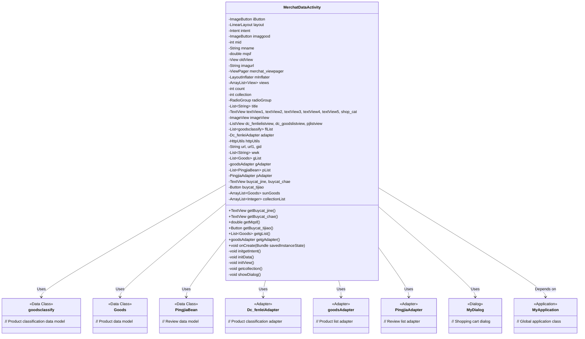
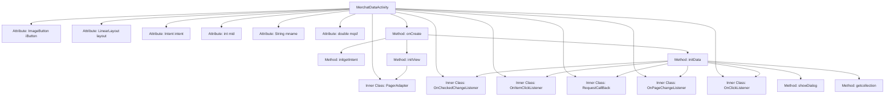

# Basic Information

|      |      |
|------|------|
| Name | MerchatDataActivity |
| Language | .java |
| Code Path | happycat/src/com/happycat/MerchatDataActivity.java |
| Package Name | com.happycat |
| Dependencies | ['java.lang.reflect.Type', 'java.util.ArrayList', 'java.util.List', 'com.example.happucat.R', 'com.google.gson.Gson', 'com.google.gson.reflect.TypeToken', 'com.happycat.Bean.CountDto', 'com.happycat.Bean.Goods', 'com.happycat.Bean.MerchatBean', 'com.happycat.Bean.PingjiaBean', 'com.happycat.Bean.goodsclassify', 'com.happycat.adapter.Dc_fenleiAdapter', 'com.happycat.adapter.DingDan_indentAdapter', 'com.happycat.adapter.PingjiaAdapter', 'com.happycat.adapter.goodsAdapter', 'com.happycat.global.GlobalContacts', 'com.happycat.util.MyApplication', 'com.lidroid.xutils.HttpUtils', 'com.lidroid.xutils.exception.HttpException', 'com.lidroid.xutils.http.RequestParams', 'com.lidroid.xutils.http.ResponseInfo', 'com.lidroid.xutils.http.callback.RequestCallBack', 'com.lidroid.xutils.http.client.HttpRequest.HttpMethod', 'android.R.integer', 'android.annotation.SuppressLint', 'android.app.Activity', 'android.app.AlertDialog', 'android.content.DialogInterface', 'android.content.Intent', 'android.os.Bundle', 'android.support.v4.view.PagerAdapter', 'android.support.v4.view.ViewPager', 'android.support.v4.view.ViewPager.OnPageChangeListener', 'android.util.Log', 'android.view.LayoutInflater', 'android.view.View', 'android.view.View.OnClickListener', 'android.view.Window', 'android.widget.AdapterView', 'android.widget.AdapterView.OnItemClickListener', 'android.widget.RadioGroup.OnCheckedChangeListener', 'android.widget.Button', 'android.widget.ImageButton', 'android.widget.ImageView', 'android.widget.LinearLayout', 'android.widget.ListView', 'android.widget.RadioGroup', 'android.widget.TextView', 'android.widget.Toast'] |
| Brief Description | MerchatDataActivity is a merchant data display page that includes product categories, product lists, reviews, and shopping cart features, supporting product browsing, favoriting, and order placement operations. |

# Description

MerchatDataActivity is an Android merchant data display page, with main functions including merchant information display, product category browsing, shopping cart management, and user review viewing. The page uses ViewPager to implement dual-tab switching between ordering and reviews, with top navigation controlled by RadioGroup. The ordering page includes product category lists and corresponding product displays, supporting shopping cart functionality (including amount calculation and minimum order validation). The reviews page displays user comment lists. Data is fetched from the server via HTTP requests and parsed using Gson for JSON. The shopping cart supports item quantity adjustments, and order submission validates the amount before redirecting to the order page. The page also displays basic merchant information such as logo, business hours, and delivery fees.

# Class Summary

| Name   | Type  | Description |
|-------|------|-------------|
| MerchatDataActivity | class | MerchatDataActivity is a merchant data display page that includes product categories, product lists, reviews, and shopping cart functionalities. It uses ViewPager to switch between the ordering and review views, supports product category filtering, shopping cart checkout, and favorite features. Data is fetched via HTTP requests and parsed from JSON using Gson. |

## Class MerchatDataActivity

|      |      |
|------|------|
| Access Modifier | @SuppressLint("InflateParams");public |
| Type | class |
| Name | MerchatDataActivity |
| Description | MerchatDataActivity is a merchant data display page that includes product categories, product lists, reviews, and shopping cart functionalities. It uses ViewPager to switch between the ordering and review views, supports product category filtering, shopping cart checkout, and favorite features. Data is fetched via HTTP requests and parsed from JSON using Gson. |

### UML Class Diagram

Class diagram description:  
MerchatDataActivity is an Android merchant data display page containing three core functional modules: product classification, product list, and review display. It utilizes multiple adapters (Dc_fenleiAdapter, goodsAdapter, PingjiaAdapter) to handle different types of data presentation, employs HttpUtils for network requests to obtain product and review data, and implements shopping cart functionality through MyDialog. The page uses ViewPager+RadioGroup for top tab switching, with its clear architecture reflecting the data-view separation principle of the MVP pattern.

### Internal Method Call Graph

This code represents an Android Activity for displaying merchant data, with primary functionalities including: 1) Initializing basic merchant information display; 2) Implementing two-column linkage for product categories and lists; 3) Integrating ViewPager for switching between "Order" and "Review" pages; 4) Shopping cart functionality; 5) Fetching product and review data via network requests. Structurally, it consists of three main modules: initialization method (onCreate), data-fetching method (initData), and view initialization method (initView). Various interaction events are handled through multiple inner classes. The overall architecture follows the MVC pattern, with data retrieved from the server via HTTP requests and parsed using Gson.

### Field List

| Name  | Type  | Description |
|-------|-------|------|
| intent | Intent | Declare an Intent object. |
| pjlistview | ListView | Three ListView controls are defined: dc_fenlielistview, dc_goodslistview, pjlistview. |
| mInflater | LayoutInflater | The private layout inflater variable mInflater. |
| imaggood | ImageButton | Image button control imaggood. |
| merchat_viewpager | ViewPager | Private view paging control merchant_viewpager. |
| sunGoods | ArrayList<Goods> | The private product list sunGoods, of type ArrayList, stores Goods objects. |
| buycat_chae | TextView | Define two TextView variables: buycat_jine and buycat_chae. |
| wwk | List<String> | Private string list variable wwk. |
| adapter | Dc_fenleiAdapter | Define the classification adapter object `adapter`. |
| pList = new ArrayList<PingjiaBean>() | List<PingjiaBean> | Created a dynamic array pList to store PingjiaBean objects. |
| iButton | ImageButton | Image button control iButton. |
| pAdapter | PingjiaAdapter | An instance of PingjiaAdapter, pAdapter. |
| mname | String | Declare string variable mname |
| flList = new ArrayList<goodsclassify>() | List<goodsclassify> | Create a product category list flList, using ArrayList to store goodsclassify objects. |
| gid | String | Three string variables are defined: url, url1, gid. |
| imagurl = "http://" + MyApplication.getIp()			+ ":8080/happycat/upimage/" | String | Generate image URL by concatenating strings in code, including IP address and path. |
| collectionList | ArrayList<Integer> | Protection type integer dynamic array collectionList. |
| httpUtils | HttpUtils | Declared a variable httpUtils of type HttpUtils. |
| imageView | ImageView | Declare an ImageView control variable. |
| collection | int | Declare two private integer variables: count and collection. |
| gAdapter | goodsAdapter | Declared a variable named gAdapter of type goodsAdapter. |
| oldView = null | View | Declare a view variable named oldView and initialize it to null. |
| mid = 1 | int | Define an integer variable mid and initialize it to 1. |
| buycat_tijiao | Button | The button buycat_tijiao is used for submission operations. |
| shop_cat | TextView | Six TextView controls are defined: textView1 to textView5 and shop_cat. |
| layout | LinearLayout | LinearLayout is an Android layout used to arrange child views either horizontally or vertically. |
| gList = new ArrayList<Goods>() | List<Goods> | Create a dynamic array gList to store Goods objects. |
| title = new ArrayList<String>() | List<String> | Create a dynamic array of string type named title. |
| mqsf | double | Declare a double-precision floating-point variable mqsf. |
| radioGroup | RadioGroup | A RadioGroup is a control used to manage a group of radio buttons. |
| views | ArrayList<View> | Private view collection, of type ArrayList, storing View objects. |

### Method List

| Name  | Type  | Description |
|-------|-------|------|
| showDialog | void | The method `showDialog` clears `sunGoods` and then iterates through `gList`, adding products with stock greater than 0 to `sunGoods`. It creates and displays a dialog containing these products while printing logs. |
| getMqsf | double | Public method to obtain the mqsf value, returns a double type. |
| initView | void | Initialize the view method, set up the ViewPager adapter, and implement functions for page count, view binding, page destruction, instantiation, and title retrieval. |
| getBuycat_chae | TextView | Get the TextView object of buycat_chae. |
| getBuycat_jine | TextView | Get the TextView object of buycat_jine. |
| getBuycat_tijiao | Button | Methods to obtain the buycat_tijiao button object. |
| getgList | List<Goods> | The method getgList returns the product list gList. |
| getgAdapter | goodsAdapter | Methods for obtaining a public commodity adapter instance. |
| onCreate | void | The onCreate method of Android Activity: Initializes a title-less window, sets the layout, retrieves Intent data, initializes views and data, and sets a click event for the ImageButton to close the Activity. |
| initgetIntent | void | The method `initgetIntent` retrieves data from the Intent and initializes the UI, including the ID, name, delivery fee, average speed, minimum order price, image, and business hours. It then sets the corresponding TextViews and ImageView for display. |
| initData | void | Initialization data method, including switching between ordering and review pages, shopping cart operations, product categorization, and comment loading, uses HTTP requests to fetch data and update the UI. |
| getcollection | void | The method sends a list of product IDs favorited by the user to a specified URL via an HTTP POST request, receives the returned favorite list, and updates the adapter display. It includes request parameter configuration, success callback handling, and failure callback handling. |

