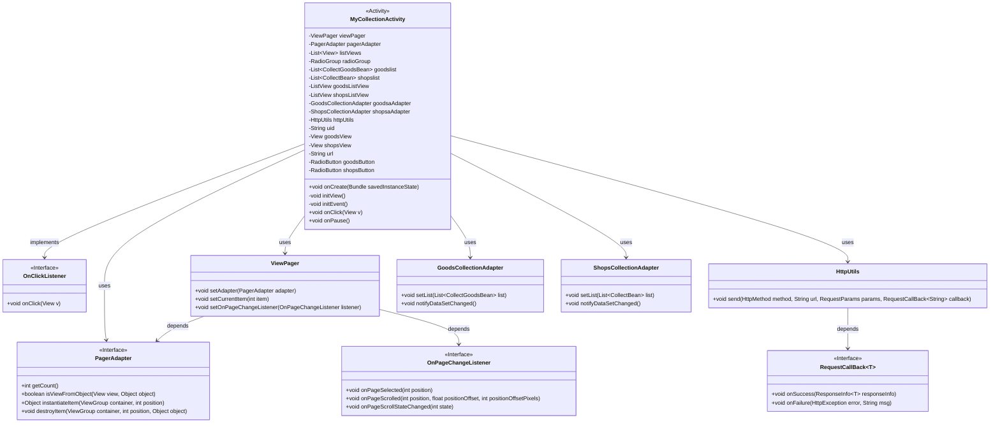
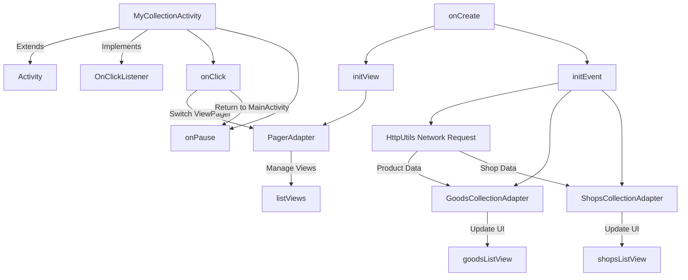

# Basic Information

|      |      |
|------|------|
| Name | MyCollectionActivity |
| Language | .java |
| Code Path | happycat/src/com/happycat/MyCollectionActivity.java |
| Package Name | com.happycat |
| Dependencies | ['java.lang.reflect.Type', 'java.util.ArrayList', 'java.util.List', 'com.example.happucat.R', 'com.google.gson.Gson', 'com.google.gson.reflect.TypeToken', 'com.happycat.Bean.CollectBean', 'com.happycat.Bean.CollectGoodsBean', 'com.happycat.adapter.GoodsCollectionAdapter', 'com.happycat.adapter.ShopsCollectionAdapter', 'com.happycat.util.ActivitiyUtils', 'com.happycat.util.MyApplication', 'com.happycat.util.StringUtils', 'com.lidroid.xutils.HttpUtils', 'com.lidroid.xutils.exception.HttpException', 'com.lidroid.xutils.http.RequestParams', 'com.lidroid.xutils.http.ResponseInfo', 'com.lidroid.xutils.http.callback.RequestCallBack', 'com.lidroid.xutils.http.client.HttpRequest.HttpMethod', 'android.R.integer', 'android.app.Activity', 'android.content.Intent', 'android.os.Bundle', 'android.support.v4.view.PagerAdapter', 'android.support.v4.view.ViewPager', 'android.support.v4.view.ViewPager.OnPageChangeListener', 'android.util.Log', 'android.view.LayoutInflater', 'android.view.View', 'android.view.ViewGroup', 'android.view.View.OnClickListener', 'android.widget.AdapterView', 'android.widget.AdapterView.OnItemClickListener', 'android.widget.ListView', 'android.widget.RadioButton', 'android.widget.RadioGroup', 'android.widget.TextView'] |
| Brief Description | MyCollectionActivity is an Android favorites page containing two tabs for products and stores, which are switched and displayed via ViewPager. The product tab uses a ListView to show the list of favorited products, while the store tab displays the list of favorited stores. Data is fetched through HTTP requests and parsed from JSON. Clicking on a product or store redirects to the details page, with a back button provided to return to the main page. |

# Description

MyCollectionActivity is an Android Activity class designed to display products and shops collected by users. It utilizes ViewPager to enable swipe-based switching between product and shop pages, with page navigation controlled by RadioButtons. Product and shop data are fetched from the server via HttpUtils, parsed using Gson from JSON format, and displayed in a ListView. Clicking on a product or shop item redirects to MerchatDataActivity to show details. Pressing the back button navigates to MainActivity and finishes the current activity.

# Class Summary

| Name   | Type  | Description |
|-------|------|-------------|
| MyCollectionActivity | class | MyCollectionActivity is an Android favorites page that includes two tabs for products and stores, using ViewPager for switching. It retrieves and displays data via HTTP requests, supports clicking to jump to detail pages, and features a return-to-homepage function. |

## Class MyCollectionActivity

|      |      |
|------|------|
| Access Modifier | public |
| Type | class |
| Name | MyCollectionActivity |
| Description | MyCollectionActivity is an Android favorites page that includes two tabs for products and stores, using ViewPager for switching. It retrieves and displays data via HTTP requests, supports clicking to jump to detail pages, and features a return-to-homepage function. |

### UML Class Diagram

This code describes an Android collection management activity, primarily featuring the display and switching between product and store collections. The class diagram shows that MyCollectionActivity extends Activity and implements the OnClickListener interface. It manages two tabs (products/stores) via ViewPager, uses custom adapters to display data, and fetches collection data through HttpUtils for network requests. The activity includes core functional modules such as view initialization, event handling, and network request callbacks, achieving synchronization between page switching and data updates through the observer pattern.

### Internal Method Call Graph

This code implements a collection management Activity with the following key features: 1) Displaying product and shop collection tabs via ViewPager; 2) Implementing tab switching using RadioButton; 3) Fetching collection data from server through HttpUtils; 4) Displaying list data using custom Adapters; 5) Handling item clicks to navigate to detail pages. The core workflow is: Initialize UI → Set up adapters → Initiate network requests → Parse data → Update UI, while handling page switching and back button events. The code structure is clear, but contains duplicate network request logic that could be abstracted for optimization.

### Field List

| Name  | Type  | Description |
|-------|-------|------|
| shopsView | View | Private view variable `shopsView`. |
| shopsaAdapter | ShopsCollectionAdapter | Shop Set Adapter shopsaAdapter. |
| goodsView | View | Private view variable `goodsView` |
| shopsListView | ListView | Two list view controls are defined: the product list and the store list. |
| shopsButton | RadioButton | Two radio buttons are defined: goodsButton and shopsButton. |
| viewPager | ViewPager | ViewPager is a control in Android used for implementing swipeable page switching. |
| goodsaAdapter | GoodsCollectionAdapter | Product set adapter object goodsaAdapter. |
| goodslist | List<CollectGoodsBean> | A collection of product lists, storing objects of the CollectGoodsBean type. |
| uid = MyApplication.SP_user_id + "" | String | Code snippet: Convert the in-app user ID to a string and assign it to the variable uid. |
| shopslist | List<CollectBean> | A list variable `shopslist` that stores `CollectBean` objects. |
| radioGroup | RadioGroup | A RadioGroup is a control used to manage a set of radio buttons, ensuring that the user can only select one option among them. |
| pagerAdapter | PagerAdapter | PagerAdapter is a base class adapter in Android used for managing page transitions, which requires custom implementation. |
| listViews = new ArrayList<View>() | List<View> | Create a dynamic array list to store View objects. |
| httpUtils | HttpUtils | Declaration of HttpUtils utility class instance. |
| url = "http://" + MyApplication.getIp() + ":8080/happycat/GetUpload" | String | Splicing the URL in code, using the application IP and the fixed path 8080/happycat/GetUpload. |

### Method List

| Name  | Type  | Description |
|-------|-------|------|
| onCreate | void | The onCreate method of Android Activity initializes views and events, sets the layout and title bar. |
| onPause | void | Rewrite the onPause method, set the myflag of MyApplication to 1 after calling the superclass method. |
| initEvent | void | Initialize the product and store favorites page, set up click events and list adapters, retrieve and parse data from the server via the XUtils framework for display, and implement page switching functionality. |
| initView | void | Initializing the view: Set up the click event for the back button, configure ViewPager and RadioButton, load product and store layouts, and customize PagerAdapter to manage view switching. |
| onClick | void | Click Event Handling: Switch ViewPager pages based on ID or return to the main interface. The product page switches to 0, the store page switches to 1, and the back button navigates to MainActivity while closing the current page. |

