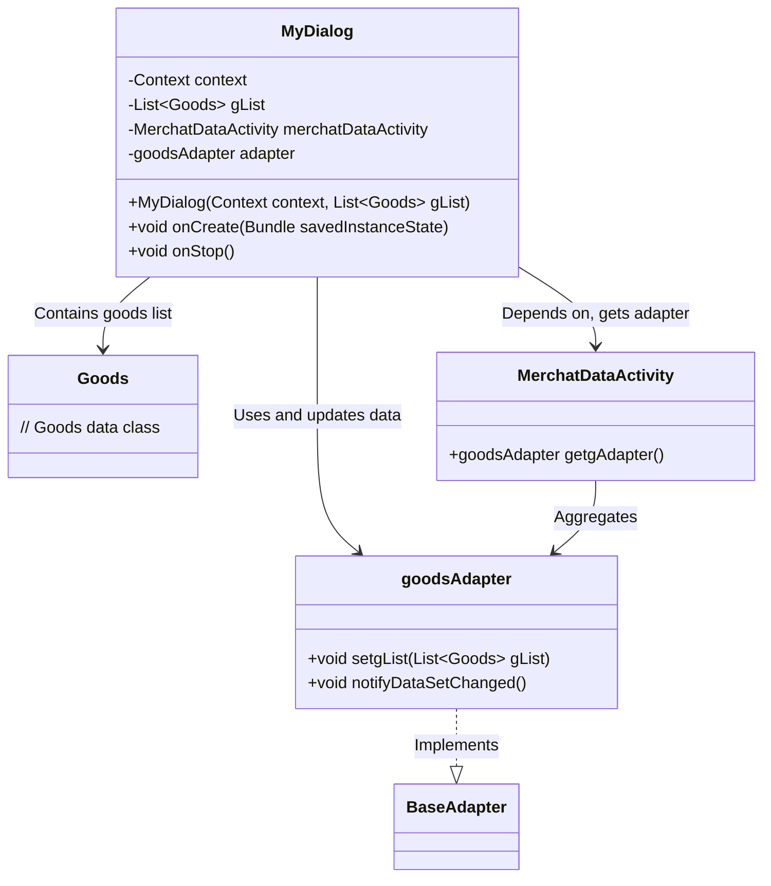
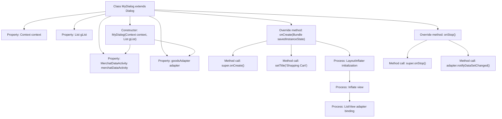

# Basic Information

|      |      |
|------|------|
| Name | MyDialog |
| Language | .java |
| Code Path | happycat/src/com/happycat/MyDialog.java |
| Package Name | com.happycat |
| Dependencies | ['java.util.List', 'com.example.happucat.R', 'com.happycat.Bean.Goods', 'com.happycat.adapter.goodsAdapter', 'android.annotation.SuppressLint', 'android.app.Dialog', 'android.content.Context', 'android.os.Bundle', 'android.view.LayoutInflater', 'android.view.View', 'android.widget.ListView'] |
| Brief Description | Custom dialog class MyDialog, inherits from Dialog, used to display shopping cart item list. The constructor receives context and item list, initializing the adapter. In onCreate, sets the title, layout, and list view, binding the adapter. Notifies the adapter of data updates during onStop. |

# Description

This is a custom dialog class MyDialog, which inherits from the Dialog class. Its main function is to display a shopping cart product list. The constructor takes Context and a product list parameter gList, converting the context to MerchatDataActivity to obtain the adapter. In the onCreate method, it sets the dialog title to "Shopping Cart," loads the layout file shopcat_alterdialog, initializes the ListView, and sets a custom adapter goodsAdapter to display product data. When the dialog closes, the onStop method notifies the original adapter to update the data. The entire class is used in the merchant data activity to display and manage shopping cart product information.

# Class Summary

| Name   | Type  | Description |
|-------|------|-------------|
| MyDialog | class | The custom dialog class MyDialog, which inherits from Dialog, is used to display the shopping cart product list. The constructor receives the context and product list, initializing the adapter. In onCreate, it sets the title, layout, and list view, binding the adapter. Upon onStop, it notifies the adapter of data updates. |

## Class MyDialog

|      |      |
|------|------|
| Access Modifier | @SuppressLint("InflateParams");public |
| Type | class |
| Name | MyDialog |
| Description | The custom dialog class MyDialog, which inherits from Dialog, is used to display the shopping cart product list. The constructor receives the context and product list, initializing the adapter. In onCreate, it sets the title, layout, and list view, binding the adapter. Upon onStop, it notifies the adapter of data updates. |

### UML Class Diagram

Class diagram description: This diagram illustrates the structure of a custom dialog MyDialog, which inherits from Android's Dialog class. It contains goods list data (gList) and the associated MerchatDataActivity. The goodsAdapter manages ListView display and notifies data updates during onStop. MerchatDataActivity serves as the context providing the adapter instance, while goodsAdapter extends BaseAdapter to implement list item rendering logic.

### Internal Method Call Graph

This flowchart illustrates the structure and method invocation relationships of the MyDialog class. Starting from property initialization in the constructor, it proceeds to set dialog title, inflate views, and bind list adapters in onCreate, finally notifying adapter data updates during onStop. Key processes include LayoutInflater view initialization and ListView custom adapter binding, demonstrating the core logic of dialog lifecycle and data interaction.

### Field List

| Name  | Type  | Description |
|-------|-------|------|
| gList | List<Goods> | Product List gList |
| adapter | goodsAdapter | Product List Adapter Instance. |
| merchatDataActivity | MerchatDataActivity | MerchatDataActivity is a merchant data activity object. |
| context | Context | Define a variable context of type Context. |

### Method List

| Name  | Type  | Description |
|-------|-------|------|
| onCreate | void | Initializing the shopping cart interface during Android Activity creation, setting the title, layout, and list adapter. |
| onStop | void | Call the superclass method and notify the adapter of data updates in the Android lifecycle method onStop. |

