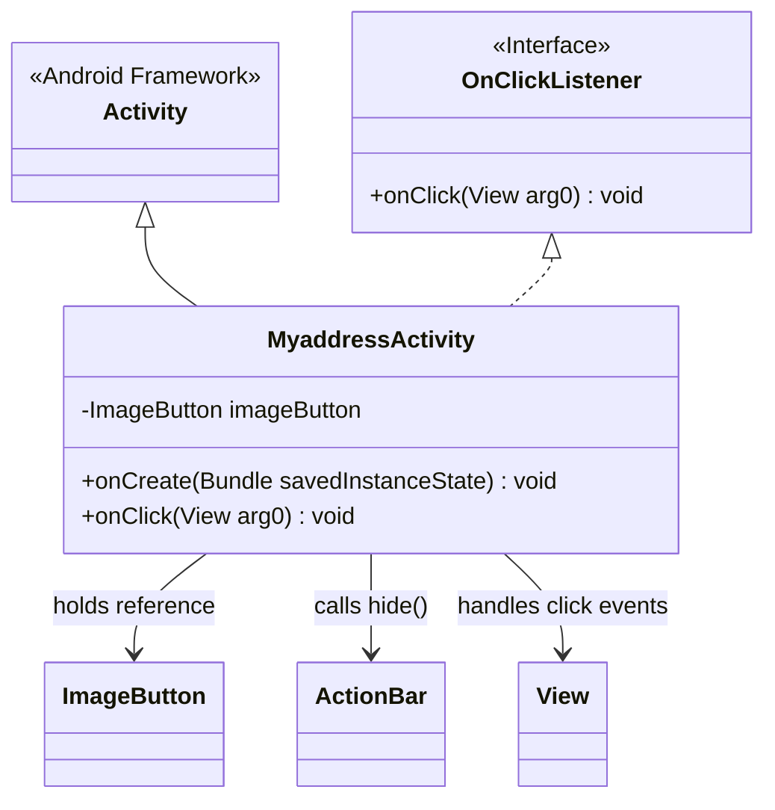
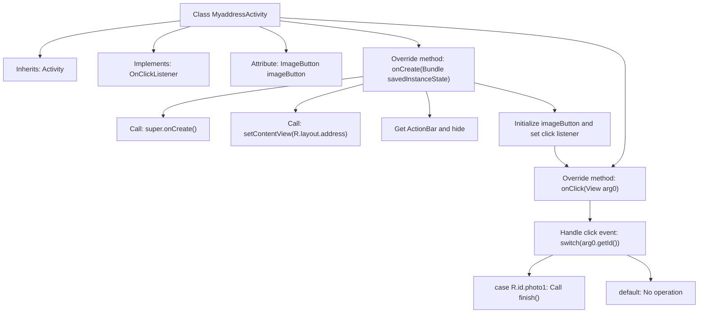

# Basic Information

|      |      |
|------|------|
| Name | MyaddressActivity |
| Language | .java |
| Code Path | happycat/src/com/happycat/MyaddressActivity.java |
| Package Name | com.happycat |
| Dependencies | ['com.example.happucat.R', 'com.example.happucat.R.id', 'com.example.happucat.R.layout', 'android.os.Bundle', 'android.app.ActionBar', 'android.app.Activity', 'android.view.Menu', 'android.view.View', 'android.view.View.OnClickListener', 'android.widget.ImageButton'] |
| Brief Description | MyaddressActivity extends Activity and implements click listeners, hides the title bar, and sets the ImageButton to close the current interface when clicked. |

# Description

This is an Android Activity class named MyaddressActivity, which extends Activity and implements the OnClickListener interface. The main functionality of this class is to display an address interface containing an image button. In the onCreate method, it initializes the layout and hides the title bar, while also setting a click listener for the image button. When the user clicks the button, the onClick method is triggered, executing the finish() operation to close the current Activity. The image button's ID is photo1, and the corresponding layout file is address.xml.

# Class Summary

| Name   | Type  | Description |
|-------|------|-------------|
| MyaddressActivity | class | MyaddressActivity extends Activity and implements click listeners, hides the title bar, and sets up ImageButton click events to close the current interface upon clicking. |

## Class MyaddressActivity

|      |      |
|------|------|
| Access Modifier | public |
| Type | class |
| Name | MyaddressActivity |
| Description | MyaddressActivity extends Activity and implements click listeners, hides the title bar, and sets up ImageButton click events to close the current interface upon clicking. |

### UML Class Diagram

This code demonstrates an Android Activity class `MyaddressActivity`, which inherits from the base `Activity` class and implements the `OnClickListener` interface. Key functionalities include hiding the title bar during interface initialization, setting up an image button click listener, and executing corresponding operations based on button IDs in click events (currently only handling photo1's click to close the Activity). The class diagram clearly illustrates inheritance relationships, interface implementation, and critical object dependencies.

### Internal Method Call Graph

This code describes an Android Activity class MyaddressActivity, which inherits from Activity and implements the click listener interface. The flowchart illustrates the complete call chain from class structure to specific methods: hiding the title bar during initialization, setting up the layout and button listeners, and closing the current activity when a specific image button is clicked. The entire process demonstrates the typical lifecycle and event handling mechanism of Android activities, particularly the pattern of handling click events from different views through a switch-case structure.

### Field List

| Name  | Type  | Description |
|-------|-------|------|
| imageButton | ImageButton | Declare a variable imageButton of type ImageButton. |

### Method List

| Name  | Type  | Description |
|-------|-------|------|
| onClick | void | Android Click Event Handling: Close the current Activity when photo1 is clicked, otherwise take no action. |
| onCreate | void | Android code snippet: Hide the title bar in onCreate, set the layout address, and bind the ImageButton click event. |

