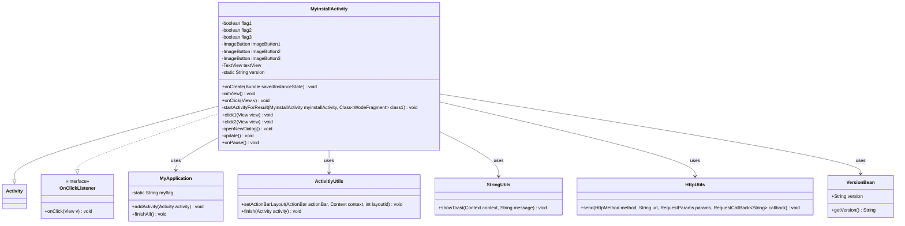
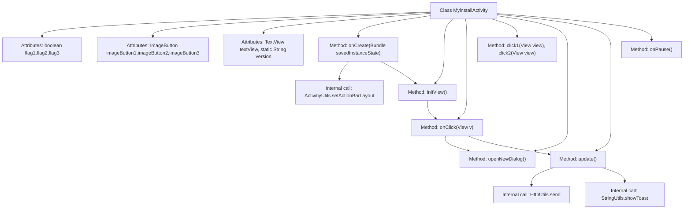

# Basic Information

|      |      |
|------|------|
| Name | MyinstallActivity |
| Language | .java |
| Code Path | happycat/src/com/happycat/MyinstallActivity.java |
| Package Name | com.happycat |
| Dependencies | ['java.lang.reflect.Type', 'java.util.ArrayList', 'com.aps.v', 'com.example.happucat.R', 'com.google.gson.Gson', 'com.google.gson.reflect.TypeToken', 'com.happycat.Bean.User', 'com.happycat.Bean.VersionBean', 'com.happycat.global.GlobalContacts', 'com.happycat.util.ActivitiyUtils', 'com.happycat.util.MyApplication', 'com.happycat.util.StringUtils', 'com.happycay.fragments.WodeFragment', 'com.lidroid.xutils.HttpUtils', 'com.lidroid.xutils.exception.HttpException', 'com.lidroid.xutils.http.RequestParams', 'com.lidroid.xutils.http.ResponseInfo', 'com.lidroid.xutils.http.callback.RequestCallBack', 'com.lidroid.xutils.http.client.HttpRequest.HttpMethod', 'android.R.string', 'android.app.Activity', 'android.app.AlertDialog', 'android.content.DialogInterface', 'android.content.Intent', 'android.os.Bundle', 'android.view.View', 'android.view.View.OnClickListener', 'android.widget.ImageButton', 'android.widget.TextView'] |
| Brief Description | MyinstallActivity is an Android activity class that implements click listeners, including functionalities such as initializing views, handling button click events, checking for version updates, clearing cache, and logging out of the account. |

# Description

MyinstallActivity is an Android activity class that implements the click listener interface. It contains three boolean flags, three image buttons, and a text view for displaying version information. In the onCreate method, it initializes the layout and views, and binds click events for multiple buttons through the initView method. Click event handling includes returning to the main interface, checking for version updates, clearing image cache, about the app, and logging out of the account. A confirmation dialog pops up when logging out. It also includes two methods for toggling the icon states of the non-WiFi data-saving mode and the auto-location feature. The version update functionality interacts with the server via HTTP requests, parsing the returned JSON data to determine whether it is the latest version. In the onPause method, it sets the application flag.

# Class Summary

| Name   | Type  | Description |
|-------|------|-------------|
| MyinstallActivity | class | MyinstallActivity is an Android Activity class that implements click listeners, including functionalities such as initializing views, handling button clicks, checking for version updates, and displaying a confirmation dialog for account logout. |

## Class MyinstallActivity

|      |      |
|------|------|
| Access Modifier | public |
| Type | class |
| Name | MyinstallActivity |
| Description | MyinstallActivity is an Android Activity class that implements click listeners, including functionalities such as initializing views, handling button clicks, checking for version updates, and displaying a confirmation dialog for account logout. |

### UML Class Diagram

This code describes an Android Activity class `MyinstallActivity`, which extends `Activity` and implements the `OnClickListener` interface. The class is primarily used to handle user installation and setup-related operations, including initializing views, processing button click events, displaying dialogs, checking for version updates, etc. It relies on several utility classes such as `MyApplication`, `ActivitiyUtils`, `StringUtils`, and `HttpUtils` to accomplish specific functionalities. The class diagram clearly illustrates the relationships and dependencies among these classes.

### Internal Method Call Graph

This code represents an Android Activity class `MyinstallActivity`, whose primary functionalities include UI initialization, button click event handling, version update checking, and dialog display. The flowchart illustrates class attributes, key methods, and their invocation relationships. For example: `onCreate` initializes views and calls `initView` to bind listeners; `onClick` processes different button click events to trigger corresponding actions (e.g., activity navigation, dialog display, network requests); the `update` method checks for version updates via HTTP requests; `openNewDialog` creates an exit confirmation dialog. The class also includes icon toggle functionality (`click1/click2`) and lifecycle management (`onPause`).

### Field List

| Name  | Type  | Description |
|-------|-------|------|
| imageButton3 | ImageButton | Three ImageButton controls are defined: imageButton1, imageButton2, imageButton3. |
| flag3=false | boolean | Declare three boolean variables flag1, flag2, flag3, all initialized to false. |
| version | String | private static String variable version. |
| textView | TextView | Define a private TextView variable named textView. |

### Method List

| Name  | Type  | Description |
|-------|-------|------|
| onPause | void | Set the global variable myflag to 1 in the Android lifecycle method onPause. |
| startActivityForResult | void | The method startActivityForResult is not implemented, used to launch MyinstallActivity and return the result to WodeFragment. |
| click1 | void | Click to toggle icon: display green yuan icon when flag1 is true, display white yuan1 icon when false, each click reverses flag1 state. |
| onClick | void | Click Return to jump to the main interface; click Version Check for updates; click Clear Image Cache to prompt success; click About to jump to the page; click Log Out to prompt and pop up a window. |
| onCreate | void | The onCreate method of Android Activity: initializes views, sets the layout, retrieves the application state and adds the current Activity, while also configuring the ActionBar. |
| initView | void | Initialize the view, set up button click listeners including back, check, various feature installations, and traffic localization, while obtaining instances of text views. |
| click2 | void | Click the toggle button icon: initially green (yuan), turns white (yuan1) after clicking, and reverses the flag2 state with each click. |
| openNewDialog | void | Create an exit confirmation dialog with the title "Are you sure you want to exit?", providing "Yes" and "No" buttons. Clicking "Yes" exits the program, while clicking "No" closes the dialog. |
| update | void | This method is used to check for version updates. It retrieves the current version number from the interface and sends it to the server via a POST request. If the request fails, it prompts that the retrieval failed; if successful, it parses the returned data, compares the version numbers, and indicates whether it is the latest version. |

