# Basic Information

|      |      |
|------|------|
| Name | NightActivity |
| Language | .java |
| Code Path | happycat/src/com/happycat/NightActivity.java |
| Package Name | com.happycat |
| Dependencies | ['java.lang.reflect.Type', 'java.util.ArrayList', 'java.util.List', 'com.example.happucat.R', 'com.google.gson.Gson', 'com.google.gson.reflect.TypeToken', 'com.happycat.Bean.NightMerchatBean', 'com.happycat.adapter.NightMerchatadapter', 'com.happycat.util.MyApplication', 'com.lidroid.xutils.HttpUtils', 'com.lidroid.xutils.exception.HttpException', 'com.lidroid.xutils.http.ResponseInfo', 'com.lidroid.xutils.http.callback.RequestCallBack', 'com.lidroid.xutils.http.client.HttpRequest.HttpMethod', 'android.os.Bundle', 'android.app.ActionBar', 'android.app.Activity', 'android.content.Intent', 'android.util.Log', 'android.view.View', 'android.view.View.OnClickListener', 'android.widget.AdapterView', 'android.widget.ImageButton', 'android.widget.ImageView', 'android.widget.ListView', 'android.widget.RadioGroup', 'android.widget.TextView', 'android.widget.AdapterView.OnItemClickListener'] |
| Brief Description | NightActivity is an Android Activity class that includes controls such as list views and image views, enabling merchant data display and click-to-navigate functionality. It retrieves JSON data via HTTP requests and parses it, supporting multiple category buttons to navigate to different URL pages. |

# Description

NightActivity is an Android Activity class primarily designed to display a list of nighttime merchants. The interface includes a list view, image buttons, and multiple category buttons. During initialization, the title bar is hidden, the layout is set, and controls are bound. Clicking a list item redirects to the merchant details page, passing information such as merchant ID, name, and delivery fee. The six category buttons correspond to different URL parameters, and clicking them redirects to the main takeout page. Data is fetched from the server via HTTP requests, parsed using Gson to populate the list. If the adapter is empty, an error prompt is displayed. Failed network requests are not handled, while successful requests update the list data.

# Class Summary

| Name   | Type  | Description |
|-------|------|-------------|
| NightActivity | class | The NightActivity class implements the takeaway list functionality, including ListView for data display, click-to-navigate details, multiple category buttons, and network requests to fetch data. |


## Class NightActivity

|      |      |
|------|------|
| Access Modifier | public |
| Type | class |
| Name | NightActivity |
| Description | The NightActivity class implements the takeaway list functionality, including ListView for data display, click-to-navigate details, multiple category buttons, and network requests to fetch data. |


### UML Class Diagram

```mermaid
classDiagram
    class Activity {
        <<Android>>
    }
    
    class NightActivity {
        -ListView listView
        -ImageView imageView
        -List~NightMerchatBean~ list
        -NightMerchatadapter adapter
        -HttpUtils httpUtils
        -String url
        -TextView textView
        -RadioGroup group
        -ImageButton iButton
        +onCreate(Bundle savedInstanceState) void
        -initDatas() void
    }
    
    class NightMerchatBean {
        <<Data>>
        +getMid() int
        +getMname() String
        +getTip() double
        +getLongtime() String
        +getMprice() double
        +getMtime() String
        +getMimg() String
    }
    
    class NightMerchatadapter {
        +NightMerchatadapter(List~NightMerchatBean~ list, Context context)
        +notifyDataSetChanged() void
    }
    
    class HttpUtils {
        +send(HttpMethod method, String url, RequestCallBack~String~ callback) void
    }
    
    class RequestCallBack~T~ {
        <<Interface>>
        +onFailure(HttpException e, String msg) void
        +onSuccess(ResponseInfo~T~ info) void
    }
    
    class Gson {
        +fromJson(String json, Type typeOfT) Object
    }
    
    class TypeToken~T~ {
        +getType() Type
    }
    
    Activity <|-- NightActivity
    RequestCallBack~String~ <|.. NightActivity
    NightMerchatadapter --> NightMerchatBean
    NightActivity --> HttpUtils
    NightActivity --> NightMerchatadapter
    HttpUtils --> RequestCallBack~String~
    NightActivity ..> Gson : uses
    NightActivity ..> TypeToken~List~NightMerchatBean~~ : uses
```

This code describes an Android NightActivity class that inherits from Activity, primarily functioning to display a list of nighttime merchants. It retrieves merchant data from a server via HttpUtils, parses the JSON data using Gson, and populates it into a ListView. The class diagram includes core data model NightMerchatBean, adapter NightMerchatadapter, network utility HttpUtils, as well as related callback interfaces and utility classes, clearly illustrating the dependencies between components.


### Internal Method Call Graph

```mermaid
graph TD
    A["NightActivity class"]
    B["Property: ListView listView"]
    C["Property: ImageView imageView"]
    D["Property: List<NightMerchatBean> list"]
    E["Property: NightMerchatadapter adapter"]
    F["Property: HttpUtils httpUtils"]
    G["Property: String url"]
    H["Property: TextView textView"]
    I["Property: RadioGroup group"]
    J["Property: ImageButton iButton"]
    K["Method: onCreate(Bundle savedInstanceState)"]
    L["Method: initDatas()"]
    M["Internal operation: Hide ActionBar"]
    N["Internal operation: Set layout R.layout.waimai"]
    O["Internal operation: Initialize iButton and set click event"]
    P["Internal operation: Initialize listView and set click event"]
    Q["Internal operation: Initialize imageView and set click event"]
    R["Internal operation: Initialize 6 Views and set click events"]
    S["Internal operation: Call initDatas()"]
    T["Internal operation: Check adapter and set empty view"]

    A --> B
    A --> C
    A --> D
    A --> E
    A --> F
    A --> G
    A --> H
    A --> I
    A --> J
    A --> K
    A --> L
    K --> M
    K --> N
    K --> O
    K --> P
    K --> Q
    K --> R
    K --> S
    K --> T
    L --> E
    L --> F
    L --> G
    L --> D
```



This code represents an Activity class on the Android platform, primarily implementing a nighttime activity display interface. The flowchart illustrates the class structure and key method invocation relationships, including UI component initialization, various click event listeners setup, data initialization, and network request core functionalities. The Activity sends GET requests via HttpUtils to retrieve merchant data, parses JSON responses using Gson, and displays data in ListView through a custom Adapter. It also provides multiple button click navigation features, collectively implementing a complete merchant list display and interaction logic.

### Field List

| Name  | Type  | Description |
|-------|-------|------|
| adapter | NightMerchatadapter | Declaration of the NightMerchantAdapter adapter instance. |
| imageView | ImageView | Declare a variable named imageView of type ImageView. |
| url | String | Declare a private string variable url. |
| iButton | ImageButton | Image button control iButton. |
| group | RadioGroup | Declare a radio button group variable named group. |
| list = new ArrayList<NightMerchatBean>() | List<NightMerchatBean> | Create an ArrayList named list to store objects of type NightMerchantBean. |
| httpUtils | HttpUtils | Declaration of HttpUtils utility class instance. |
| textView | TextView | Declare a variable named textView of type TextView. |
| listView | ListView | Declare a ListView control variable named listView. |

### Method List

| Name  | Type  | Description |
|-------|-------|------|
| onCreate | void | Android Activity initialization, hide the title bar, set the layout, handle button clicks, list item clicks, and group button navigation, pass parameters to start a new Activity, initialize data, and handle empty views. |
| initDatas | void | Initialization data method: Create an adapter and set it to the list view, fetch server data via HTTP GET request, parse JSON using Gson, and update the adapter. |


