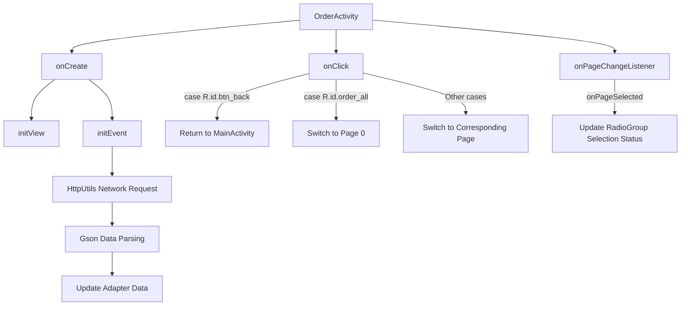

# Basic Information

|      |      |
|------|------|
| Name | OrderActivity |
| Language | .java |
| Code Path | happycat/src/com/happycat/OrderActivity.java |
| Package Name | com.happycat |
| Dependencies | ['java.lang.reflect.Type', 'java.util.ArrayList', 'java.util.List', 'com.example.happucat.R', 'com.google.gson.Gson', 'com.google.gson.reflect.TypeToken', 'com.happycat.Bean.MyOrderBean', 'com.happycat.adapter.MyOrderadapter', 'com.happycat.global.GlobalContacts', 'com.happycat.util.ActivitiyUtils', 'com.happycat.util.MyApplication', 'com.happycat.util.StringUtils', 'com.lidroid.xutils.HttpUtils', 'com.lidroid.xutils.exception.HttpException', 'com.lidroid.xutils.http.RequestParams', 'com.lidroid.xutils.http.ResponseInfo', 'com.lidroid.xutils.http.callback.RequestCallBack', 'com.lidroid.xutils.http.client.HttpRequest.HttpMethod', 'android.app.Activity', 'android.content.Intent', 'android.os.Bundle', 'android.support.v4.view.PagerAdapter', 'android.support.v4.view.ViewPager', 'android.support.v4.view.ViewPager.OnPageChangeListener', 'android.util.Log', 'android.view.LayoutInflater', 'android.view.View', 'android.view.ViewGroup', 'android.view.View.OnClickListener', 'android.widget.AdapterView', 'android.widget.AdapterView.OnItemClickListener', 'android.widget.ListView', 'android.widget.RadioGroup', 'android.widget.TextView', 'android.widget.RadioGroup.OnCheckedChangeListener'] |
| Brief Description | Order Management Activity, including four tabs: All, Pending Payment, Pending Consumption, and Pending Review. It uses ViewPager for switching, fetches order data via HttpUtils for display, and supports clicking to navigate to the review page. |

# Description

OrderActivity is an Android order management page that extends Activity and implements click listeners. Its main functions include: initializing view components such as ViewPager, four order classification tabs (All/Unpaid/Unconsumed/To Be Reviewed), and their corresponding ListViews; sending POST requests via HttpUtils to fetch order data of different categories, parsing JSON with Gson, and updating the adapter; implementing synchronized page swiping and tab switching, where clicking a tab navigates to the corresponding page; including a back button to redirect to MainActivity. A global flag is set when the page is paused.

# Class Summary

| Name   | Type  | Description |
|-------|------|-------------|
| OrderActivity | class | Order Management Activity, including four tabs: All, Pending Payment, Pending Consumption, and Pending Review. It uses ViewPager and ListView to display order data, retrieves and parses data through HTTP requests, and supports page switching and click event handling. |


## Class OrderActivity

|      |      |
|------|------|
| Access Modifier | public |
| Type | class |
| Name | OrderActivity |
| Description | Order Management Activity, including four tabs: All, Pending Payment, Pending Consumption, and Pending Review. It uses ViewPager and ListView to display order data, retrieves and parses data through HTTP requests, and supports page switching and click event handling. |


### UML Class Diagram

```mermaid
classDiagram
    class Activity {
        <<Android Framework>>
    }
    
    class OnClickListener {
        <<Interface>>
        +onClick(View v) void
    }
    
    class OrderActivity {
        -ViewPager orderViewPager
        -PagerAdapter pagerAdapter
        -MyOrderadapter adapter
        -MyOrderadapter wfkadapter
        -MyOrderadapter wxfadapter
        -MyOrderadapter dpjadapter
        -List~View~ listviews
        -TextView allTabView
        -TextView noFukuanTabView
        -TextView noXiaofeiTabView
        -TextView daiPingjiaTabView
        -ListView alllisListView
        -ListView wfklListView
        -ListView wxfListView
        -ListView dpjListView
        -HttpUtils httpUtils
        -String uid
        -String url
        -List~MyOrderBean~ list
        -List~MyOrderBean~ list1
        -List~MyOrderBean~ wxfList
        -List~MyOrderBean~ dpjList
        -View allView
        -View noFukuanView
        -View noXiaofeiView
        -View daipingjiaView
        -RadioGroup radioGroup
        +onCreate(Bundle savedInstanceState) void
        -initView() void
        -initEvent() void
        +onClick(View v) void
        +onPause() void
    }
    
    class ViewPager {
        <<Android Framework>>
        +setAdapter(PagerAdapter adapter) void
        +setCurrentItem(int item) void
        +setOnPageChangeListener(OnPageChangeListener listener) void
    }
    
    class PagerAdapter {
        <<Abstract>>
        +destroyItem(ViewGroup container, int position, Object object) void
        +instantiateItem(ViewGroup container, int position) Object
        +isViewFromObject(View view, Object object) boolean
        +getCount() int
    }
    
    class MyOrderadapter {
        +MyOrderadapter(List~MyOrderBean~ list, Context context)
        +setList(List~MyOrderBean~ list) void
        +notifyDataSetChanged() void
    }
    
    class HttpUtils {
        +send(HttpMethod method, String url, RequestParams params, RequestCallBack~String~ callback) void
    }
    
    class RequestCallBack~T~ {
        <<Interface>>
        +onSuccess(ResponseInfo~T~ responseInfo) void
        +onFailure(HttpException error, String msg) void
    }
    
    class MyOrderBean {
        -int mid
        +getMid() int
    }
    
    class Gson {
        +fromJson(String json, Type typeOfT) Object
    }
    
    class TypeToken~T~ {
        +getType() Type
    }
    
    OrderActivity --|> Activity
    OrderActivity ..|> OnClickListener
    OrderActivity --> ViewPager
    OrderActivity --> PagerAdapter
    OrderActivity --> MyOrderadapter
    OrderActivity --> HttpUtils
    OrderActivity --> MyOrderBean
    OrderActivity --> Gson
    OrderActivity --> TypeToken~MyOrderBean~
    HttpUtils --> RequestCallBack~String~
    PagerAdapter <|-- OrderActivity$1
    RequestCallBack~String~ <|-- OrderActivity$1
    RequestCallBack~String~ <|-- OrderActivity$2
    RequestCallBack~String~ <|-- OrderActivity$3
    RequestCallBack~String~ <|-- OrderActivity$4
```

Class Diagram Description: This diagram illustrates the class structure of the Order Management Activity. OrderActivity inherits from Android's Activity class and implements the click listener interface. It contains multiple order list views and adapters, uses HttpUtils for network requests, and parses response data via Gson. The diagram clearly shows inheritance, implementation, and dependency relationships between classes, including interactions with Android framework components, network request callback handling, and data parsing workflows.


### Internal Method Call Graph



This code represents the implementation of an order management Activity on the Android platform. Its main functionalities include: 1) Initializing four order category pages (ViewPager + ListView layout); 2) Requesting order data of different statuses from the server via HttpUtils; 3) Parsing JSON data using Gson and updating the corresponding Adapter; 4) Handling page switching events and button click events. The flowchart illustrates the complete process from Activity creation to data loading, including key steps such as view initialization, network requests, data parsing, and UI updates, as well as the handling paths of user interaction events.

### Field List

| Name  | Type  | Description |
|-------|-------|------|
| url = "http://" + MyApplication.getIp() + ":8080/happycat/myServlet" | String | Splicing URLs in code, using the application IP with port 8080 and the path /happycat/myServlet. |
| allView | View | The private view object allView. |
| pagerAdapter | PagerAdapter | PagerAdapter is the base adapter class in Android used for managing page switching. |
| noXiaofeiTabView | TextView | Define the TextView variable noXiaofeiTabView |
| noFukuanView | View | The private view variable `noFukuanView` is used to represent the unpaid interface. |
| listviews = new ArrayList<View>() | List<View> | Create an ArrayList named listviews to store elements of type View. |
| dpjListView | ListView | Four ListView variables are defined: alllisListView, wfklListView, wxfListView, dpjListView. |
| httpUtils | HttpUtils | Declaration of HttpUtils utility class instance. |
| noFukuanTabView | TextView | Define the TextView control variable noFukuanTabView. |
| noXiaofeiView | View | Private view variable `noXiaofeiView` |
| orderViewPager | ViewPager | The ViewPager component orderViewPager is used to achieve page sliding effects. |
| uid=MyApplication.SP_user_id+"" | String | The code snippet converts the stored user ID into a string and assigns it to the variable uid. |
| daiPingjiaTabView | TextView | Define the TextView control variable daiPingjiaTabView. |
| dpjList | List<MyOrderBean> | Four order list variables are defined: list, list1, wxfList, dpjList, with the type List<MyOrderBean>. |
| daipingjiaView | View | Private view control daipingjiaView |
| dpjadapter | MyOrderadapter | The four adapter instances: MyOrderadapter, wfkadapter, wxfadapter, and dpjadapter. |
| allTabView | TextView | Define a TextView type variable allTabView. |
| radioGroup | RadioGroup | Define the radio button group control variable radioGroup. |

### Method List

| Name  | Type  | Description |
|-------|-------|------|
| initView | void | Initialize the view, set the click event for the back button, bind the ViewPager with four TabViews, load four layouts into the list, create a custom PagerAdapter, and set it to the ViewPager. |
| onCreate | void | The onCreate method of an Android Activity, calls the parent class method and sets the layout, initializes views and events. |
| initEvent | void | Initialize the order page events, set up click listeners for four order tabs, use the XUtils framework to fetch and parse order data from the server, display order lists of different statuses via an adapter, and monitor page swipes to switch corresponding tabs. |
| onClick | void | Click Event Handling: The back button navigates to MainActivity and closes the current page; other buttons switch the orderViewPager to the corresponding tab (0-3). |
| onPause | void | Override the onPause method, after calling the superclass method, set MyApplication.myflag to "1". |


