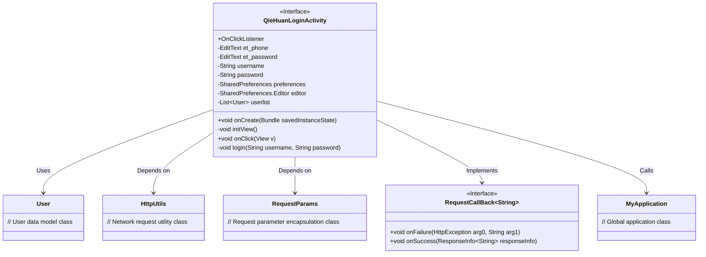
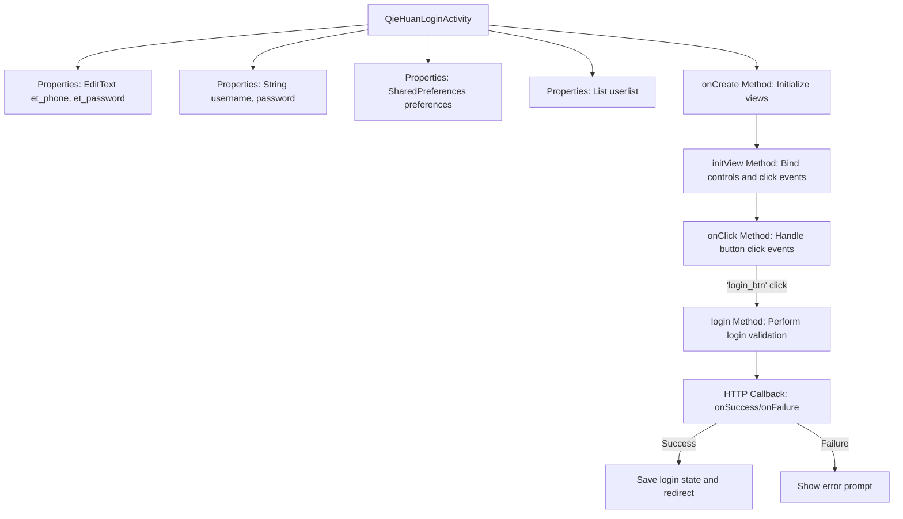
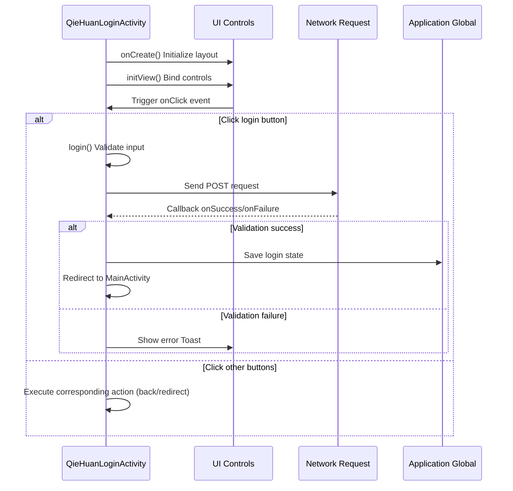

# Basic Information

|      |      |
|------|------|
| Name | QieHuanLoginActivity |
| Language | .java |
| Code Path | happycat/src/com/happycat/QieHuanLoginActivity.java |
| Package Name | com.happycat |
| Dependencies | ['java.lang.reflect.Type', 'java.util.ArrayList', 'java.util.List', 'android.R.string', 'android.app.Activity', 'android.content.Intent', 'android.content.SharedPreferences', 'android.os.Bundle', 'android.util.Log', 'android.view.View', 'android.view.View.OnClickListener', 'android.widget.Button', 'android.widget.EditText', 'android.widget.Toast', 'com.example.happucat.R', 'com.google.gson.Gson', 'com.google.gson.reflect.TypeToken', 'com.happycat.Bean.User', 'com.happycat.Bean.goodsclassify', 'com.happycat.global.GlobalContacts', 'com.happycat.util.ActivitiyUtils', 'com.happycat.util.MyApplication', 'com.happycat.util.StringUtils', 'com.lidroid.xutils.HttpUtils', 'com.lidroid.xutils.exception.HttpException', 'com.lidroid.xutils.http.RequestParams', 'com.lidroid.xutils.http.ResponseInfo', 'com.lidroid.xutils.http.callback.RequestCallBack', 'com.lidroid.xutils.http.client.HttpRequest.HttpMethod'] |
| Brief Description | This is a login activity class that includes user input validation, login request processing, and interface navigation functions. It verifies user information via an HTTP POST request. Upon successful login, it saves the user state and navigates to the main interface; otherwise, it displays an error message. It supports click events for buttons such as back, register, and forgot password. |

# Description

The code describes a login activity class named QieHuanLoginActivity, which extends Activity and implements the click listener interface. The class includes input controls for phone number and password, a user list, and a SharedPreferences storage object. In the onCreate method, the view is initialized, and the title bar layout is set. The initView method initializes various controls and binds click events. Click event handling includes functionalities such as returning, registering, forgetting the password, and logging in. During login, input validity is verified, and a POST request is sent via HttpUtils to validate user information. Upon success, user data is saved to MyApplication, and the user is redirected to the main interface; otherwise, an error is displayed. Upon successful login, the user ID, phone number, password, and address information are saved to global variables.

# Class Summary

| Name   | Type  | Description |
|-------|------|-------------|
| QieHuanLoginActivity | class | This is an Android login activity class that includes phone number and password input fields, handling back, register, forgot password, and login button click events. During login, it verifies user information and, upon success, navigates to the main interface while saving the user's state. |

## Class QieHuanLoginActivity

|      |      |
|------|------|
| Access Modifier | public |
| Type | class |
| Name | QieHuanLoginActivity |
| Description | This is an Android login activity class that includes phone number and password input fields, handling back, register, forgot password, and login button click events. During login, it verifies user information and, upon success, navigates to the main interface while saving the user's state. |

### UML Class Diagram

This code describes an Android login activity class (QieHuanLoginActivity) that implements the OnClickListener interface to handle various button click events. The class contains UI elements (EditText), user data storage (SharedPreferences), and network login functionality (HttpUtils). The flowchart shows that this class is primarily responsible for: 1) Initializing view components; 2) Handling button clicks for back, register, forgot password, and login; 3) Performing username/password validation; 4) Interacting with the server via HTTP POST requests; 5) Processing login success/failure callbacks. Upon successful login, it redirects to MainActivity and saves user state in MyApplication. The entire process demonstrates the complete login flow from user input to server verification.

### Internal Method Call Graph

This code implements a login Activity, primarily consisting of three core functionalities: UI initialization, click event handling, and network login validation. The flowchart illustrates the class structure and main method call relationships, while the sequence diagram details the complete interaction process from UI operations to network requests. The code persists login states via SharedPreferences, uses HttpUtils for network requests, and parses returned JSON data with Gson. Special attention is given to handling different branches for login success/failure and response logic for various button click events.

### Field List

| Name  | Type  | Description |
|-------|-------|------|
| username | String | Declare a string variable username |
| userlist = new ArrayList<User>() | List<User> | Create a dynamic array to store user objects. |
| preferences | SharedPreferences | Define a SharedPreferences object named preferences for storing lightweight key-value pair data. |
| et_password | EditText | Define two EditText control variables: et_phone and et_password. |
| editor | SharedPreferences.Editor | SharedPreferences.Editor is used to modify SharedPreferences data, providing an editing interface for key-value pair storage. |
| password | String | Declare a string variable password |

### Method List

| Name  | Type  | Description |
|-------|-------|------|
| initView | void | Initialize the view components and set up click listeners, including the phone number and password input fields, as well as multiple buttons. |
| onClick | void | Click the back button to exit the current page; click register or forgot password to navigate to the corresponding page and close the current page; click login to verify the account and password before proceeding with login; click register to navigate only without closing the current page. |
| onCreate | void | The onCreate method of Android Activity initializes the login interface layout, sets a custom title bar, and calls the method to initialize views. |
| login | void | Login method: Obtain username and password, verify via POST request, save user information and redirect to homepage upon success, prompt "User does not exist or failed" upon failure. |

