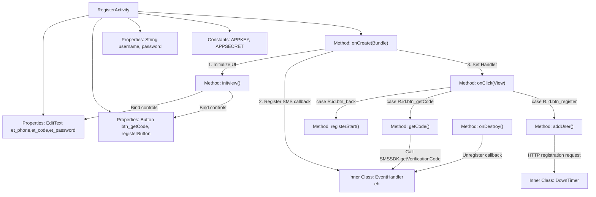

# Basic Information

|      |      |
|------|------|
| Name | RegisterActivity |
| Language | .java |
| Code Path | happycat/src/com/happycat/RegisterActivity.java |
| Package Name | com.happycat |
| Dependencies | ['cn.smssdk.EventHandler', 'cn.smssdk.SMSSDK', 'com.example.happucat.R', 'com.happycat.global.GlobalContacts', 'com.happycat.util.ActivitiyUtils', 'com.happycat.util.StringUtils', 'com.lidroid.xutils.HttpUtils', 'com.lidroid.xutils.exception.HttpException', 'com.lidroid.xutils.http.RequestParams', 'com.lidroid.xutils.http.ResponseInfo', 'com.lidroid.xutils.http.callback.RequestCallBack', 'com.lidroid.xutils.http.client.HttpRequest.HttpMethod', 'android.annotation.SuppressLint', 'android.app.Activity', 'android.content.Intent', 'android.os.Bundle', 'android.os.CountDownTimer', 'android.os.Handler', 'android.os.Message', 'android.util.Log', 'android.view.View', 'android.view.View.OnClickListener', 'android.widget.Button', 'android.widget.EditText', 'android.widget.Toast'] |
| Brief Description | Registration page Activity, including phone number, verification code, password input fields, as well as buttons for obtaining the verification code and registration. It uses SMSSDK for verification code sending and validation. Upon successful registration, user information is submitted to the server, and it handles countdown and callback events. |

# Description

RegisterActivity is an Android registration page that extends Activity and implements click listeners. It includes input fields for phone number, verification code, and password, as well as buttons for obtaining the verification code and registering. During initialization, the SMS SDK's APPKEY and APPSECRET are configured, and SMS callback events are registered. Clicking the "Get Verification Code" button validates the phone number and invokes the SDK to send the verification code, initiating a 60-second countdown. Clicking the "Register" button verifies the code, and upon success, submits the username and password to the server for registration. If the server returns a success response, it navigates to the main page; otherwise, it prompts that the account is already registered. Upon page destruction, the SMS callback must be unregistered to prevent memory leaks. The entire process includes functional modules such as SMS verification, network requests, and countdown timers.

# Class Summary

| Name   | Type  | Description |
|-------|------|-------------|
| RegisterActivity | class | The registration page implements SMS verification functionality, including obtaining verification codes, submitting verification, user registration, and database storage, using SMSSDK for verification code sending and validation. |


## Class RegisterActivity

|      |      |
|------|------|
| Access Modifier | public |
| Type | class |
| Name | RegisterActivity |
| Description | The registration page implements SMS verification functionality, including obtaining verification codes, submitting verification, user registration, and database storage, using SMSSDK for verification code sending and validation. |


### UML Class Diagram

```mermaid
classDiagram
    class Activity {
        <<android.app.Activity>>
    }
    
    class OnClickListener {
        <<Interface>>
        +onClick(View v) void
    }
    
    class RegisterActivity {
        -EditText et_phone
        -EditText et_code
        -EditText et_password
        -Button btn_getCode
        -Button registerButton
        -String username
        -String password
        -static String APPKEY
        -static String APPSECRET
        -Handler handler
        -EventHandler eh
        +onCreate(Bundle savedInstanceState) void
        -initview() void
        +onClick(View v) void
        -registerStart() void
        -getCode() void
        -addUser() void
        -DownTimer~inner~ : CountDownTimer
    }
    
    class SMSSDK {
        <<static>>
        +initSDK(Context ctx, String appkey, String appsecret) void
        +getVerificationCode(String country, String phone) void
        +registerEventHandler(EventHandler handler) void
        +unregisterAllEventHandler() void
    }
    
    class EventHandler {
        <<abstract>>
        +afterEvent(int event, int result, Object data) void
    }
    
    class Handler {
        <<android.os.Handler>>
        +handleMessage(Message msg) void
    }
    
    class CountDownTimer {
        <<android.os.CountDownTimer>>
        +onTick(long millisUntilFinished) void
        +onFinish() void
    }
    
    class HttpUtils {
        +send(HttpMethod method, String url, RequestParams params, RequestCallBack~String~ callback) void
    }
    
    class RequestParams {
        +addQueryStringParameter(String key, String value) void
        +addBodyParameter(String key, String value) void
    }
    
    class RequestCallBack~T~ {
        <<Interface>>
        +onSuccess(ResponseInfo~T~ responseInfo) void
        +onFailure(HttpException error, String msg) void
    }
    
    Activity <|-- RegisterActivity
    OnClickListener <|.. RegisterActivity
    RegisterActivity --> SMSSDK : uses
    RegisterActivity --> EventHandler : contains
    RegisterActivity --> Handler : contains
    RegisterActivity --> CountDownTimer : contains
    RegisterActivity --> HttpUtils : uses
    RegisterActivity --> RequestParams : uses
    RegisterActivity ..> RequestCallBack~String~ : implements
    EventHandler <|.. RegisterActivity$1
    CountDownTimer <|-- RegisterActivity$DownTimer
```

This code describes an Android registration activity (RegisterActivity) that extends Activity and implements the OnClickListener interface. Its main functionalities include: obtaining SMS verification codes via SMSSDK, validating user input, registering new users, and submitting user data to a server through HTTP requests. The class diagram illustrates core components and their relationships, including UI controls, SMS SDK integration, countdown functionality, and network request handling modules. The activity processes SMS verification results via an event handler (EventHandler), implements a verification code countdown using a custom DownTimer, and sends registration requests to the server via HttpUtils.


### Internal Method Call Graph



This code implements a mobile registration feature, with the main workflow including: initializing UI controls, SMS verification code acquisition and validation, and user registration data submission. The SMS verification is handled via SMSSDK, asynchronous messages are processed using Handler, DownTimer manages the verification code countdown, and finally, user data is submitted to the server via an HTTP request. The code structure is clear, but attention should be paid to memory leak prevention and network request exception handling.

### Field List

| Name  | Type  | Description |
|-------|-------|------|
| APPKEY="b6f91b24020b" | String | private static String variable APPKEY with the value "b6f91b24020b". |
| username | String | Declare a string variable username |
| registerButton | Button | The interface includes two buttons: the Get Verification Code button btn_getCode and the Register button registerButton. |
| APPSECRET="b6d3d9b2908868d8e95d8728f45746a9" | String | The code defines a private static string constant APPSECRET with the value b6d3d9b2908868d8e95d8728f45746a9. |
| password | String | private string variable password |
| eh=new EventHandler(){	        @Override	        public void afterEvent(int event, int result, Object data) {	            if (result == SMSSDK.RESULT_COMPLETE) {	                //回调完成	                if (event == SMSSDK.EVENT_SUBMIT_VERIFICATION_CODE) {	                    //提交验证码成功	                    Log.e("event", "提交验证码成功");	                    Message message=new Message();	                    message.what=0;	                    message.obj="提交验证码成功";	                    handler.sendMessage(message);	                }else if (event == SMSSDK.EVENT_GET_VERIFICATION_CODE){	                    //获取验证码成功	                    Log.e("event", "获取验证码成功");	                    Message message=new Message();						Bundle bundle=new Bundle();						bundle.putString("msg", "验证码已发送至您的手机,有效时间5分钟，请及时填写！");						message.setData(bundle);						handler.sendMessage(message);	                }else if (event ==SMSSDK.EVENT_GET_SUPPORTED_COUNTRIES){	                    //返回支持发送验证码的国家列表	                }	            }else{	                ((Throwable)data).printStackTrace();	                System.err.println("------获取验证码出错---------");					Message message=new Message();					message.what=0;					Bundle bundle=new Bundle();					bundle.putString("msg", "验证码发送失败，请检查网络稍候重试！");					message.setData(bundle);					handler.sendMessage(message);	            }	        }	    } | EventHandler | Define event handlers to process SMS verification code operations: log and send messages when submitting the verification code succeeds, obtaining the verification code succeeds, or the country list is returned; print exceptions and send failure messages when errors occur. |
| handler | Handler | Private Handler object, used for processing messages or tasks. |
| et_password | EditText | Three EditText control variables are defined: et_phone (phone), et_code (verification code), et_password (password). |

### Method List

| Name  | Type  | Description |
|-------|-------|------|
| addUser | void | The method `addUser` retrieves the username and password, submits them to the server via a POST request, redirects to the homepage upon success, and prompts that the account is already registered upon failure. |
| onClick | void | Click the back button to display a prompt and close the page; click the get verification code button to execute the getCode method; click the register button to execute the registerStart and addUser methods. |
| onCreate | void | Initialization of Activity registration: Load layout, start SMS SDK, set up title bar, initialize views, handle message callbacks. |
| onDestroy | void | Call the SMSSDK to unregister all event handlers in the Android lifecycle method onDestroy to ensure resource release. |
| getCode | void | The method `getCode` validates the phone number format and returns if invalid. When valid, it retrieves the phone number, requests an SMS verification code, disables the button, and initiates a 60-second countdown. |
| registerStart | void | The method `registerStart` checks if the phone number and verification code are not empty; if they are empty, it returns directly. The comment indicates that the original plan was to obtain input but it was not implemented. |
| initview | void | Initialize view components: Retrieve the phone number, password, and verification code input fields, along with the register, get verification code, and back buttons, and set up click listeners. |


