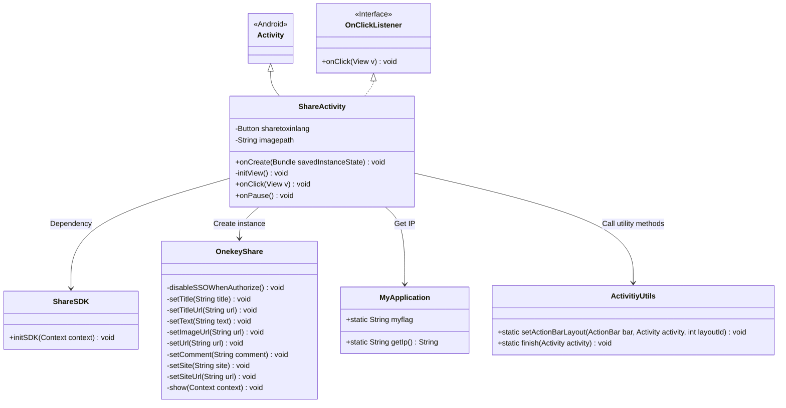
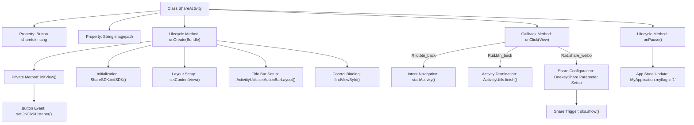

# Basic Information

|      |      |
|------|------|
| Name | ShareActivity |
| Language | .java |
| Code Path | happycat/src/com/happycat/ShareActivity.java |
| Package Name | com.happycat |
| Dependencies | ['cn.sharesdk.framework.ShareSDK', 'cn.sharesdk.onekeyshare.OnekeyShare', 'com.example.happucat.R', 'com.happycat.util.ActivitiyUtils', 'com.happycat.util.MyApplication', 'com.happycat.util.StringUtils', 'android.app.Activity', 'android.content.Intent', 'android.os.Bundle', 'android.view.View', 'android.view.View.OnClickListener', 'android.widget.Button'] |
| Brief Description | The ShareActivity implements the click-to-share functionality, initializes ShareSDK, and configures Weibo sharing content, including title, text, image links, etc. Clicking the button can return to the main interface or launch the sharing interface. |

# Description

ShareActivity is a class that extends Activity and implements the OnClickListener interface. It contains variables for the share button and image path. In the onCreate method, it initializes ShareSDK and the UI layout, sets up the title bar and buttons. The initView method sets click listeners for the back and share buttons. Clicking the back button navigates to MainActivity and finishes the current screen. When the share button is clicked, it initializes ShareSDK and configures OnekeyShare parameters, including title, text, image URL, link, etc., and finally calls the show method to launch the share interface. In the onPause method, it sets a global flag to 1.

# Class Summary

| Name   | Type  | Description |
|-------|------|-------------|
| ShareActivity | class | The ShareActivity implements the sharing feature, including a back button and a Weibo share button. It initializes and configures the sharing content using ShareSDK, supporting parameters such as title, text, image, and link. Clicking the share button invokes OnekeyShare to perform the sharing. |

## Class ShareActivity

|      |      |
|------|------|
| Access Modifier | public |
| Type | class |
| Name | ShareActivity |
| Description | The ShareActivity implements the sharing feature, including a back button and a Weibo share button. It initializes and configures the sharing content using ShareSDK, supporting parameters such as title, text, image, and link. Clicking the share button invokes OnekeyShare to perform the sharing. |

### UML Class Diagram

Class Diagram Description:
ShareActivity inherits from Android's Activity class and implements the OnClickListener interface, primarily handling social sharing functionality. It initializes through ShareSDK, uses the OnekeyShare class to configure and display the sharing interface, relies on MyApplication to obtain the server IP address, and calls utility methods from ActivitiyUtils for UI management. The diagram clearly illustrates inheritance relationships, interface implementations, and key dependencies, reflecting typical initialization, event handling, and resource management flows in Android activities.

### Internal Method Call Graph

This code describes an Android Activity class for social sharing functionality, primarily including UI initialization, button click handling, and Weibo sharing features. The flowchart illustrates the complete process from activity creation (onCreate) to view initialization (initView), then to click event processing (onClick), encompassing page navigation via back button and complex configuration for share button. Finally, it updates the application state flag during onPause, with the overall structure clearly demonstrating the core implementation path of social sharing functionality.

### Field List

| Name  | Type  | Description |
|-------|-------|------|
| sharetoxinlang | Button | Button control, labeled as sharetoxinlang. |
| imagepath | String | Declare a private string variable imagepath to store the image path. |

### Method List

| Name  | Type  | Description |
|-------|-------|------|
| onPause | void | Override the onPause method in Android, after calling the superclass method, set the myflag of MyApplication to "1". |
| onClick | void | Click the button to perform different actions: return to the homepage or invoke ShareSDK to share to Weibo, set parameters such as title, text, image link, etc., and then launch the sharing interface. |
| initView | void | Initialize the view, set up click listeners for the back button and Weibo share button. |
| onCreate | void | Android Activity initialization code, including ShareSDK initialization, layout setup, title bar configuration, and Weibo share button binding. |

