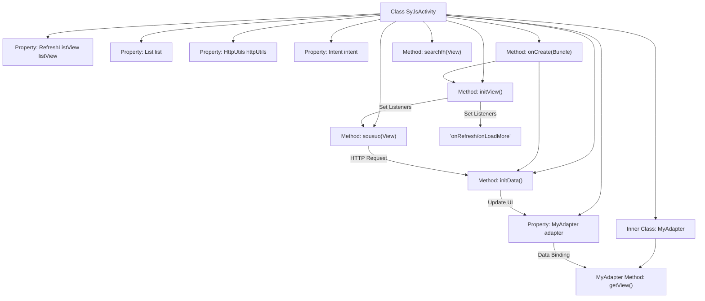

# Basic Information

|      |      |
|------|------|
| Name | SyJsActivity |
| Language | .java |
| Code Path | happycat/src/com/happycat/SyJsActivity.java |
| Package Name | com.happycat |
| Dependencies | ['java.io.UnsupportedEncodingException', 'java.lang.reflect.Type', 'java.net.URLEncoder', 'java.util.ArrayList', 'java.util.List', 'org.json.JSONArray', 'org.json.JSONException', 'org.json.JSONObject', 'com.example.happucat.R', 'com.google.gson.Gson', 'com.google.gson.reflect.TypeToken', 'com.happycat.Bean.SouSuoBean', 'com.happycat.util.MyApplication', 'com.happycat.util.RefreshListView', 'com.happycat.util.RefreshListView.OnRefreshListener', 'com.happycat.util.SearchClearEditText', 'com.lidroid.xutils.HttpUtils', 'com.lidroid.xutils.exception.HttpException', 'com.lidroid.xutils.http.RequestParams', 'com.lidroid.xutils.http.ResponseInfo', 'com.lidroid.xutils.http.callback.RequestCallBack', 'com.lidroid.xutils.http.client.HttpRequest.HttpMethod', 'android.os.Bundle', 'android.R.integer', 'android.app.ActionBar', 'android.app.Activity', 'android.content.Context', 'android.content.Intent', 'android.util.Log', 'android.view.LayoutInflater', 'android.view.View', 'android.view.ViewGroup', 'android.widget.AdapterView', 'android.widget.AdapterView.OnItemClickListener', 'android.widget.BaseAdapter', 'android.widget.ImageView', 'android.widget.ListView', 'android.widget.RadioButton', 'android.widget.TextView', 'android.widget.Toast'] |
| Brief Description | The Android activity class SyJsActivity implements search functionality, including list display, pagination loading, data requests, and adapter handling. It uses Gson to parse JSON data and supports click-to-navigate to the detail page. |

# Description

SyJsActivity is an Android Activity class primarily designed to implement search functionality and display search results in a list. This class includes a RefreshListView for showing the search result list and a SearchClearEditText for entering search keywords. It sends POST requests to a specified URL via HttpUtils to fetch search results, parses the returned JSON data using Gson, and updates the list accordingly. The list supports pull-down refresh and pull-up load-more features. Clicking on a list item navigates to MerchatDataActivity to display detailed information. MyAdapter is a custom adapter responsible for the layout and data binding of list items, including fields such as merchant name, delivery time, and product information, while also utilizing an image-loading library to display product images.

# Class Summary

| Name   | Type  | Description |
|-------|------|-------------|
| SyJsActivity | class | SyJsActivity is an Android Activity class that includes search functionality, list display, and pagination loading. It utilizes HttpUtils for network requests, Gson for data parsing, and RefreshListView to implement pull-down refresh and pull-up loading. Clicking on a list item navigates to the details page. The adapter MyAdapter handles data binding and view presentation for list items. |


## Class SyJsActivity

|      |      |
|------|------|
| Access Modifier | public |
| Type | class |
| Name | SyJsActivity |
| Description | SyJsActivity is an Android Activity class that includes search functionality, list display, and pagination loading. It utilizes HttpUtils for network requests, Gson for data parsing, and RefreshListView to implement pull-down refresh and pull-up loading. Clicking on a list item navigates to the details page. The adapter MyAdapter handles data binding and view presentation for list items. |


### UML Class Diagram

```mermaid
classDiagram
    class SyJsActivity {
        -RefreshListView listView
        -MyAdapter adapter
        -List~SouSuoBean~ list
        -HttpUtils httpUtils
        -Intent intent
        -View footer
        -int pageNow
        -SearchClearEditText editText
        -List~SouSuoBean~ beans
        -String url
        +void onCreate(Bundle savedInstanceState)
        +void searchfh(View view)
        +void sousuo(View view)
        -void initView()
        -void initData()
    }

    class MyAdapter {
        -Context context
        -List~SouSuoBean~ lista
        -LayoutInflater minflater
        -TextView textView
        -RadioButton radioButton
        -ViewHolder mHolder
        +MyAdapter(Context context, List~SouSuoBean~ lista)
        +void addAll(List~SouSuoBean~ picture)
        +int getCount()
        +Object getItem(int arg0)
        +long getItemId(int arg0)
        +View getView(int position, View convertView, ViewGroup parent)
    }

    class ViewHolder {
        -TextView textView1
        -TextView textView2
        -TextView textView3
        -TextView textView4
        -TextView textView5
        -ImageView imageView
    }

    class SouSuoBean {
        <<DataClass>>
        // Omitted specific attributes and methods
    }

    class HttpUtils {
        +void send(HttpMethod method, String url, RequestParams params, RequestCallBack~String~ callBack)
    }

    class RequestParams {
        +void addBodyParameter(String key, String value)
    }

    interface RequestCallBack~T~ {
        <<Interface>>
        +void onSuccess(ResponseInfo~T~ responseInfo)
        +void onFailure(HttpException error, String msg)
    }

    SyJsActivity --> MyAdapter : Uses
    SyJsActivity --> HttpUtils : Depends on
    SyJsActivity --> RequestParams : Depends on
    SyJsActivity --> RequestCallBack : Implements callback
    MyAdapter --> ViewHolder : Uses
    MyAdapter --> SouSuoBean : Operates data
    HttpUtils --> RequestCallBack : Callback notification
```

This code implements an Android activity page for product search functionality, including list display, network requests, data parsing, and adapter logic. SyJsActivity serves as the main controller, sending POST requests via HttpUtils to retrieve product data, displaying SouSuoBean list data using MyAdapter, and implementing pull-to-refresh and load-more features. The class diagram illustrates the collaboration relationships between core components, including key classes such as Activity, Adapter, Network Utility, and Data Model, along with their interaction patterns.


### Internal Method Call Graph



This code represents an Android Activity class primarily implementing product search and list display functionality. The flowchart illustrates class structure relationships, including property declarations, main method call chains, and the workflow of the inner adapter. The core logic involves fetching product data via HTTP requests, rendering the list using a custom adapter, and implementing pull-to-refresh/load-more features. Data loads during initialization, re-requests during searches, and clicks navigate to detail pages, following an MVC architectural pattern overall.

### Field List

| Name  | Type  | Description |
|-------|-------|------|
| list = new ArrayList<SouSuoBean>() | List<SouSuoBean> | Create an ArrayList named list to store objects of type SouSuoBean. |
| httpUtils | HttpUtils | HttpUtils is a utility class designed for handling HTTP-related operations. |
| beans | List<SouSuoBean> | Defined a list named beans with elements of type SouSuoBean. |
| pageNow = 1 | int | The current page number is 1. |
| url = "http://" + MyApplication.getIp()			+ ":8080/happycat/GetUpload" | String | The private string URL is constructed by concatenating the base URL, application IP, and path, pointing to the GetUpload service. |
| adapter | MyAdapter | Declare a variable named adapter of type MyAdapter. |
| footer | View | View footer section. |
| intent | Intent | Declare an intent object. |
| listView | RefreshListView | An instance of the RefreshListView control named listView is defined. |
| editText | SearchClearEditText | Defined a variable named editText of type SearchClearEditText. |

### Method List

| Name  | Type  | Description |
|-------|-------|------|
| sousuo | void | The method sousuo handles search requests: retrieves the input text, encodes it, and sends it via a POST request with parameters including key, pageNow, and goodsname. Upon successful return, it parses the JSON data to update the list; upon failure, it refreshes the list with a failure message. Errors are printed when exceptions occur. |
| searchfh | void | The method searchfh ends the current activity. |
| onCreate | void | The onCreate method of Android Activity: Initialize views, data, and hide the ActionBar. |
| initData | void | The method initData retrieves the input text, encodes it, and sends the parameters key, pageNow, and goodsname via a POST request to the specified URL. Upon successful return, it parses the JSON data to update the list; if it fails, it refreshes the list with a failure status. |
| initView | void | Initialize the view, set up the list adapter and refresh listener, handle search and pagination loading, and navigate to the details page on click. |


