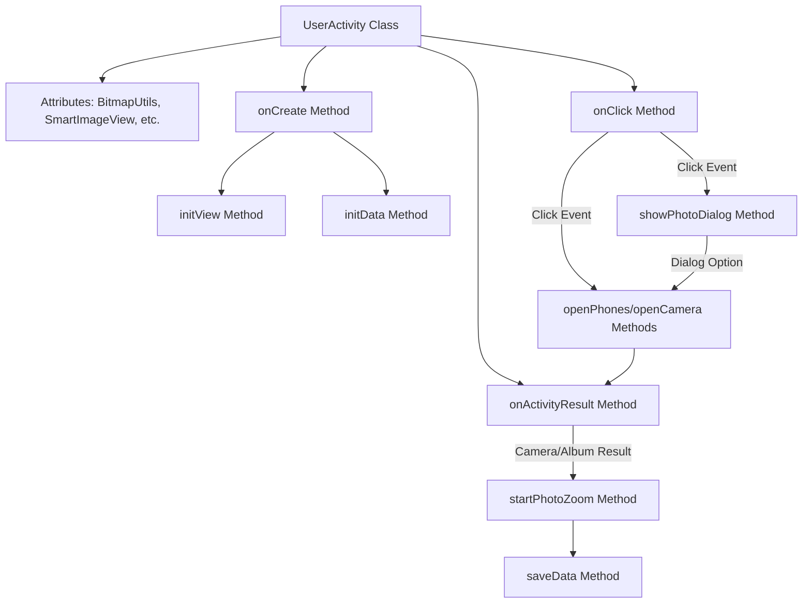
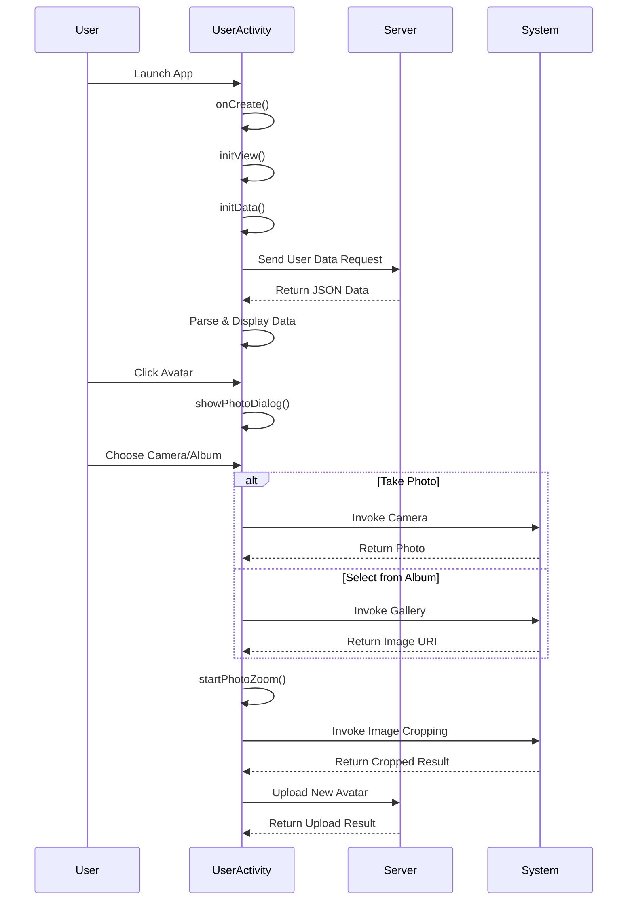

# Basic Information

|      |      |
|------|------|
| Name | UserActivity |
| Language | .java |
| Code Path | happycat/src/com/happycat/UserActivity.java |
| Package Name | com.happycat |
| Dependencies | ['image.SmartImageView', 'java.io.File', 'java.lang.reflect.Type', 'java.util.ArrayList', 'java.util.List', 'com.example.happucat.R', 'com.google.gson.Gson', 'com.google.gson.reflect.TypeToken', 'com.happycat.Bean.User', 'com.happycat.util.ActivitiyUtils', 'com.happycat.util.MyApplication', 'com.happycat.util.StringUtils', 'com.happycat.view.Circleimage', 'com.lidroid.xutils.BitmapUtils', 'com.lidroid.xutils.HttpUtils', 'com.lidroid.xutils.exception.HttpException', 'com.lidroid.xutils.http.RequestParams', 'com.lidroid.xutils.http.ResponseInfo', 'com.lidroid.xutils.http.callback.RequestCallBack', 'com.lidroid.xutils.http.client.HttpRequest.HttpMethod', 'android.annotation.SuppressLint', 'android.app.Activity', 'android.app.Dialog', 'android.content.Intent', 'android.graphics.Bitmap', 'android.graphics.BitmapFactory', 'android.net.Uri', 'android.os.Bundle', 'android.os.Environment', 'android.provider.MediaStore', 'android.util.Log', 'android.view.LayoutInflater', 'android.view.View', 'android.view.ViewGroup', 'android.view.Window', 'android.view.WindowManager', 'android.view.View.OnClickListener', 'android.view.ViewGroup.LayoutParams', 'android.widget.ImageView', 'android.widget.RelativeLayout', 'android.widget.TextView', 'android.widget.Toast'] |
| Brief Description | The Android user details page Activity includes features such as avatar upload, personal information display, and password modification. It retrieves user data via HTTP requests and displays it, supporting avatar selection from both the camera and gallery, with the option to crop and upload the image to the server. |

# Description

The code defines an Android activity class named `UserActivity`, primarily designed to manage the user profile interface. The activity includes functionalities for displaying user information, modifying avatars, editing profiles, and changing passwords. It retrieves user data from the server via HTTP requests, parses the JSON response using Gson, and populates the interface's text views. The activity supports selecting avatar images from the camera or gallery, provides cropping functionality, and uploads the result to the server. The interface features a back button, an avatar area, and clickable fields for username, gender, phone number, and address, with click events handled through a switch-case structure for different operations. The activity also implements a photo selection dialog and result-handling logic to ensure smooth user interaction.

# Class Summary

| Name   | Type  | Description |
|-------|------|-------------|
| UserActivity | class | The UserActivity implements user profile display and modification functions, including avatar upload, personal information updates, password changes, and other operations, interacting with the server via HTTP requests. |


## Class UserActivity

|      |      |
|------|------|
| Access Modifier | public |
| Type | class |
| Name | UserActivity |
| Description | The UserActivity implements user profile display and modification functions, including avatar upload, personal information updates, password changes, and other operations, interacting with the server via HTTP requests. |


### UML Class Diagram

```mermaid
classDiagram
    class Activity {
        <<Interface>>
    }
    class OnClickListener {
        <<Interface>>
        +onClick(View v) void
    }
    class UserActivity {
        -BitmapUtils bitmapUtils
        -SmartImageView civ_photo
        -LayoutInflater mInflater
        -Dialog dialog
        -String filepath
        -RelativeLayout my_password
        -String filename
        -Uri uri
        -List~User~ userList
        -String imagurl
        -TextView name, phone, sex, address
        -String province, city, district, detail
        +onCreate(Bundle savedInstanceState) void
        -initData() void
        -initView() void
        +onClick(View v) void
        -openPhones() void
        -openCamera() void
        +onActivityResult(int requestCode, int resultCode, Intent data) void
        -startPhotoZoom(Uri uri) void
        -showPhotoDialog() void
        -saveData() void
        +onPause() void
    }
    class BitmapUtils {
        +display(ImageView imageView, String uri) void
    }
    class SmartImageView {
        +setImageBitmap(Bitmap bitmap) void
        +setOnClickListener(OnClickListener listener) void
    }
    class HttpUtils {
        +send(HttpMethod method, String url, RequestParams params, RequestCallBack~String~ callback) void
    }
    class RequestParams {
        +addBodyParameter(String key, String value) void
        +addBodyParameter(String key, File file) void
    }
    class RequestCallBack~T~ {
        <<Interface>>
        +onSuccess(ResponseInfo~T~ responseInfo) void
        +onFailure(HttpException error, String msg) void
    }
    class Gson {
        +fromJson(String json, Type typeOfT) Object
    }
    class TypeToken~T~ {
        +getType() Type
    }
    class User {
        +getUname() String
        +getSex() String
        +getUprovince() String
        +getUcity() String
        +getUcountry() String
        +getUdetail() String
        +getUimg() String
    }
    class MyApplication {
        +static String SP_user_phone
        +static String SP_user_id
        +static String myflag
        +static BitmapUtils bitmapUtils
        +static String getIp() String
    }
    class Circleimage {
        +toRoundBitmap(Bitmap bitmap) Bitmap
    }

    UserActivity --|> Activity
    UserActivity ..|> OnClickListener
    UserActivity --> BitmapUtils : uses
    UserActivity --> SmartImageView : contains
    UserActivity --> HttpUtils : uses
    UserActivity --> RequestParams : uses
    UserActivity --> Gson : uses
    UserActivity --> TypeToken~List~User~~ : uses
    UserActivity --> User : contains
    UserActivity --> MyApplication : depends
    UserActivity --> Circleimage : uses
    HttpUtils --> RequestCallBack~String~ : callback
    Gson --> TypeToken~List~User~~ : depends
```

This class diagram illustrates the structure of UserActivity and its relationships with other classes. UserActivity inherits from Activity and implements the OnClickListener interface, primarily responsible for displaying and editing user profiles. It contains multiple UI components (e.g., SmartImageView, TextView) and utility classes (e.g., BitmapUtils, HttpUtils), parsing JSON data via Gson to populate user information. The diagram clearly presents data flow (from network requests to UI display) and interaction logic (click event handling), demonstrating a typical MVC pattern implementation in Android applications.


### Internal Method Call Graph





This code implements a user profile management Activity with core functionalities including: initializing UI, loading user data from server, handling avatar modification (supporting camera and album selection), and updating user information. The flowchart demonstrates internal method call relationships within the class, while the sequence diagram details system collaboration during user interactions. The code utilizes HttpUtils for network communication, Gson for JSON parsing, and implements a complete image processing pipeline including photo capture, album selection, image cropping, and upload functionality.

### Field List

| Name  | Type  | Description |
|-------|-------|------|
| bitmapUtils | BitmapUtils | Private Bitmap utility class instance. |
| mInflater | LayoutInflater | Private layout inflater mInflater. |
| civ_photo | SmartImageView | The private member variable SmartImageView civ_photo is used for image display. |
| detail | String | Define four string variables: province, city, district, detailed address. |
| filepath | String | The private string variable filepath is used to store the file path. |
| imagurl = "http://" + MyApplication.getIp() + ":8080/happycat/img/" | String | Splicing image URLs in code, using the application's IP address and a fixed path. |
| uri | Uri | Private URI variable `uri`. |
| filename = System.currentTimeMillis() + ".jpg" | String | Generate JPG filenames using the current timestamp. |
| my_password | RelativeLayout | Private relative layout control my_password. |
| dialog | Dialog | Dialog box instance declaration. |
| address | TextView | The text view includes fields for name, phone number, gender, and address. |
| userList = new ArrayList<User>() | List<User> | Create a dynamic array `userList` to store User objects. |

### Method List

| Name  | Type  | Description |
|-------|-------|------|
| openCamera | void | Close the dialog, create a photo capture intent, specify the storage path as a filename under the external storage directory, start the photo capture activity, and wait for the result. |
| openPhones | void | After closing the dialog, create an intent to select an image and start the activity with a request code of 2. |
| initView | void | Initialize the view and set click events, including controls such as the back button, avatar, username, gender, address, and change password, while obtaining references to the relevant text views. |
| onClick | void | Click Return to navigate to the main interface; click the avatar to display the photo dialog; click Edit Profile to navigate to the profile page; click the camera or gallery to open the corresponding function; click Cancel to close the dialog; click Change Password to navigate to the password page. |
| onCreate | void | Android Activity Initialization Code: Setting up the layout, customizing the title bar, and initializing views and data. |
| showPhotoDialog | void | The method `showPhotoDialog` creates and displays a bottom-popup photo selection dialog, which includes buttons for taking photos, selecting from the album, and canceling. It sets animation and layout parameters, and the dialog can be closed by clicking outside. |
| saveData | void | The method `saveData` sends a POST request via `HttpUtils` to upload the user's profile picture to the specified URL, displaying corresponding prompts upon success or failure. |
| onPause | void | Set the global variable myflag to 1 in the Android lifecycle method onPause. |
| initData | void | Initialization data method: Create BitmapUtils and HttpUtils, send a POST request to fetch user information, parse JSON data, and update the UI to display the user's name, gender, phone number, address, and photo. |
| startPhotoZoom | void | Start the image cropping function, set the aspect ratio to 1:1, output size to 500x500, save the result to the specified file, and return the data. |
| onActivityResult | void | Processing return results for different request codes: 0 updates user information, 1 retrieves images from the album, 2 captures images by taking photos, 3 displays and saves cropped images, 4 processes specific results. |


