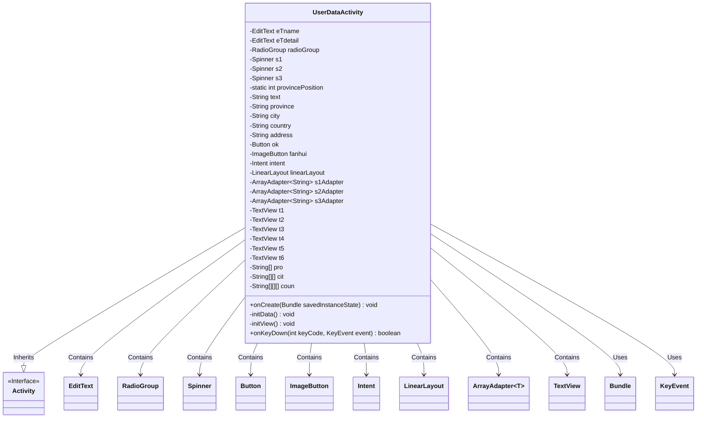
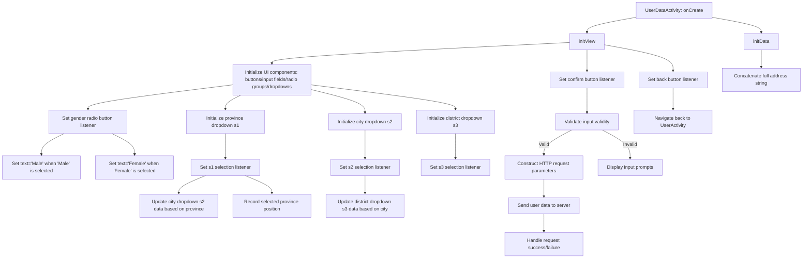

# Basic Information

|      |      |
|------|------|
| Name | UserDataActivity |
| Language | .java |
| Code Path | happycat/src/com/happycat/UserDataActivity.java |
| Package Name | com.happycat |
| Dependencies | ['com.example.happucat.R', 'com.happycat.util.ActivitiyUtils', 'com.happycat.util.MyApplication', 'com.lidroid.xutils.HttpUtils', 'com.lidroid.xutils.exception.HttpException', 'com.lidroid.xutils.http.RequestParams', 'com.lidroid.xutils.http.ResponseInfo', 'com.lidroid.xutils.http.callback.RequestCallBack', 'com.lidroid.xutils.http.client.HttpRequest.HttpMethod', 'android.app.Activity', 'android.content.Intent', 'android.os.Bundle', 'android.util.Log', 'android.view.KeyEvent', 'android.view.View', 'android.view.View.OnClickListener', 'android.widget.AdapterView', 'android.widget.ArrayAdapter', 'android.widget.Button', 'android.widget.EditText', 'android.widget.ImageButton', 'android.widget.LinearLayout', 'android.widget.RadioButton', 'android.widget.RadioGroup', 'android.widget.Spinner', 'android.widget.TextView', 'android.widget.Toast', 'android.widget.AdapterView.OnItemSelectedListener'] |
| Brief Description | UserDataActivity is an Android user data editing interface that includes name input, gender selection, three-level linkage selection for province, city, and district, as well as detailed address input functionality. It supports data submission and return operations. |

# Description

The code describes a user data editing activity class `UserDataActivity`, which inherits from the `Activity` class. Its main functionalities include: capturing user nickname and detailed address via `EditText` controls, selecting gender through a `RadioGroup`, and implementing a three-level cascading selection for province, city, and district using three `Spinner` controls (including data for Jiangsu, Henan, Beijing provinces and their subordinate cities, counties, and districts). The interface includes a back button and a confirm button. When the confirm button is clicked, it validates the input length and submits the data to the server via an HTTP POST request. When the user clicks the back button or the physical back key, the data is passed back to `UserActivity` via an `Intent`. The address is concatenated from the selected province, city, district, and detailed address, with male and Xuanwu District, Nanjing City, Jiangsu Province selected by default.

# Class Summary

| Name   | Type  | Description |
|-------|------|-------------|
| UserDataActivity | class | Android user data editing page, including nickname, gender selection, three-level linkage for province/city/district, and detailed address input. After data validation, it submits to the server and supports back and save functions. |

## Class UserDataActivity

|      |      |
|------|------|
| Access Modifier | public |
| Type | class |
| Name | UserDataActivity |
| Description | Android user data editing page, including nickname, gender selection, three-level linkage for province/city/district, and detailed address input. After data validation, it submits to the server and supports back and save functions. |

### UML Class Diagram

This class diagram illustrates the structure and relationships of UserDataActivity. UserDataActivity inherits from the Activity class and contains multiple UI components such as EditText, RadioGroup, Spinner, etc., for handling user data input and display. The class initializes view components via initView(), processes data logic via initData(), and implements lifecycle methods like onCreate() and onKeyDown(). Its primary functions include collecting user information (nickname, gender, address, etc.), submitting data via HTTP requests, and handling back button events. The class utilizes multi-level nested string arrays to store provincial/municipal data and implements cascading selection functionality through Spinners.

### Internal Method Call Graph

This flowchart depicts the complete lifecycle control logic of an Android user data editing page. It primarily consists of three core modules: UI initialization, cascading dropdown data binding, and user input validation with network request handling. When users modify personal information, the system collects province/city/district data through a three-level联动 selector, combines the detailed address, and sends it to the server while processing various user interaction events such as back button presses and cancel operations. The entire process strictly adheres to Android component lifecycle management specifications, ensuring data consistency and interface responsiveness.

### Field List

| Name  | Type  | Description |
|-------|-------|------|
| ok | Button | Button confirmation. |
| coun = new String[][][] {			{ { "玄武区", "白下区", "秦淮区", "建邺区", "鼓楼区", "下关区", "浦口区" },					{ "京口区 ", "润州区", "丹徒区" },					{ "武进区", "天宁区", "钟楼区", "新北区", "戚墅堰区" },					{ "崇安区", "南长区", "北塘区", "滨湖区", "无锡新区", "惠山区", "锡山区" },					{ "金阊区", "沧浪区", "平江区", "虎丘区", "吴中区", "相城区" },					{ "新浦区", "连云区", "海州区" }, { "亭湖区", "盐都区" },					{ "崇川区", "港闸区", "通州区" },					{ "云龙区", "鼓楼区", "九里区", "贾汪区", "泉山区" }, { "宿城区", "宿豫区" },					{ "清河区", "清浦区", "楚州区", "淮阴区" }, { "广陵区", "邗江区", "江都区" },					{ "海陵区", "高港区" } },			{					{ "管城回族区", "金水区", "二七区", "上街区", "中原区", "西北高新区", "东南高新区",							"郑东新区", "惠济区（邙山区）" },					{ "龙庭区", "金明区", "顺河区", "鼓楼区", "禹王台区" },					{ "涧西区 ", "西工区", "老城区", "瀍河回族区", "吉利区", "洛龙区" },					{ "新华区卫东区", "新城区", "高新区", "石龙区", "湛河区" },					{ "殷都区 ", "北关区", "文峰区", "龙安区 " },					{ "淇滨区", "山城区", "鹤山区" },					{ "卫滨区", "红旗区", "牧野区", "凤泉区", "高新技术产业开发区", "西工区", "小店工业区" },					{ "山阳区", "解放区", "中站区", "马村区" }, { "华龙区", "高新区" },					{ "郾城区", "源汇区", "召陵区" }, { "魏都区" }, { "湖滨区" },					{ "睢阳区", "梁园区", "开发区" }, { "驿城区" }, { "宛城区", "卧龙区" },					{ "浉河区", "平桥区" },					{ "克井镇", "五龙口镇", "轵城镇", "承留镇", "邵原镇", "坡头镇", "梨林镇", "大峪镇" } },			{ { "东城区", "西城区", "崇文区", "宣武区" }, { "朝阳区", "丰台区", "石景山区", "海淀区" },					{ "门头沟区", "房山区", "通州区", "顺义区" },					{ "昌平区 ", "大兴区", "怀柔区", "平谷区" } } } | String[][][] | The code defines a three-dimensional string array that stores the names of multiple cities in China and their subordinate district-level administrative divisions, including Nanjing, Zhenjiang, Changzhou, Wuxi, Suzhou, Lianyungang, Yancheng, Nantong, Xuzhou, Suqian, Huaian, Yangzhou, Taizhou, Zhengzhou, Kaifeng, Luoyang, Pingdingshan, Anyang, Hebi, Xinxiang, Jiaozuo, Puyang, Luohe, Xuchang, Sanmenxia, Shangqiu, Zhumadian, Nanyang, Xinyang, Jiyuan, and the districts of Beijing. |
| pro = new String[] { "江苏省", "河南省", "北京市" } | String[] | Define a string array pro containing three elements: Jiangsu Province, Henan Province, and Beijing. |
| t6 | TextView | Six TextView variables are defined: t1, t2, t3, t4, t5, t6. |
| fanhui | ImageButton | Back button control |
| s3Adapter | ArrayAdapter<String> | Three string array adapter variables are defined: s1Adapter, s2Adapter, s3Adapter. |
| s3 | Spinner | Declare three private Spinner control variables: s1, s2, s3. |
| cit = new String[][] {			{ "南京市", "镇江市", "常州市", "无锡市 ", "苏州市 ", "连云港市 ", "盐城市 ", "南通市 ",					"徐州市 ", "宿迁市 ", "淮安市 ", "扬州市 ", "泰州市 " },			{ "郑州市", "开封市", "洛阳市", "平顶山市", "安阳市", "鹤壁市", "新乡市", "焦作市", "濮阳市",					"漯河市", "许昌市", "三门峡市", "商丘市", "驻马店市", "南阳市", "信阳市", "济源市" },			{ "无", "无", "无", "无", "无", "无", "无", "无", "无" } } | String[][] | Define a two-dimensional string array `cit`, containing three groups of city lists: the first group includes 13 cities in Jiangsu, the second group includes 17 cities in Henan, and the third group consists of 9 "None". |
| linearLayout | LinearLayout | Declare a variable named linearLayout of type LinearLayout. |
| provincePosition = 0 | int | The static integer variable provincePosition is initialized to 0. |
| radioGroup | RadioGroup | Private radio button group control. |
| address | String | Male, Xuanwu District, Nanjing City, Jiangsu Province. |
| eTdetail | EditText | Define two EditText control variables: eTname and eTdetail. |
| intent | Intent | Declare an intent object intent. |

### Method List

| Name  | Type  | Description |
|-------|-------|------|
| onCreate | void | Android Activity initialization code: Inherit the parent class onCreate, set the layout file, customize the title bar, initialize views and data. |
| initView | void | Initialize the user data editing interface, including a back button, text display, edit box, radio buttons, a three-level linkage selector for province/city/district, and a submit button, implementing data validation and network submission functionality. |
| onKeyDown | boolean | Android Key Event Handling: When the back button is pressed, navigate to UserActivity, passing name, gender, and address data, and terminate the current activity. |
| initData | void | Initialization data method, concatenates province, city, district, and input box text into an address string. |

