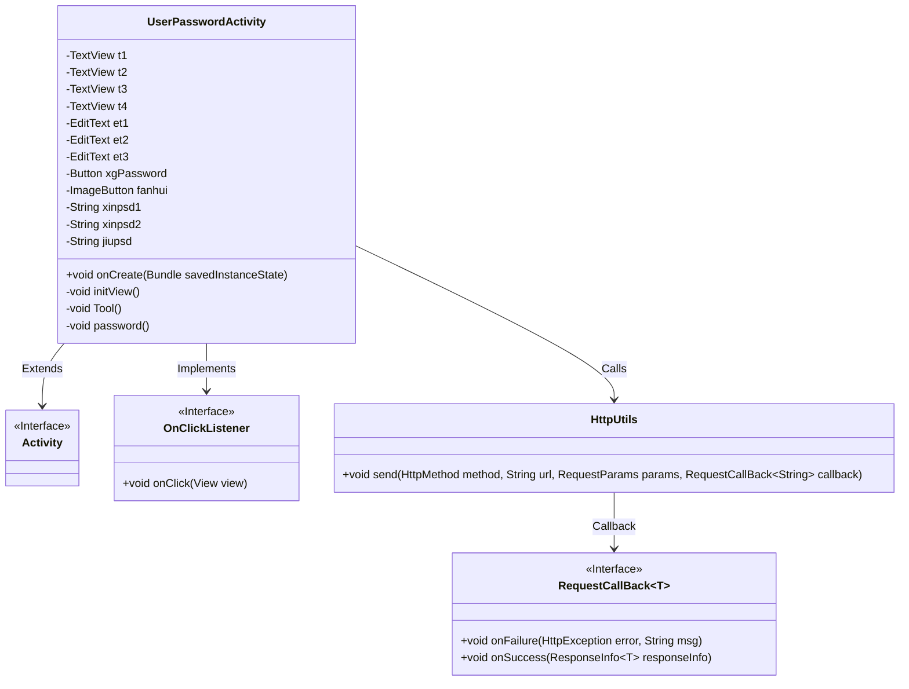
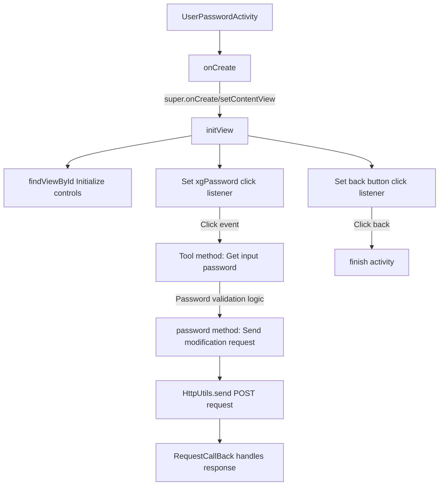
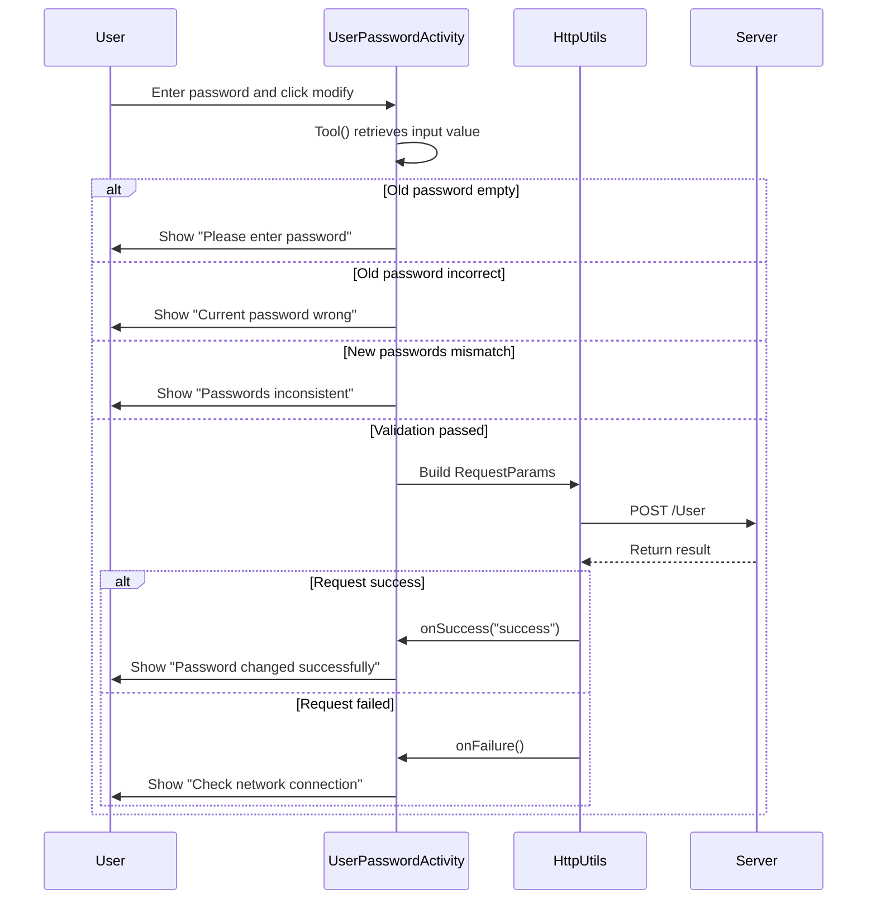

# Basic Information

|      |      |
|------|------|
| Name | UserPasswordActivity |
| Language | .java |
| Code Path | happycat/src/com/happycat/UserPasswordActivity.java |
| Package Name | com.happycat |
| Dependencies | ['com.example.happucat.R', 'com.happycat.util.ActivitiyUtils', 'com.happycat.util.MyApplication', 'com.lidroid.xutils.HttpUtils', 'com.lidroid.xutils.exception.HttpException', 'com.lidroid.xutils.http.RequestParams', 'com.lidroid.xutils.http.ResponseInfo', 'com.lidroid.xutils.http.callback.RequestCallBack', 'com.lidroid.xutils.http.client.HttpRequest.HttpMethod', 'com.lidroid.xutils.http.client.entity.UploadEntity', 'android.app.Activity', 'android.content.Intent', 'android.os.Bundle', 'android.util.Log', 'android.view.View', 'android.view.View.OnClickListener', 'android.widget.Button', 'android.widget.EditText', 'android.widget.ImageButton', 'android.widget.TextView', 'android.widget.Toast'] |
| Brief Description | User password modification activity class, including old password, new password input fields and confirmation button. After verifying password consistency, submit to the server for modification, with success or failure prompts. |

# Description

The UserPasswordActivity is an Android activity class designed for modifying user passwords. The interface includes three text input fields (old password, new password, confirm new password), four text labels, a modify password button, and a back button. Clicking the back button navigates to the UserActivity and terminates the current activity. When modifying the password, the system verifies whether the old password is correct and whether the new passwords match. Upon successful validation, an HTTP POST request is sent to the server to update the password, with request parameters including the user's phone number and new password. The operation result is displayed to the user via Toast notifications, covering states such as network errors, password mismatches, and successful or failed password modifications.

# Class Summary

| Name   | Type  | Description |
|-------|------|-------------|
| UserPasswordActivity | class | User password modification activity class, including interface initialization, password verification, and network request functionalities, handling old password validation, new password consistency checks, and modification result feedback. |

## Class UserPasswordActivity

|      |      |
|------|------|
| Access Modifier | public |
| Type | class |
| Name | UserPasswordActivity |
| Description | User password modification activity class, including interface initialization, password verification, and network request functionalities, handling old password validation, new password consistency checks, and modification result feedback. |

### UML Class Diagram

This code demonstrates an Android user password modification activity (UserPasswordActivity), which inherits from the base Activity class. Key functionalities include: initializing view components (TextView, EditText, Button, etc.), handling back button click events, validating consistency between old and new passwords, initiating network requests via HttpUtils to modify passwords, and displaying operation results using Toast. The class diagram clearly reflects its inheritance relationship with Activity, implementation of the OnClickListener interface, and the collaborative process of network communication through HttpUtils. The password modification logic incorporates multi-layer validation to ensure operational security and completeness of user prompts.

### Internal Method Call Graph

The flowchart describes the complete execution process of an Android password modification feature, from activity initialization to UI control binding, password validation logic, and network request handling. The sequence diagram highlights three key phases: user interaction, local validation, and network communication, covering input validation, password comparison, HTTP request sending, and response processing in an end-to-end flow. It includes 4 validation branches and 2 network request result states. The entire process involves 7 core steps and 3 exception handling paths, exemplifying the data flow control pattern typical of mobile form submissions.

### Field List

| Name  | Type  | Description |
|-------|-------|------|
| xgPassword | Button | Button variable xgPassword |
| et3 | EditText | Three EditText control variables are defined: et1, et2, et3. |
| t4 | TextView | Four TextView variables are defined: t1, t2, t3, t4. |
| jiupsd | String | Declare three string variables: newPassword1, newPassword2, oldPassword. |
| fanhui | ImageButton | Back button control |

### Method List

| Name  | Type  | Description |
|-------|-------|------|
| Tool | void | Get the text content from the three input boxes, trim leading and trailing spaces, and assign them to the new password 1, new password 2, and old password variables respectively. |
| password | void | This method is used to modify the user password by sending a POST request with the phone number and new password to the server, which returns a success or failure prompt. |
| initView | void | Initialize the view component, set up the password modification logic: verify the old password, check the consistency of the new password, display error prompts, and submit before closing the page upon success. |
| onCreate | void | The onCreate method of Android Activity: Calling the parent class method, setting the layout, initializing the custom title bar and views. |

