# Basic Information

|      |      |
|------|------|
| Name | WaiMAIMainActivity |
| Language | .java |
| Code Path | happycat/src/com/happycat/WaiMAIMainActivity.java |
| Package Name | com.happycat |
| Dependencies | ['java.lang.reflect.Type', 'java.util.ArrayList', 'java.util.List', 'com.example.happucat.R', 'com.google.gson.Gson', 'com.google.gson.reflect.TypeToken', 'com.happycat.Bean.Goods', 'com.happycat.Bean.MerchatBean', 'com.happycat.adapter.Merchatadapter', 'com.happycat.adapter.Myadapter', 'com.happycat.util.MyApplication', 'com.lidroid.xutils.BitmapUtils', 'com.lidroid.xutils.HttpUtils', 'com.lidroid.xutils.ViewUtils', 'com.lidroid.xutils.bitmap.PauseOnScrollListener', 'com.lidroid.xutils.exception.HttpException', 'com.lidroid.xutils.http.ResponseInfo', 'com.lidroid.xutils.http.callback.RequestCallBack', 'com.lidroid.xutils.http.client.HttpRequest.HttpMethod', 'com.lidroid.xutils.view.annotation.event.OnScrollStateChanged', 'android.app.Activity', 'android.content.Intent', 'android.os.Bundle', 'android.util.Log', 'android.view.Menu', 'android.view.MenuItem', 'android.view.View', 'android.view.View.OnClickListener', 'android.view.Window', 'android.widget.AdapterView', 'android.widget.ImageButton', 'android.widget.TextView', 'android.widget.AdapterView.OnItemClickListener', 'android.widget.ListView', 'android.widget.Toast'] |
| Brief Description | The main activity class of an Android food delivery app, which includes displaying merchant data in a list, network requests, JSON parsing, and click event handling. |

# Description

WaiMAIMainActivity is an Android Activity class for displaying a list of takeaway merchants. It includes a ListView to show merchant list data, fetches JSON data from a specified URL via HttpUtils, and parses it into a list of MerchantBean objects using Gson. During initialization, it sets a no-title-bar style, loads the layout, and initializes view components. The list adapter MerchantAdapter manages data display and optimizes image loading performance during scrolling. Clicking a list item navigates to MerchantDataActivity and passes detailed merchant information, including ID, name, delivery fee, rating, minimum order price, phone number, image, and business hours. A top navigation button provides a back function. A failure in network requests triggers an error prompt.

# Class Summary

| Name   | Type  | Description |
|-------|------|-------------|
| WaiMAIMainActivity | class | The main activity class of the food delivery app, which includes list view initialization, network requests to fetch merchant data, JSON parsing, list adapter setup, and click event handling. |


## Class WaiMAIMainActivity

|      |      |
|------|------|
| Access Modifier | public |
| Type | class |
| Name | WaiMAIMainActivity |
| Description | The main activity class of the food delivery app, which includes list view initialization, network requests to fetch merchant data, JSON parsing, list adapter setup, and click event handling. |


### UML Class Diagram

```mermaid
classDiagram
    class WaiMAIMainActivity {
        -ListView listView
        -List~MerchatBean~ list
        -Merchatadapter adapter
        -HttpUtils httpUtils
        -String url
        -TextView textView
        -ImageButton iButton
        +onCreate(Bundle savedInstanceState) void
        +initData() void
        +initview() void
    }

    class MerchatBean {
        // Merchant data model
    }

    class Merchatadapter {
        +setList(List~MerchatBean~ list) void
        +notifyDataSetChanged() void
    }

    class HttpUtils {
        +send(HttpMethod method, String url, RequestCallBack~String~ callback) void
    }

    class RequestCallBack~T~ {
        <<Interface>>
        +onFailure(HttpException e, String msg) void
        +onSuccess(ResponseInfo~T~ response) void
    }

    class Gson {
        +fromJson(String json, Type typeOfT) R~T~
    }

    class TypeToken~T~ {
        +getType() Type
    }

    class PauseOnScrollListener {
        +PauseOnScrollListener(BitmapUtils utils, boolean pauseOnScroll, boolean pauseOnFling)
    }

    WaiMAIMainActivity --> MerchatBean : contains
    WaiMAIMainActivity --> Merchatadapter : uses
    WaiMAIMainActivity --> HttpUtils : uses
    WaiMAIMainActivity --> RequestCallBack~String~ : implements callback
    WaiMAIMainActivity --> PauseOnScrollListener : sets listener
    HttpUtils --> RequestCallBack~String~ : depends on
    Merchatadapter --> MerchatBean : adapts
    Gson --> TypeToken~List~MerchatBean~~ : used for parsing
```

This code describes an Android Activity implementation for a food delivery merchant list. The WaiMAIMainActivity serves as the main controller class, using HttpUtils to initiate network requests for merchant data, parsing JSON responses with Gson, and displaying the data on a ListView via Merchatadapter. The implementation includes list scroll optimization (PauseOnScrollListener), click event handling, and a network request callback mechanism, following the MVC pattern with clear separation between the data layer (MerchatBean), view layer (ListView), and control layer (Activity). Key processes include view initialization, asynchronous data loading, and list item click navigation.


### Internal Method Call Graph

```mermaid
graph TD
    A["WaiMAIMainActivity"]
    B["Property: ListView listView"]
    C["Property: List<MerchatBean> list"]
    D["Property: Merchatadapter adapter"]
    E["Property: HttpUtils httpUtils"]
    F["Property: String url"]
    G["Property: TextView textView"]
    H["Property: ImageButton iButton"]
    I["Method: onCreate(Bundle savedInstanceState)"]
    J["Method: initData()"]
    K["Method: initview()"]
    L["Internal operation: requestWindowFeature(Window.FEATURE_NO_TITLE)"]
    M["Internal operation: setContentView(R.layout.waimai_merchat_main)"]
    N["Internal operation: getIntent() to obtain url"]
    O["Internal operation: Set empty view textView"]
    P["HTTP request: httpUtils.send()"]
    Q["Callback handling: Parse JSON and update adapter in onSuccess"]
    R["UI initialization: Bind listView and adapter"]
    S["Event listener: Set OnItemClickListener"]
    T["Event listener: Set OnClickListener for back button"]

    A --> B
    A --> C
    A --> D
    A --> E
    A --> F
    A --> G
    A --> H
    A --> I
    I --> L
    I --> M
    I --> K
    I --> N
    I --> O
    A --> J
    J --> P
    P --> Q
    A --> K
    K --> R
    K --> S
    K --> T
```



This flowchart illustrates the core structure and execution flow of WaiMAIMainActivity. The class encompasses key functionalities including UI component initialization, HTTP data requests, list adapter management, and event listeners. The main process starts with onCreate, sequentially executing view initialization, data loading, and event binding. Upon successful HTTP asynchronous request, data is parsed via Gson to refresh the list, while list item clicks and back button triggers page navigation and closure respectively. The entire flow demonstrates typical lifecycle management and asynchronous data processing patterns in Android activities.

### Field List

| Name  | Type  | Description |
|-------|-------|------|
| textView | TextView | Define the TextView object textView. |
| adapter | Merchatadapter | Adapter instance of the Merchatadapter type. |
| url | String | Declare a private string variable url. |
| iButton | ImageButton | Image Button Control iButton |
| httpUtils | HttpUtils | Declaration of HttpUtils utility class instance. |
| list = new ArrayList<MerchatBean>() | List<MerchatBean> | Create an ArrayList object named list of type MerchatBean. |
| listView | ListView | Declare a variable named listView of type ListView. |

### Method List

| Name  | Type  | Description |
|-------|-------|------|
| initData | void | The method initData retrieves data via an HTTP GET request, parses the JSON into a list of MerchatBean using Gson, updates the adapter, and refreshes the display. |
| onCreate | void | Android Activity initialization code: Hide the title bar, load the layout, initialize views and data, and display an error prompt when the adapter is found empty. |
| initview | void | Initialization view method: Set up the list view adapter, control image loading during scrolling, monitor item click events to pass data, and close the activity when the top button is clicked. |


