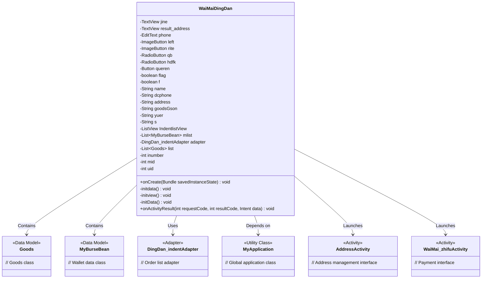
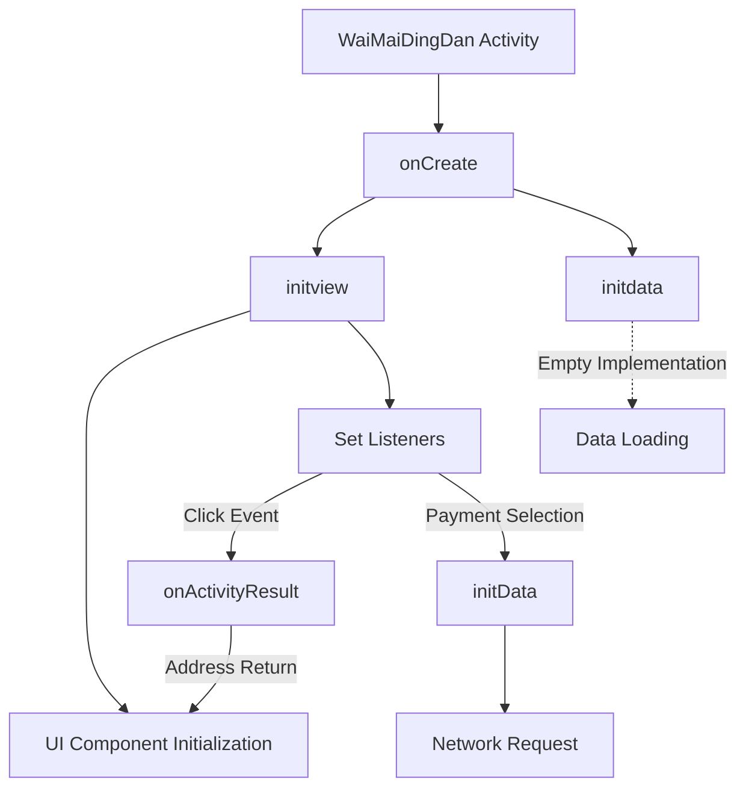
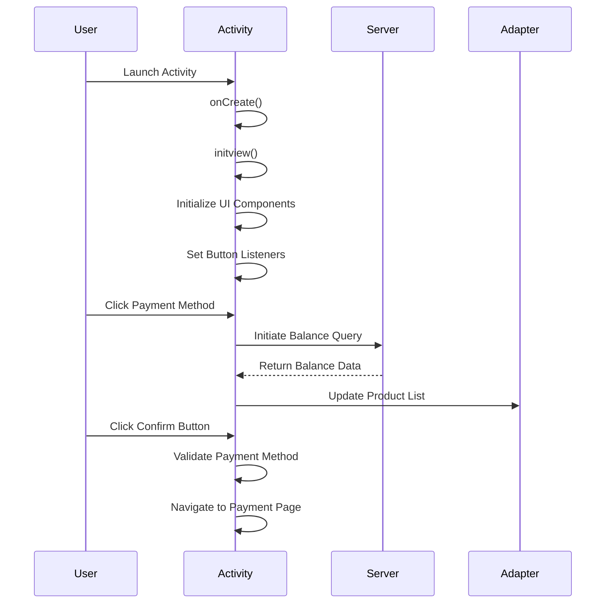

# Basic Information

|      |      |
|------|------|
| Name | WaiMaiDingDan |
| Language | .java |
| Code Path | happycat/src/com/happycat/WaiMaiDingDan.java |
| Package Name | com.happycat |
| Dependencies | ['java.lang.reflect.Type', 'java.util.ArrayList', 'java.util.LinkedList', 'java.util.List', 'com.example.happucat.R', 'com.example.happucat.R.id', 'com.google.gson.Gson', 'com.google.gson.reflect.TypeToken', 'com.happycat.Bean.Goods', 'com.happycat.Bean.MyBurseBean', 'com.happycat.adapter.DingDan_indentAdapter', 'com.happycat.util.MyApplication', 'com.lidroid.xutils.HttpUtils', 'com.lidroid.xutils.exception.HttpException', 'com.lidroid.xutils.http.RequestParams', 'com.lidroid.xutils.http.ResponseInfo', 'com.lidroid.xutils.http.callback.RequestCallBack', 'com.lidroid.xutils.http.client.HttpRequest.HttpMethod', 'android.R.string', 'android.app.Activity', 'android.app.AlertDialog', 'android.content.DialogInterface', 'android.content.Intent', 'android.os.Bundle', 'android.util.Log', 'android.view.LayoutInflater', 'android.view.Menu', 'android.view.MenuItem', 'android.view.View', 'android.view.View.OnClickListener', 'android.view.Window', 'android.widget.Button', 'android.widget.EditText', 'android.widget.ImageButton', 'android.widget.ListView', 'android.widget.RadioButton', 'android.widget.TextView', 'android.widget.Toast'] |
| Brief Description | Takeout Order Activity class, which includes order information display, payment method selection, address management, and order confirmation functions. It uses Gson to parse product data and supports balance and cash-on-delivery payments. |

# Description

The code describes an Activity class for a food delivery order, with main functionalities including initializing the order interface, processing user address information, displaying product lists, selecting payment methods, and confirming the order. The interface includes a back button, address display, amount calculation, product list view, and payment options. Users can choose between wallet payment or cash on delivery, and upon order confirmation, they are redirected to the payment page. The code also involves network requests to fetch user balance data and passes order information to the payment page via Intent. Overall, it implements the core flow of a food delivery order, covering information display, interaction handling, and payment preparation.

# Class Summary

| Name   | Type  | Description |
|-------|------|-------------|
| WaiMaiDingDan | class | Food Delivery Order Activity class, which includes address display, product list, payment method selection, and order confirmation functionality. It supports two payment methods: balance payment and cash on delivery. Data is parsed via Gson and passed through Intent. |

## Class WaiMaiDingDan

|      |      |
|------|------|
| Access Modifier | public |
| Type | class |
| Name | WaiMaiDingDan |
| Description | Food Delivery Order Activity class, which includes address display, product list, payment method selection, and order confirmation functionality. It supports two payment methods: balance payment and cash on delivery. Data is parsed via Gson and passed through Intent. |

### UML Class Diagram

This code represents a takeout order Activity class, with primary functionalities including: initializing the order interface, displaying product lists, handling payment method selection, address management, and navigating to the payment page. The class diagram illustrates the relationships between WaiMaiDingDan and multiple data models (Goods, MyBurseBean), adapters (DingDan_indentAdapter), and other Activities (AddressActivity, WaiMai_zhifuActivity). Through member variables and methods, it is evident that this class is responsible for consolidating order data, processing user interactions, and coordinating multiple functional modules to complete the takeout order process.

### Internal Method Call Graph

This code implements a takeaway order Activity, with main functionalities including: initializing UI components (address display, amount calculation, payment method selection), handling user interactions (back button, address modification, payment confirmation), and fetching user balance data via network requests. The flowchart illustrates the invocation relationships from Activity creation to functional modules, while the sequence diagram details the interaction process between user operations and system responses. The code features complete order information display, payment flow control, and data validation logic, typically suitable for takeaway order scenarios in O2O applications.

### Field List

| Name  | Type  | Description |
|-------|-------|------|
| result_address | TextView | Define two TextView variables: jine and result_address. |
| adapter | DingDan_indentAdapter | Order Adapter Instantiation. |
| s | String | String variables: name, phone, address, product JSON, balance, generic string. |
| list | List<Goods> | Declare a list variable named list of type Goods. |
| f | boolean | Declaration of boolean variables flag and f. |
| mlist | List<MyBurseBean> | Defined a list variable named mlist, storing objects of type MyBurseBean. |
| rite | ImageButton | Two ImageButton variables are defined: left and rite. |
| hdfk | RadioButton | Define two radio button variables: qb and hdfk. |
| IndentlistView | ListView | Declare a ListView control variable named IndentlistView. |
| uid=0 | int | Three integer variables are defined: inumber, mid, uid, all initialized to 0. |
| queren | Button | Confirm button |
| phone | EditText | Defined an EditText control named phone. |

### Method List

| Name  | Type  | Description |
|-------|-------|------|
| initdata | void | Empty method initdata with no specific implementation. |
| onCreate | void | Android Activity initialization code: Extends onCreate, hides the title bar, sets the layout file waimai_dingdan, and initializes views and data. |
| initview | void | Initialize the order view, retrieve address and product information, set the payment method, and confirm the order to redirect to the payment page. |
| onActivityResult | void | Rewrite the onActivityResult method to handle the returned result, and if successful, retrieve the address and display it. |
| initData | void | Using the XUtils framework to send a POST request to retrieve server data, parse the JSON into a linked list object, and extract balance information, handling both success and failure scenarios. |

