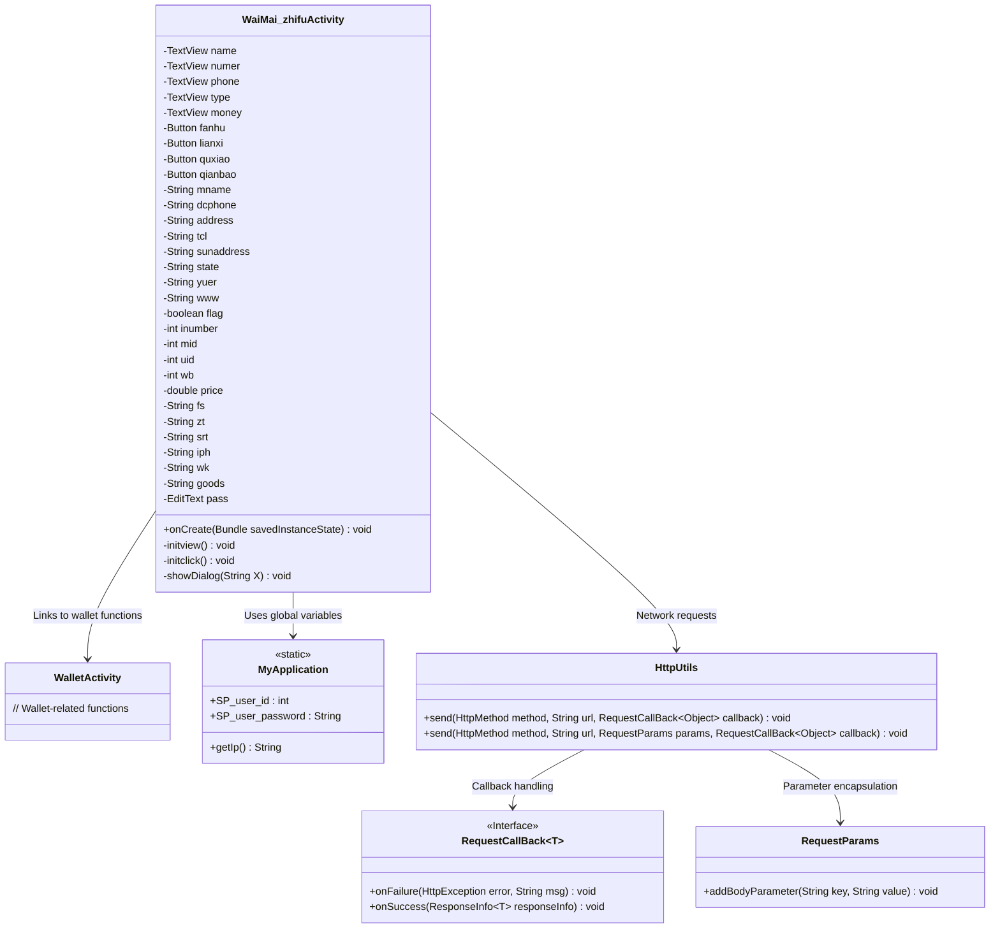
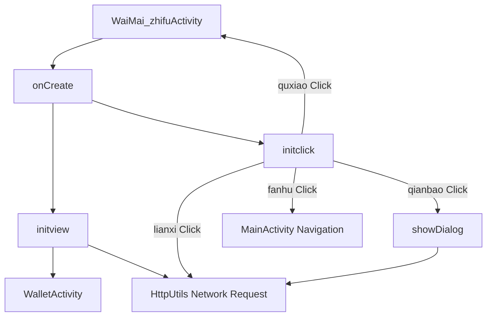
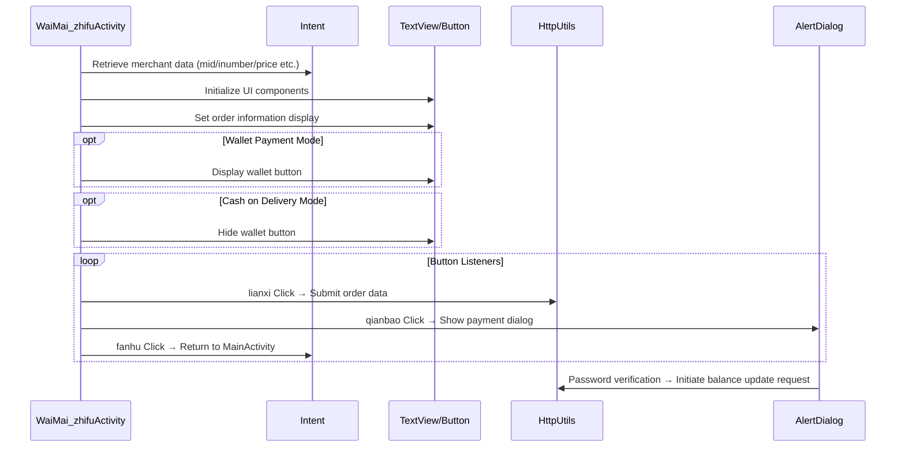

# Basic Information

|      |      |
|------|------|
| Name | WaiMai_zhifuActivity |
| Language | .java |
| Code Path | happycat/src/com/happycat/WaiMai_zhifuActivity.java |
| Package Name | com.happycat |
| Dependencies | ['java.lang.reflect.Type', 'java.text.SimpleDateFormat', 'java.util.Date', 'java.util.LinkedList', 'java.util.List', 'com.example.happucat.R', 'com.google.gson.Gson', 'com.google.gson.reflect.TypeToken', 'com.happycat.Bean.MyBurseBean', 'com.happycat.util.MyApplication', 'com.happycay.fragments.XiaoxiFragment', 'com.lidroid.xutils.HttpUtils', 'com.lidroid.xutils.exception.HttpException', 'com.lidroid.xutils.http.RequestParams', 'com.lidroid.xutils.http.ResponseInfo', 'com.lidroid.xutils.http.callback.RequestCallBack', 'com.lidroid.xutils.http.client.HttpRequest.HttpMethod', 'android.R.integer', 'android.R.string', 'android.app.Activity', 'android.app.AlertDialog', 'android.content.DialogInterface', 'android.content.Intent', 'android.opengl.Visibility', 'android.os.Bundle', 'android.util.Log', 'android.view.LayoutInflater', 'android.view.Menu', 'android.view.MenuItem', 'android.view.View', 'android.view.View.OnClickListener', 'android.view.Window', 'android.widget.Button', 'android.widget.EditText', 'android.widget.TextView', 'android.widget.Toast'] |
| Brief Description | Takeout payment activity class, includes order information display, payment method selection (wallet or cash on delivery), order submission and balance payment functions, supports return, contact merchant, and cancel order operations. |

# Description

The code describes an Android class for a takeout payment activity, with main functionalities including order information display, payment method selection, and order submission. The class defines multiple UI components such as TextView, Button, and EditText to display details like the order name, order number, amount, contact phone number, etc. The payment methods are divided into two states: wallet payment and cash on delivery, which toggle based on the `flag` variable. Users can click buttons to return to the homepage, contact the merchant, cancel the order, or proceed with wallet payment. Wallet payment requires password verification, and insufficient balance triggers a prompt to top up. Order data is submitted to the server via an HTTP request, including fields such as order number, user ID, merchant ID, product quantity, total price, payment method, status, time, and address. Upon successful payment, the balance is updated, and the user is notified of the order submission.

# Class Summary

| Name   | Type  | Description |
|-------|------|-------------|
| WaiMai_zhifuActivity | class | Takeout Payment Activity, which includes order information display, payment method selection (wallet or cash on delivery), order submission and balance payment functions, supports operations such as going back, contacting the merchant, and canceling the order. |

## Class WaiMai_zhifuActivity

|      |      |
|------|------|
| Access Modifier | public |
| Type | class |
| Name | WaiMai_zhifuActivity |
| Description | Takeout Payment Activity, which includes order information display, payment method selection (wallet or cash on delivery), order submission and balance payment functions, supports operations such as going back, contacting the merchant, and canceling the order. |

### UML Class Diagram

This code implements an Android Activity for food delivery payment functionality, primarily including order information display, payment method selection (wallet payment/cash on delivery), network request submission, balance verification, and password validation. The class diagram illustrates core component relationships: WaiMai_zhifuActivity retrieves user data via MyApplication, uses HttpUtils for network communication, relies on RequestParams for parameter encapsulation, processes response results through RequestCallBack, and maintains an association with WalletActivity. The payment flow involves business logic such as amount calculation, password verification, and balance updates.

### Internal Method Call Graph

This flowchart illustrates the core logic of the food delivery payment page: 1) Initializing views with merchant data received via Intent; 2) Dynamically adjusting UI based on payment mode (wallet/cash on delivery); 3) Handling interactions for four buttons including order submission, payment verification, and page navigation. The sequence diagram emphasizes data flow paths and component collaboration, particularly the trigger conditions for network requests and dialogs. The code implements a complete order processing flow with key functional modules such as amount calculation, payment verification, and status tracking.

### Field List

| Name  | Type  | Description |
|-------|-------|------|
| money | TextView | Text view fields: Name, Number, Phone, Type, Amount. |
| price=0 | double | Declare a double-precision floating-point variable price and initialize it to 0. |
| qianbao | Button | Buttons include Back, Contact, Cancel, Wallet. |
| goods | String | Six string variables are defined: fs, zt, srt, iph, wk, goods. |
| www | String | String variable declarations: mname, dcphone, address, tcl, sunaddress, state, yuer, www. |
| flag | boolean | The boolean flag variable `flag` is used to represent true/false states. |
| pass | EditText | Define the password input box variable pass. |
| wb=0 | int | Four integer variables are defined: inumber, mid, uid, wb, all initialized to 0. |

### Method List

| Name  | Type  | Description |
|-------|-------|------|
| onCreate | void | The onCreate method of Android Activity: calls the parent class, hides the title bar, sets the layout, and initializes views and click events. |
| initview | void | Initialize the wallet interface, bind buttons and text controls, retrieve order information (name, number, amount, payment method, phone, etc.), process payment status and method, log records, and set the current time. |
| initclick | void | The method initclick sets up click events for four buttons: return to redirect to the homepage, contact to submit an order (including product information), wallet to display the balance, and cancel to close the page. |
| showDialog | void | The method displays a payment confirmation dialog, verifies the password, and checks the balance. If the balance is insufficient, it prompts for a top-up. Upon successful payment, it submits the order; if it fails, it prompts a network error. The payment can be canceled. |

