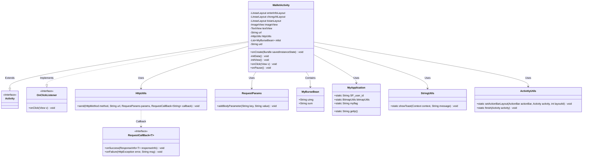
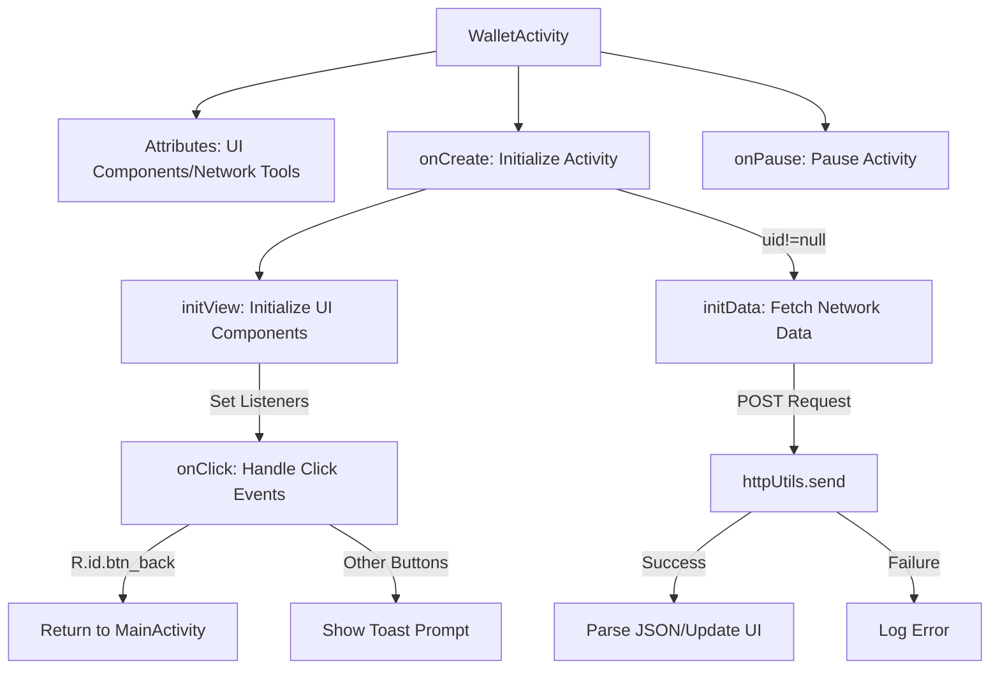
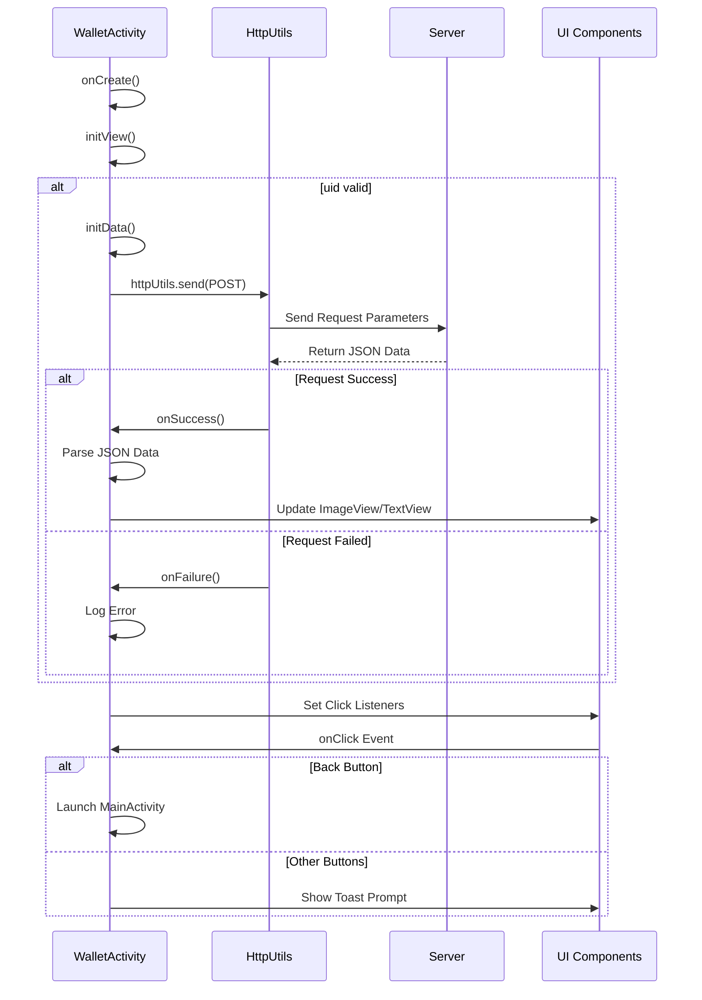

# Basic Information

|      |      |
|------|------|
| Name | WalletActivity |
| Language | .java |
| Code Path | happycat/src/com/happycat/WalletActivity.java |
| Package Name | com.happycat |
| Dependencies | ['java.lang.reflect.Type', 'java.util.LinkedList', 'java.util.List', 'com.example.happucat.R', 'com.google.gson.Gson', 'com.google.gson.reflect.TypeToken', 'com.happycat.Bean.MerchatXqBean', 'com.happycat.Bean.MyBurseBean', 'com.happycat.util.ActivitiyUtils', 'com.happycat.util.MyApplication', 'com.happycat.util.StringUtils', 'com.lidroid.xutils.HttpUtils', 'com.lidroid.xutils.exception.HttpException', 'com.lidroid.xutils.http.RequestParams', 'com.lidroid.xutils.http.ResponseInfo', 'com.lidroid.xutils.http.callback.RequestCallBack', 'com.lidroid.xutils.http.client.HttpRequest.HttpMethod', 'android.app.Activity', 'android.content.Intent', 'android.os.Bundle', 'android.util.Log', 'android.view.View', 'android.view.View.OnClickListener', 'android.widget.ImageView', 'android.widget.LinearLayout', 'android.widget.TextView'] |
| Brief Description | WalletActivity is an Android wallet feature page that includes balance display, deposit, and withdrawal operations. It retrieves user balance and avatar data via HTTP requests, utilizes the XUtils framework to handle network requests and image loading, and supports functions such as clicking back, viewing bills, depositing, and withdrawing. |

# Description

WalletActivity is an Android Activity class that implements the click listener interface. Its primary functions include initializing view components (such as LinearLayout, ImageView, TextView), sending POST requests to the server via HttpUtils to fetch user wallet data, parsing the returned JSON data using Gson, and displaying the user's avatar and balance. It contains three clickable areas: bill details, recharge, and withdrawal, which trigger corresponding operations or page redirects upon clicking. When the activity is paused, it sets a global flag to 1.

# Class Summary

| Name   | Type  | Description |
|-------|------|-------------|
| WalletActivity | class | WalletActivity is an Android wallet feature interface that includes balance display, deposit, and withdrawal operations. It retrieves user balance and avatar data via HTTP requests, utilizes the XUtils framework to handle network requests and image loading, and supports functions such as clicking back, viewing bills, depositing, and withdrawing. |

## Class WalletActivity

|      |      |
|------|------|
| Access Modifier | public |
| Type | class |
| Name | WalletActivity |
| Description | WalletActivity is an Android wallet feature interface that includes balance display, deposit, and withdrawal operations. It retrieves user balance and avatar data via HTTP requests, utilizes the XUtils framework to handle network requests and image loading, and supports functions such as clicking back, viewing bills, depositing, and withdrawing. |

### UML Class Diagram

This code demonstrates the class structure of an Android WalletActivity, which extends Activity and implements the OnClickListener interface. Its main functionalities include initializing views, handling user click events, fetching wallet data from the server, and displaying it. Network requests are performed via HttpUtils with JSON data parsed using Gson, while relying on multiple utility classes (MyApplication, StringUtils, etc.) to complete operations. The class diagram clearly illustrates inheritance, implementation, and dependency relationships between components.

### Internal Method Call Graph

This code implements a wallet feature for an Android Activity, primarily involving UI initialization, network data requests, and user interaction handling. The flowchart illustrates the complete lifecycle from Activity creation to destruction, highlighting the network request branches and click event processing flow. The sequence diagram details the interaction process between HttpUtils and the server, as well as the UI component update mechanism. The code utilizes the XUtils framework for network communication, Gson for JSON data parsing, and adopts the MVC pattern to separate business logic from interface presentation.

### Field List

| Name  | Type  | Description |
|-------|-------|------|
| tixianLayout | LinearLayout | The variable `tixianLayout` in LinearLayout is used for interface layout. |
| mlist | List<MyBurseBean> | The variable mlist is a list of type MyBurseBean. |
| httpUtils | HttpUtils | Declaration of HttpUtils utility class instance. |
| uid=MyApplication.SP_user_id+"" | String | Define a private string variable uid with the value converted to string from MyApplication.SP_user_id. |
| chongzhiLayout | LinearLayout | Linear Layout Recharge Interface Controls |
| enterInfoLayout | LinearLayout | Declare a LinearLayout layout variable named enterInfoLayout. |
| textView | TextView | Declare a variable named textView of type TextView. |
| imageView | ImageView | Declare a variable named imageView of type ImageView. |
| url | String | Declare a private string variable url. |

### Method List

| Name  | Type  | Description |
|-------|-------|------|
| onPause | void | Override the onPause method, after calling the superclass method, set MyApplication.myflag to "1". |
| initView | void | Initialize interface controls: Set up the back button, balance information, recharge, withdrawal layouts, and click listeners for images and text views. |
| initData | void | The method initData uses the XUtils framework to send a POST request to the server, retrieves JSON data, parses it into a list of MyBurseBean, and displays images and amounts. Errors are logged upon failure. |
| onCreate | void | Android Activity Initialization: Set up layout, title bar, and views. Load data if uid is not empty. |
| onClick | void | Rewrite the onClick method to perform different actions based on the view ID: return to the main interface, display bill details, or prompt for top-up/withdrawal. |

