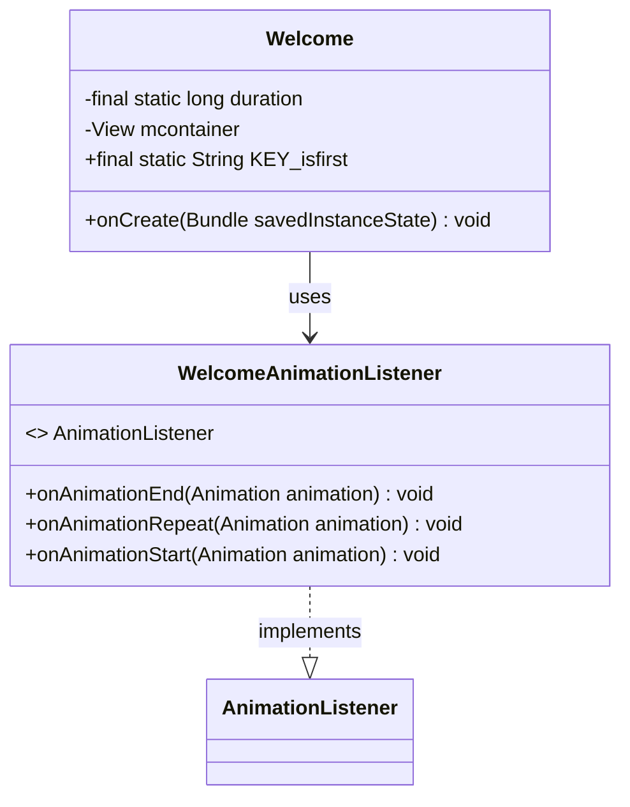
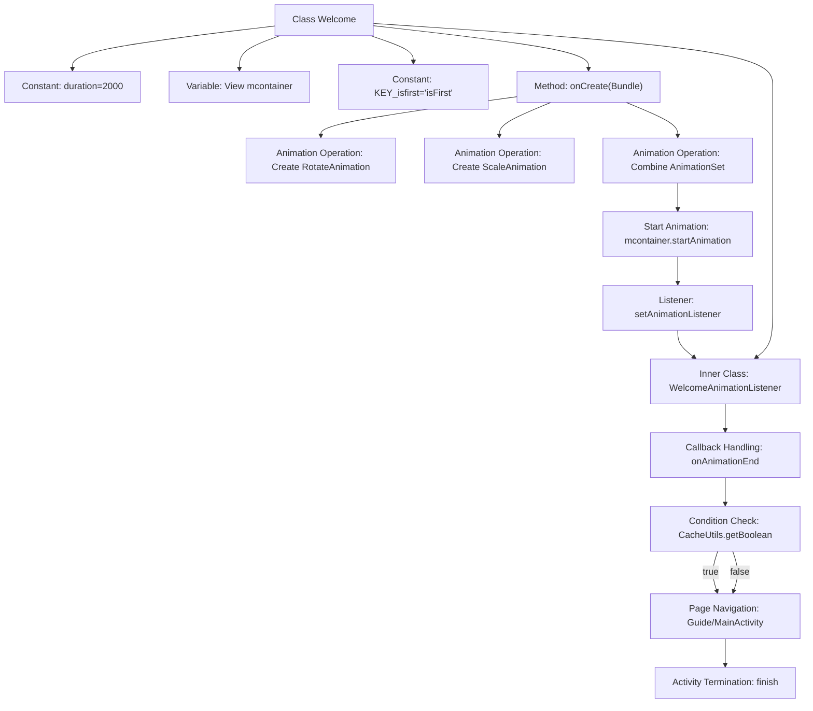

# Basic Information

|      |      |
|------|------|
| Name | Welcome |
| Language | .java |
| Code Path | happycat/src/com/happycat/Welcome.java |
| Package Name | com.happycat |
| Dependencies | ['com.example.happucat.R', 'com.happycat.util.CacheUtils', 'android.os.Bundle', 'android.app.Activity', 'android.content.Intent', 'android.view.View', 'android.view.Window', 'android.view.animation.Animation', 'android.view.animation.Animation.AnimationListener', 'android.view.animation.AnimationSet', 'android.view.animation.RotateAnimation', 'android.view.animation.ScaleAnimation'] |
| Brief Description | Welcome page Activity class, includes rotation and scaling animations, jumps to the guide page on first login, otherwise enters the home page. |

# Description

This is an Activity implementation for a welcome page, featuring a combined animation effect lasting 2000 milliseconds. The animation consists of rotation and scaling, both centered on the view's axis. Upon first launch, the page checks whether it is the first login. If so, it redirects to the guide page Guide; otherwise, it redirects to the main page MainActivity. The current page automatically closes after the animation ends. Key variables include the animation duration `duration` and the first login flag `KEY_isfirst`.

# Class Summary

| Name   | Type  | Description |
|-------|------|-------------|
| Welcome | class | Welcome page Activity class, includes rotation and scaling animation. Redirects to the guide page on first login, otherwise proceeds to the main page. Animation duration is 2 seconds, and the redirect is executed upon listening to the animation end. |

## Class Welcome

|      |      |
|------|------|
| Access Modifier | public |
| Type | class |
| Name | Welcome |
| Description | Welcome page Activity class, includes rotation and scaling animation. Redirects to the guide page on first login, otherwise proceeds to the main page. Animation duration is 2 seconds, and the redirect is executed upon listening to the animation end. |

### UML Class Diagram

Class diagram description:
This diagram illustrates the structure of the Welcome activity class and its internal animation listener in Android. The Welcome class inherits from Activity, containing duration constants, view containers, and a first-login flag, primarily handling the creation of welcome screens and animation effects. WelcomeAnimationListener implements the AnimationListener interface to handle animation events, determining whether to navigate to the guide page or home page based on first-login status. The two are associated through a dependency relationship, reflecting the typical interaction pattern between activities and animation listeners in Android.

### Internal Method Call Graph

This code represents an Android welcome page Activity implementation. Its primary function is to display a 2-second combined animation (rotation + scaling) before navigating to different pages based on first-launch status. The flowchart clearly illustrates the complete workflow from view initialization, animation creation, listener setup to final page navigation. Key paths include animation combination, listener callback handling, and conditional jump logic. The code uses CacheUtils to determine the app's first-launch state, directing to either a guide page or main page, and finally destroys the current Activity.

### Field List

| Name  | Type  | Description |
|-------|-------|------|
| mcontainer | View | Private view container variable mcontainer |
| duration = 2000 | long | Defined a private static long constant duration with a value of 2000. |
| KEY_isfirst="isFirst" | String | Static constant string KEY_isfirst with the value "isFirst". |

### Method List

| Name  | Type  | Description |
|-------|-------|------|
| onCreate | void | When creating an Android Activity, remove the title and set a combined rotation and scale animation while monitoring the animation state. |

