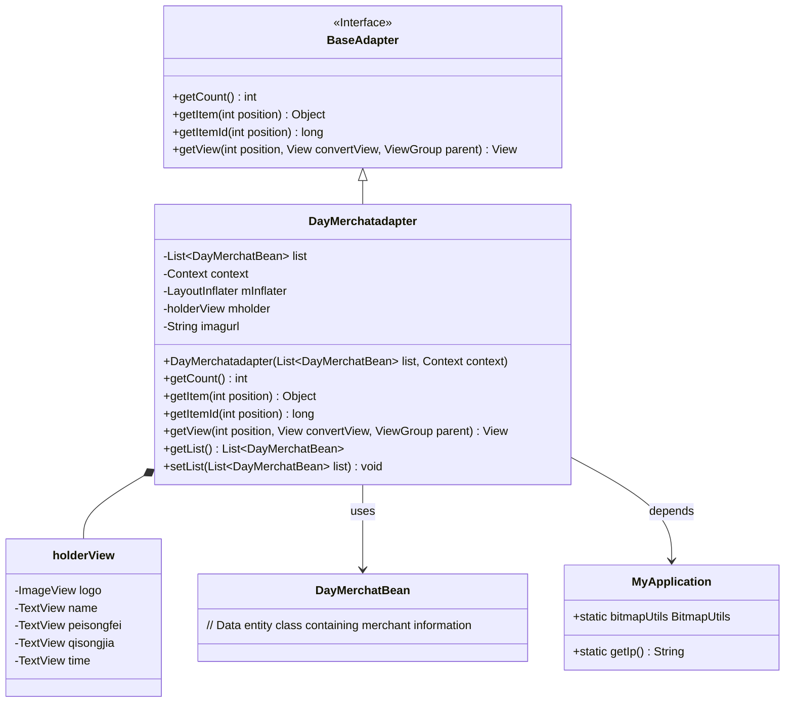

# Basic Information

|      |      |
|------|------|
| Name | DayMerchatadapter |
| Language | .java |
| Code Path | happycat/src/com/happycat/adapter/DayMerchatadapter.java |
| Package Name | com.happycat.adapter |
| Dependencies | ['java.util.List', 'com.example.happucat.R', 'com.happycat.Bean.DayMerchatBean', 'com.happycat.Bean.Goods', 'com.happycat.util.MyApplication', 'android.R.integer', 'android.content.Context', 'android.util.Log', 'android.view.LayoutInflater', 'android.view.View', 'android.view.ViewGroup', 'android.widget.BaseAdapter', 'android.widget.ImageView', 'android.widget.TextView'] |
| Brief Description | The DayMerchantAdapter is an Android adapter class designed to display a list of merchants, including details such as names, delivery fees, minimum order prices, and delivery times. It supports image loading and view recycling. |

# Description

The DayMerchatadapter is a custom adapter that inherits from BaseAdapter, designed to display merchant list data in Android applications. It takes a list of DayMerchatBean objects and a Context as constructor parameters, and loads the layout via LayoutInflater. The adapter internally defines a holderView class containing view components such as merchant logo, name, delivery fee, minimum order price, and delivery time. The getView method handles view reuse and data binding, setting merchant information to the corresponding views and using MyApplication.bitmapUtils to load remote images. Additionally, it provides methods for getting and setting the list data.

# Class Summary

| Name   | Type  | Description |
|-------|------|-------------|
| DayMerchatadapter | class | DayMerchantAdapter is an Android adapter class designed to display a list of merchants, including information such as names, delivery fees, minimum order prices, and delivery times. It supports image loading and list item recycling. |

## Class DayMerchatadapter

|      |      |
|------|------|
| Access Modifier | public |
| Type | class |
| Name | DayMerchatadapter |
| Description | DayMerchantAdapter is an Android adapter class designed to display a list of merchants, including information such as names, delivery fees, minimum order prices, and delivery times. It supports image loading and list item recycling. |

### UML Class Diagram

This code demonstrates an Android custom adapter DayMerchatadapter, which inherits from BaseAdapter and is used to display merchant list data in a ListView. The adapter internally employs the holderView pattern to optimize view performance, utilizing MyApplication to fetch network image URLs and image loading utilities. The class diagram clearly illustrates the relationships between the adapter, data entities, utility classes, as well as the structure of the internal view holder.

### Internal Method Call Graph

```mermaid
graph TD
    A["Class DayMerchatadapter"]
    B["Property: List<DayMerchatBean> list"]
    C["Property: Context context"]
    D["Property: LayoutInflater mInflater"]
    E["Property: holderView mholder"]
    F["Property: String imagurl"]
    G["Constructor: DayMerchatadapter(List, Context)"]
    H["Method: int getCount()"]
    I["Method: Object getItem(int)"]
    J["Method: long getItemId(int)"]
    K["Inner Class: holderView"]
    L["Method: View getView(int, View, ViewGroup)"]
    M["Method: List<DayMerchatBean> getList()"]
    N["Method: void setList(List)"]
    O["holderView Property: ImageView logo"]
    P["holderView Property: TextView name"]
    Q["holderView Property: TextView peisongfei"]
    R["holderView Property: TextView qisongjia"]
    S["holderView Property: TextView time"]

    A --> B
    A --> C
    A --> D
    A --> E
    A --> F
    A --> G
    A --> H
    A --> I
    A --> J
    A --> K
    A --> L
    A --> M
    A --> N
    K --> O
    K --> P
    K --> Q
    K --> R
    K --> S
```

This code represents an Android custom adapter class that extends BaseAdapter, primarily used to display merchant list data in a ListView. Core functionalities include data binding (getView method), view recycling mechanism (holderView pattern), and implementation of basic adapter methods (getCount/getItem, etc.). It dynamically loads layouts via LayoutInflater to bind merchant names, delivery fees, minimum order prices, and other information to corresponding views, while utilizing image loading tools to display merchant logos. The inner class holderView optimizes list performance by avoiding repetitive view lookups.

### Field List

| Name  | Type  | Description |
|-------|-------|------|
| mholder | holderView | The variable mholder is of type holderView. |
| context | Context | Define a variable context of type Context. |
| list | List<DayMerchatBean> | List of DayMerchatBean objects. |
| mInflater | LayoutInflater | LayoutInflater is used to instantiate XML layout files into corresponding View objects. |
| imagurl=" http://" + MyApplication.getIp()			+ ":8080//happycat/upimage/" | String | The code snippet defines a string variable `imagurl`, which constructs an image URL by concatenating the protocol, IP address, and path. |

### Method List

| Name  | Type  | Description |
|-------|-------|------|
| getView | View | Android list item view adaptation method, reuse convertView to optimize performance, dynamically set merchant name, delivery fee, minimum order price, delivery time, and Logo image. |
| getItem | Object | The method `getItem` returns the element at the specified position in the list. The parameter `position` is the index, and it returns the corresponding element. |
| getCount | int | The method getCount returns the size of the list. |
| getItemId | long | The method `getItemId` returns the ID of the list item, here it directly returns the position value `position`. |
| getList | List<DayMerchatBean> | The method returns a list of DayMerchatBean type. |
| setList | void | The method `setList` takes a List parameter of type `DayMerchatBean` and assigns it to the `list` property of the current object. |

