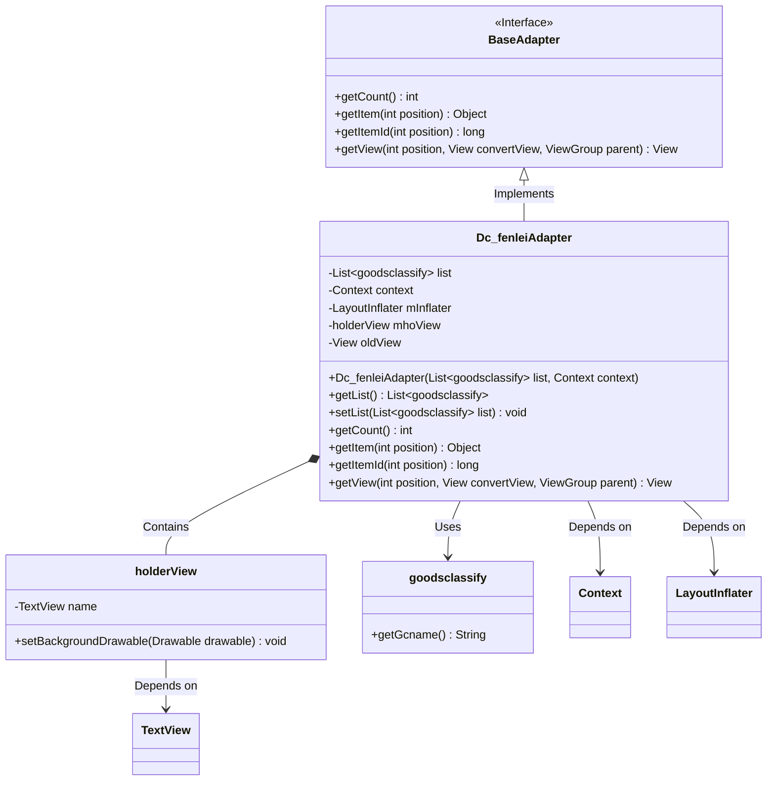

# Basic Information

|      |      |
|------|------|
| Name | Dc_fenleiAdapter |
| Language | .java |
| Code Path | happycat/src/com/happycat/adapter/Dc_fenleiAdapter.java |
| Package Name | com.happycat.adapter |
| Dependencies | ['java.util.List', 'com.example.happucat.R', 'com.happycat.Bean.goodsclassify', 'android.content.Context', 'android.graphics.drawable.Drawable', 'android.view.LayoutInflater', 'android.view.View', 'android.view.View.OnClickListener', 'android.view.ViewGroup', 'android.widget.BaseAdapter', 'android.widget.TextView'] |
| Brief Description | Dc_fenleiAdapter is an Android list adapter designed to display the goodsclassify data list, incorporating view reuse and holder pattern optimization. |

# Description

The Dc_fenleiAdapter is a custom adapter class that inherits from BaseAdapter, designed to display product category lists in Android applications. It contains a list data of type goodsclassify, initialized via the constructor along with the context. The adapter provides methods to retrieve the list size and obtain data items at specified positions. The inner class holderView is used to cache view controls, including a TextView member named name. The getView method implements view reuse logic: when convertView is null, it loads the layout and initializes holderView; otherwise, it reuses existing views. Finally, it sets the current category name and returns the view. The commented section indicates unimplemented click event handling logic, involving view background switching functionality.

# Class Summary

| Name   | Type  | Description |
|-------|------|-------------|
| Dc_fenleiAdapter | class | Dc_fenleiAdapter is a custom Android adapter designed to display product category lists, incorporating data binding and view recycling logic. |

## Class Dc_fenleiAdapter

|      |      |
|------|------|
| Access Modifier | public |
| Type | class |
| Name | Dc_fenleiAdapter |
| Description | Dc_fenleiAdapter is a custom Android adapter designed to display product category lists, incorporating data binding and view recycling logic. |

### UML Class Diagram

Class diagram description:
Dc_fenleiAdapter inherits from BaseAdapter and serves as a data adapter for product category lists. It contains an inner class holderView for view caching optimization, which holds TextView controls. The adapter stores data via List<goodsclassify> and dynamically loads layouts using LayoutInflater. The core method getView() implements a view reuse mechanism, reducing overhead from repeated view creation through convertView and setTag/getTag. The annotation section shows unimplemented click state toggle logic, with the current version only supporting basic text display functionality.

### Internal Method Call Graph

```mermaid
graph TD
    A["Class Dc_fenleiAdapter"]
    B["Inheritance: BaseAdapter"]
    C["Property: List<goodsclassify> list"]
    D["Property: Context context"]
    E["Property: LayoutInflater mInflater"]
    F["Property: holderView mhoView"]
    G["Property: View oldView"]
    H["Constructor: Dc_fenleiAdapter(List<goodsclassify>, Context)"]
    I["Method: getList()"]
    J["Method: setList(List<goodsclassify>)"]
    K["Override Method: getCount()"]
    L["Override Method: getItem(int)"]
    M["Override Method: getItemId(int)"]
    N["Override Method: getView(int, View, ViewGroup)"]
    O["Inner Class: holderView"]
    P["holderView Property: TextView name"]
    Q["holderView Method: setBackgroundDrawable(Drawable)"]

    A --> B
    A --> C
    A --> D
    A --> E
    A --> F
    A --> G
    A --> H
    A --> I
    A --> J
    A --> K
    A --> L
    A --> M
    A --> N
    A --> O
    O --> P
    O --> Q
```

This code represents a typical custom Adapter implementation in Android development for ListView/RecyclerView data binding. Its primary functions include: managing a product category data list (list), implementing view recycling logic through the getView() method, and optimizing performance using the holderView pattern. The constructor initializes the layout inflater (mInflater), while getView() sets the corresponding product category name based on position and handles tag storage logic during view recycling.

### Field List

| Name  | Type  | Description |
|-------|-------|------|
| oldView = null | View | Declare a view variable named oldView, initialized to null. |
| mInflater | LayoutInflater | Layout filler object, used for dynamically loading XML layout files as view objects. |
| list | List<goodsclassify> | Define a product category list variable named list. |
| context | Context | Define the context object variable `context`. |
| mhoView | holderView | The type of the variable holderView is mhoView. |

### Method List

| Name  | Type  | Description |
|-------|-------|------|
| getView | View | This is an Android list item view adaptation method that checks for reusable views and sets the category name text, finally returning the view object. |
| getCount | int | Override the method getCount to return the size of the list. |
| getItem | Object | The method getItem returns the element at the specified position in the list. |
| setList | void | The method to set the product category list assigns the passed-in list to the list property of the current object. |
| getList | List<goodsclassify> | The method returns a list of product categories. |
| getItemId | long | The method getItemId returns the ID at the specified position, with the default implementation directly returning the position value. |

