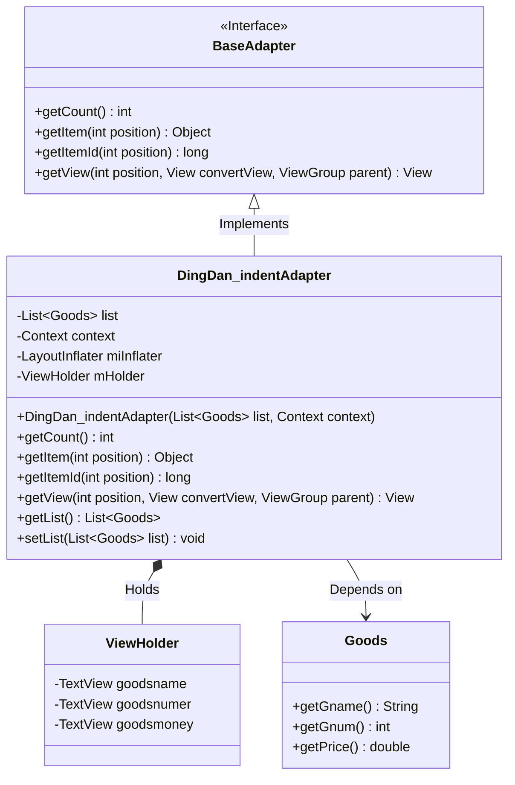
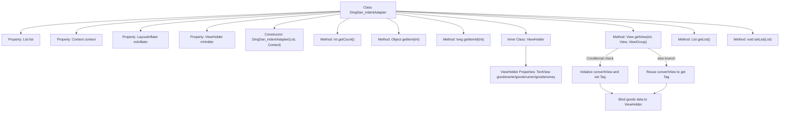

# Basic Information

|      |      |
|------|------|
| Name | DingDan_indentAdapter |
| Language | .java |
| Code Path | happycat/src/com/happycat/adapter/DingDan_indentAdapter.java |
| Package Name | com.happycat.adapter |
| Dependencies | ['java.util.List', 'com.example.happucat.R', 'com.example.happucat.R.string', 'com.happycat.Bean.Goods', 'com.happycat.Bean.PingjiaBean', 'com.happycat.util.MyApplication', 'android.content.Context', 'android.view.LayoutInflater', 'android.view.View', 'android.view.ViewGroup', 'android.widget.BaseAdapter', 'android.widget.ImageView', 'android.widget.RadioButton', 'android.widget.TextView'] |
| Brief Description | The custom adapter class DingDan_indentAdapter extends BaseAdapter, designed for displaying order product lists, incorporating data binding and view recycling logic. |

# Description

DingDan_indentAdapter is a custom adapter class that inherits from BaseAdapter, designed to display a list of order items in Android applications. It accepts a list of Goods objects and a Context as constructor parameters, and loads the layout via LayoutInflater. The adapter internally defines a ViewHolder class to cache view controls, including TextViews for product name, quantity, and amount. The getView method implements view reuse logic: initializing controls and setting Tags during the first load, and directly reusing them thereafter. During the data binding phase, the product name, quantity, and total amount (unit price multiplied by quantity) are set to the corresponding controls. The class also provides methods to get and set the product list. This adapter is primarily used to optimize the display performance of order lists.

# Class Summary

| Name   | Type  | Description |
|-------|------|-------------|
| DingDan_indentAdapter | class | Custom order list adapter, inheriting from BaseAdapter, includes product list, context, and layout inflater, implements list item view reuse, and displays product name, quantity, and total price. |

## Class DingDan_indentAdapter

|      |      |
|------|------|
| Access Modifier | public |
| Type | class |
| Name | DingDan_indentAdapter |
| Description | Custom order list adapter, inheriting from BaseAdapter, includes product list, context, and layout inflater, implements list item view reuse, and displays product name, quantity, and total price. |

### UML Class Diagram

This code demonstrates an Android order list adapter DingDan_indentAdapter, which inherits from the BaseAdapter interface and is used to manage the display of product data in a ListView. The adapter internally employs the ViewHolder pattern for performance optimization, containing TextView controls for product name, quantity, and amount. It dynamically loads layouts via LayoutInflater and implements data binding logic. The class diagram clearly reflects the adapter's associations with the data model Goods and view container ViewHolder, as well as its hierarchical structure as an implementation class of BaseAdapter.

### Internal Method Call Graph

This code represents a custom adapter in Android development for displaying order lists, inheriting from BaseAdapter. Its main functionalities include: initializing data and layout inflater through the constructor, implementing the getView method for list item view recycling (optimized via ViewHolder pattern), and dynamically binding goods name, quantity, and price data. The adapter also provides basic list data access and modification methods, with an inner ViewHolder class managing list item view components to efficiently avoid repetitive view resource lookups.

### Field List

| Name  | Type  | Description |
|-------|-------|------|
| context | Context | Define a context variable `context` of type `Context`. |
| mHolder | ViewHolder | Define the ViewHolder variable mHolder for list item view reuse optimization. |
| miInflater | LayoutInflater | Declaration of layout filler instance variables. |
| list | List<Goods> | Declare a list of Goods objects named list. |

### Method List

| Name  | Type  | Description |
|-------|-------|------|
| getList | List<Goods> | The method returns a list of products. |
| getView | View | Rewrite the getView method, initialize or reuse the list item layout, set the product name, quantity, and price, and return the view. |
| getCount | int | The method getCount returns the size of the list. |
| getItem | Object | This is a Java method that overrides the getItem function to return the element at the corresponding position in the list based on the incoming position parameter. |
| getItemId | long | The method getItemId returns the ID at the specified position, and here it directly returns the position value. |
| setList | void | The method for setting the product list assigns the passed-in list to the `list` property of the current object. |

