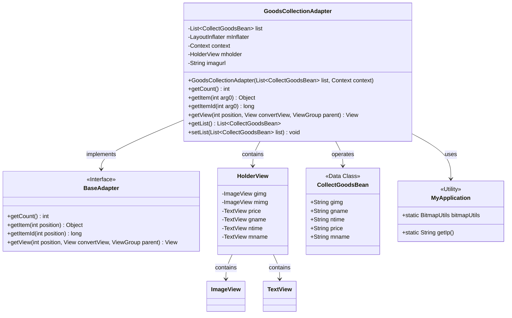
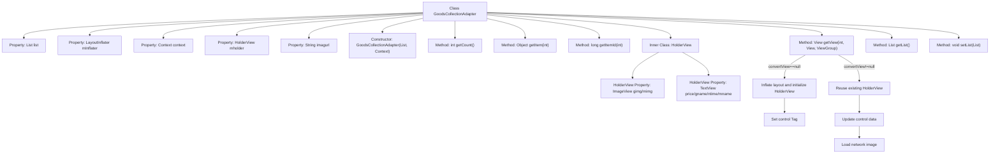

# Basic Information

|      |      |
|------|------|
| Name | GoodsCollectionAdapter |
| Language | .java |
| Code Path | happycat/src/com/happycat/adapter/GoodsCollectionAdapter.java |
| Package Name | com.happycat.adapter |
| Dependencies | ['java.util.List', 'com.example.happucat.R', 'com.happycat.Bean.CollectBean', 'com.happycat.Bean.CollectGoodsBean', 'com.happycat.util.MyApplication', 'android.content.Context', 'android.util.Log', 'android.view.LayoutInflater', 'android.view.View', 'android.view.ViewGroup', 'android.widget.BaseAdapter', 'android.widget.ImageView', 'android.widget.TextView'] |
| Brief Description | The GoodsCollectionAdapter is an Android adapter class designed to display a list of favorite products, including images, names, prices, and timestamps, with support for data binding and view recycling. |

# Description

The GoodsCollectionAdapter is a custom adapter class that extends BaseAdapter, designed to display a list of collected goods in an Android application. It accepts a list of CollectGoodsBean type and a context object as constructor parameters. Internally, the adapter defines a HolderView class to cache view components, including controls for product images, prices, names, and collection times. The getView method is responsible for populating list item views, setting product information, and loading remote images. The adapter also provides methods for retrieving and updating the list data. Image URLs are generated by concatenating the base path with the product image path.

# Class Summary

| Name   | Type  | Description |
|-------|------|-------------|
| GoodsCollectionAdapter | class | The GoodsCollectionAdapter is an Android adapter class designed to display a list of favorite products, including images, names, prices, and timestamps. It implements data binding and view recycling through BaseAdapter. |

## Class GoodsCollectionAdapter

|      |      |
|------|------|
| Access Modifier | public |
| Type | class |
| Name | GoodsCollectionAdapter |
| Description | The GoodsCollectionAdapter is an Android adapter class designed to display a list of favorite products, including images, names, prices, and timestamps. It implements data binding and view recycling through BaseAdapter. |

### UML Class Diagram

This code demonstrates an Android adapter class GoodsCollectionAdapter that extends BaseAdapter to display product collection data in a ListView. The class diagram illustrates the relationships between the adapter and the data model CollectGoodsBean, view holder HolderView, and utility class MyApplication. The adapter binds data to views via the getView method, utilizes the ViewHolder pattern for performance optimization, and accesses network image URLs and image loading tools through MyApplication. The overall design embodies a typical Android list adapter pattern, incorporating key functionalities such as data binding, view recycling, and external resource access.

### Internal Method Call Graph

This code represents a custom adapter class in Android for binding product collection data to list views like ListView or GridView. Core functionalities include data counting, item retrieval, view creation and updating, with special handling of view recycling mechanism for performance optimization. It employs HolderView pattern to streamline control lookup, dynamically constructs list items containing product images, names, prices, and collection timestamps, and supports remote image loading via URLs. The adapter also provides methods for getting and setting the data list, facilitating external manipulation of the data source.

### Field List

| Name  | Type  | Description |
|-------|-------|------|
| context | Context | Define the context object variable `context`. |
| mInflater | LayoutInflater | Private layout inflater mInflater. |
| list | List<CollectGoodsBean> | The private list variable `list` stores objects of type `CollectGoodsBean`. |
| mholder | HolderView | Variable mholder of type HolderView. |
| imagurl = " http://" + MyApplication.getIp() + ":8080/happycat/img/" | String | Generate image URL by concatenating strings in code, including server IP and path. |

### Method List

| Name  | Type  | Description |
|-------|-------|------|
| getItem | Object | This method overrides getItem, takes an int parameter arg0, and returns the element at index arg0 in the list. |
| getItemId | long | Rewrite the getItemId method to directly return the value of the input parameter arg0. |
| getCount | int | The method getCount returns the size of the list. |
| getView | View | Customize the adapter's getView method to reuse views for performance optimization, binding product image, name, price, and favorite time data to the list item view. |
| getList | List<CollectGoodsBean> | The method returns a collection list of products. |
| setList | void | This is a Java method used to set the member variable 'list' of the class, with the parameter being a list of type CollectGoodsBean. |

