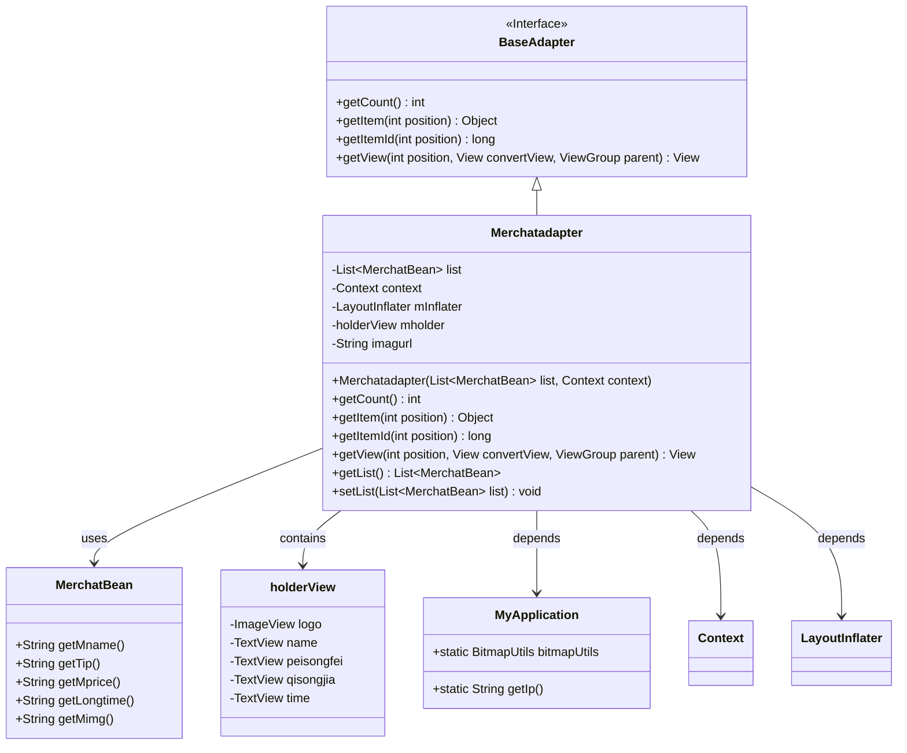

# Basic Information

|      |      |
|------|------|
| Name | Merchatadapter |
| Language | .java |
| Code Path | happycat/src/com/happycat/adapter/Merchatadapter.java |
| Package Name | com.happycat.adapter |
| Dependencies | ['java.util.List', 'com.example.happucat.R', 'com.happycat.Bean.Goods', 'com.happycat.Bean.MerchatBean', 'com.happycat.util.MyApplication', 'android.R.integer', 'android.content.Context', 'android.util.Log', 'android.view.LayoutInflater', 'android.view.View', 'android.view.ViewGroup', 'android.widget.BaseAdapter', 'android.widget.ImageView', 'android.widget.TextView'] |
| Brief Description | The Merchatadapter is an Android adapter class that extends BaseAdapter, designed to display merchant list data including details such as name, delivery fee, minimum order price, and delivery time, with ViewHolder used to optimize performance. |

# Description

The Merchatadapter is a custom adapter class that inherits from BaseAdapter, designed to display merchant list data in Android applications. This class contains a merchant data list (list) and a context (context), loading layouts via LayoutInflater. The adapter internally defines a holderView class to cache view controls, including the merchant's logo, name, delivery fee, minimum order price, and delivery time. The getView method is responsible for binding data to views, utilizing the ViewHolder pattern for performance optimization. Images are loaded from specified URLs through MyApplication.bitmapUtils. The adapter also provides methods for retrieving and setting the data list.

# Class Summary

| Name   | Type  | Description |
|-------|------|-------------|
| Merchatadapter | class | Merchatadapter is a custom Android adapter designed for displaying merchant lists. It extends BaseAdapter and includes information such as merchant names, delivery fees, minimum order prices, and delivery times, while utilizing ViewHolder to optimize performance. Images are loaded via URLs. |

## Class Merchatadapter

|      |      |
|------|------|
| Access Modifier | public |
| Type | class |
| Name | Merchatadapter |
| Description | Merchatadapter is a custom Android adapter designed for displaying merchant lists. It extends BaseAdapter and includes information such as merchant names, delivery fees, minimum order prices, and delivery times, while utilizing ViewHolder to optimize performance. Images are loaded via URLs. |

### UML Class Diagram

This diagram illustrates the structure and relationships of an Android adapter class `Merchatadapter`. The class inherits from the `BaseAdapter` interface and is designed to manage the display of a `MerchatBean` data list. The inner class `holderView` optimizes view caching by containing multiple TextView and ImageView controls. The adapter retrieves network image addresses and utility classes via `MyApplication`, while relying on Android's `Context` and `LayoutInflater` for view rendering. The overall design achieves efficient list data binding and display optimization.

### Internal Method Call Graph

```mermaid
graph TD
    A["Class Merchatadapter"]
    B["Attribute: List<MerchatBean> list"]
    C["Attribute: Context context"]
    D["Attribute: LayoutInflater mInflater"]
    E["Attribute: holderView mholder"]
    F["Attribute: String imagurl"]
    G["Constructor: Merchatadapter(List, Context)"]
    H["Method: int getCount()"]
    I["Method: Object getItem(int)"]
    J["Method: long getItemId(int)"]
    K["Inner Class: holderView"]
    L["Method: View getView(int, View, ViewGroup)"]
    M["Method: List<MerchatBean> getList()"]
    N["Method: void setList(List<MerchatBean>)"]
    O["holderView Attribute: ImageView logo"]
    P["holderView Attribute: TextView name"]
    Q["holderView Attribute: TextView peisongfei"]
    R["holderView Attribute: TextView qisongjia"]
    S["holderView Attribute: TextView time"]

    A --> B
    A --> C
    A --> D
    A --> E
    A --> F
    A --> G
    A --> H
    A --> I
    A --> J
    A --> K
    A --> L
    A --> M
    A --> N
    K --> O
    K --> P
    K --> Q
    K --> R
    K --> S
```

This flowchart illustrates the complete structure of the Merchatadapter class, a typical Android adapter implementation. As a subclass of BaseAdapter, it contains 5 core attributes (including a static image URL), 4 overridden base adapter methods (getCount/getItem/getItemId/getView), 2 list operation methods, and an inner ViewHolder class. Notably, the getView method implements view recycling through convertView null checks and setTag/getTag optimizations for list performance, while utilizing MyApplication.bitmapUtils for asynchronous image loading. The overall structure exemplifies Android list adapter best practices.

### Field List

| Name  | Type  | Description |
|-------|-------|------|
| mInflater | LayoutInflater | Layout loader object, used for dynamically loading XML layout files into views. |
| context | Context | Declare a variable named context of type Context. |
| imagurl=" http://" + MyApplication.getIp()			+ ":8080//happycat/upimage/" | String | The code snippet defines a string variable `imagurl`, which constructs a complete image upload URL by concatenating the HTTP protocol, IP address, and path. |
| list | List<MerchatBean> | List of stored merchant objects. |
| mholder | holderView | The variable mholder is of the holderView type. |

### Method List

| Name  | Type  | Description |
|-------|-------|------|
| getItem | Object | The method getItem returns the element at the specified position in the list. The parameter position is the index, and it returns the object at the corresponding position. |
| getItemId | long | The method getItemId returns the ID at the specified position, with the default implementation directly returning the position value. |
| getView | View | The Android adapter's getView method reuses the convertView to optimize performance, binding merchant name, delivery fee, minimum order price, delivery time, and logo image data to the list item view. |
| getCount | int | The method getCount returns the size of the list and outputs the log "GETCOUNT" when called. |
| getList | List<MerchatBean> | The method returns a list of MerchantBean type. |
| setList | void | Set the merchant list, assigning the passed list to the `list` property of the current object. |

