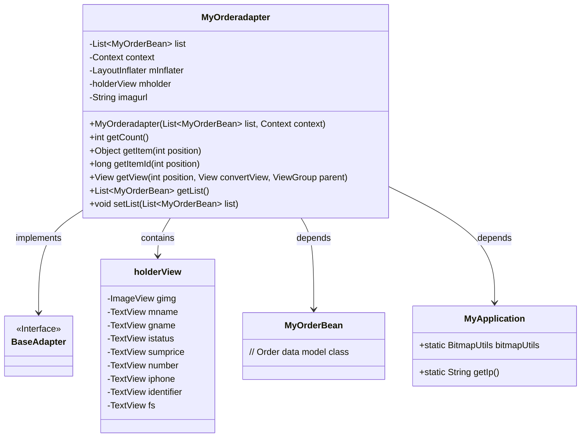

# Basic Information

|      |      |
|------|------|
| Name | MyOrderadapter |
| Language | .java |
| Code Path | happycat/src/com/happycat/adapter/MyOrderadapter.java |
| Package Name | com.happycat.adapter |
| Dependencies | ['java.util.List', 'com.example.happucat.R', 'com.happycat.Bean.MyOrderBean', 'com.happycat.util.MyApplication', 'android.content.Context', 'android.view.LayoutInflater', 'android.view.View', 'android.view.ViewGroup', 'android.widget.BaseAdapter', 'android.widget.ImageView', 'android.widget.TextView'] |
| Brief Description | MyOrderAdapter is an Android order list adapter that extends BaseAdapter, incorporating functionalities for order data binding, view recycling, and image loading. |

# Description

This is a custom adapter class named MyOrderadapter, which inherits from BaseAdapter and is used to display an order list in an Android application. It includes a list of MyOrderBean objects and a context object as constructor parameters. The adapter manages the view components of list items through the holderView inner class, including images, order names, product names, order statuses, total prices, quantities, phone numbers, order numbers, and payment methods. The getView method is responsible for populating list item data, using LayoutInflater to load the layout and BitmapUtils to display product images. The image URL is generated by concatenating the base path with the product image name. The adapter also provides methods for getting and setting the list data.

# Class Summary

| Name   | Type  | Description |
|-------|------|-------------|
| MyOrderadapter | class | Custom order adapter class, inherits from BaseAdapter, used to display order list data, including view reuse and data processing logic. |

## Class MyOrderadapter

|      |      |
|------|------|
| Access Modifier | public |
| Type | class |
| Name | MyOrderadapter |
| Description | Custom order adapter class, inherits from BaseAdapter, used to display order list data, including view reuse and data processing logic. |

### UML Class Diagram

This code demonstrates an Android custom adapter `MyOrderadapter` that extends `BaseAdapter`, used to display order data in a ListView. The adapter internally defines `holderView` as a view cache container, implementing view reuse and data binding through the `getView()` method. The class diagram clearly shows the adapter's dependency relationships with the data model `MyOrderBean` and utility class `MyApplication`, as well as the composition structure of the internal view container, reflecting a typical Android list optimization implementation approach.

### Internal Method Call Graph

```mermaid
graph TD
    A["Class MyOrderadapter extends BaseAdapter"]
    B["Property: List<MyOrderBean> list"]
    C["Property: Context context"]
    D["Property: LayoutInflater mInflater"]
    E["Property: holderView mholder"]
    F["Property: String imagurl"]
    G["Constructor: MyOrderadapter(List<MyOrderBean>, Context)"]
    H["Method: int getCount()"]
    I["Method: Object getItem(int)"]
    J["Method: long getItemId(int)"]
    K["Inner Class: holderView"]
    L["Method: View getView(int, View, ViewGroup)"]
    M["Method: List<MyOrderBean> getList()"]
    N["Method: void setList(List<MyOrderBean>)"]
    O["holderView Property: ImageView gimg"]
    P["holderView Property: 7 TextViews"]

    A --> B
    A --> C
    A --> D
    A --> E
    A --> F
    A --> G
    A --> H
    A --> I
    A --> J
    A --> K
    A --> L
    A --> M
    A --> N
    K --> O
    K --> P
    L -->|"convertView==null"| Q["inflate layout R.layout.dingdan_all_listviewitem"]
    L -->|"convertView!=null"| R["Get Tag from convertView"]
    L --> S["Set data to holderView controls"]
    L --> T["Load image via MyApplication.bitmapUtils.display"]
```

### Field List

| Name  | Type  | Description |
|-------|-------|------|
| mholder | holderView | Declare a variable named mholder of type holderView. |
| imagurl = " http://" + MyApplication.getIp() + ":8080/happycat/img/" | String | Assemble image URL with code, using application IP address and fixed path. |
| list | List<MyOrderBean> | List storing MyOrderBean objects. |
| mInflater | LayoutInflater | Layout loader object, used for dynamically loading XML layout files. |
| context | Context | Define a variable context of type Context. |

### Method List

| Name  | Type  | Description |
|-------|-------|------|
| getItemId | long | The method getItemId returns the ID at the specified position, with the default implementation directly returning the position value. |
| getList | List<MyOrderBean> | This is a Java method with a return type of List<MyOrderBean>, named getList, which directly returns the member variable list. |
| setList | void | The method `setList` takes a List parameter of type `MyOrderBean` and assigns it to the `list` member variable of the current object. |
| getCount | int | This is a rewritten getCount method that returns the size of the list. |
| getItem | Object | This is a rewritten getItem method that returns the corresponding item in the list based on the position parameter. |
| getView | View | Customize the adapter's getView method to reuse views and set order item data, including images, names, order numbers, phone numbers, quantities, payment methods, prices, and statuses. |

