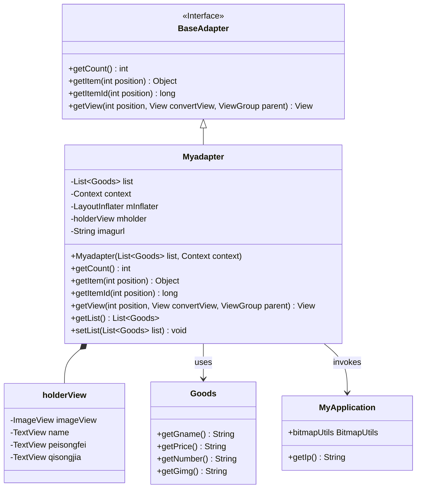

# Basic Information

|      |      |
|------|------|
| Name | Myadapter |
| Language | .java |
| Code Path | happycat/src/com/happycat/adapter/Myadapter.java |
| Package Name | com.happycat.adapter |
| Dependencies | ['java.util.List', 'com.example.happucat.R', 'com.happycat.Bean.Goods', 'com.happycat.util.MyApplication', 'android.R.integer', 'android.content.Context', 'android.view.LayoutInflater', 'android.view.View', 'android.view.ViewGroup', 'android.widget.BaseAdapter', 'android.widget.ImageView', 'android.widget.TextView'] |
| Brief Description | The custom adapter Myadapter extends BaseAdapter and is used to display a product list, including images, names, delivery fees, and minimum order prices. It supports view reuse and dynamic data loading. |

# Description

This is a custom adapter class named Myadapter, which extends BaseAdapter and is used to display a product list in an Android application. The adapter takes a product list and a context as constructor parameters, using LayoutInflater to load the layout. Internally, it defines a holderView class to cache view components, including an ImageView and three TextViews. The getView method implements view recycling logic, sets the product name, delivery fee, and minimum order price, and loads remote product images via MyApplication.bitmapUtils. The image URL is constructed by concatenating a base address with the product image path. The adapter also provides methods to get and set the product list.

# Class Summary

| Name   | Type  | Description |
|-------|------|-------------|
| Myadapter | class | The custom adapter MyAdapter extends BaseAdapter, designed to display product lists including images, names, delivery fees, and minimum order prices, supporting view reuse and dynamic data loading. |

## Class Myadapter

|      |      |
|------|------|
| Access Modifier | public |
| Type | class |
| Name | Myadapter |
| Description | The custom adapter MyAdapter extends BaseAdapter, designed to display product lists including images, names, delivery fees, and minimum order prices, supporting view reuse and dynamic data loading. |

### UML Class Diagram

This code demonstrates an Android custom adapter Myadapter, which inherits from BaseAdapter and is used to display a product list in a ListView. The adapter includes an inner class holderView for view caching, loads layouts via LayoutInflater, and binds product data to view controls. MyApplication provides network image loading and IP configuration functionality, while the Goods class stores product information. The adapter implements list item reuse optimization and dynamic data binding features.

### Internal Method Call Graph

```mermaid
graph TD
    A["class Myadapter extends BaseAdapter"]
    B["Property: List<Goods> list"]
    C["Property: Context context"]
    D["Property: LayoutInflater mInflater"]
    E["Property: holderView mholder"]
    F["Property: String imagurl"]
    G["Constructor: Myadapter(List<Goods>, Context)"]
    H["Method: int getCount()"]
    I["Method: Object getItem(int)"]
    J["Method: long getItemId(int)"]
    K["Inner class: holderView"]
    L["Method: View getView(int, View, ViewGroup)"]
    M["Method: List<Goods> getList()"]
    N["Method: void setList(List<Goods>)"]
    O["holderView Property: ImageView imageView"]
    P["holderView Property: TextView name"]
    Q["holderView Property: TextView peisongfei"]
    R["holderView Property: TextView qisongjia"]
    S["Initialization: mInflater = LayoutInflater.from(context)"]
    T["View Operations: convertView.inflate/setTag"]
    U["Data Binding: setText/bitmapUtils.display"]

    A --> B
    A --> C
    A --> D
    A --> E
    A --> F
    A --> G
    A --> H
    A --> I
    A --> J
    A --> K
    A --> L
    A --> M
    A --> N
    K --> O
    K --> P
    K --> Q
    K --> R
    G --> S
    L --> T
    L --> U
```

This code implements a custom adapter Myadapter for displaying product lists in Android. The flowchart illustrates the class structure, properties, methods, and their invocation relationships, with emphasis on the view reuse mechanism (optimizing performance via holderView) and data binding process. The adapter dynamically processes each list item through the getView method, including view initialization, control caching, and binding product data (name, delivery fee, minimum order price, and images), where images are loaded remotely via URLs. The constructor initializes the layout inflater, while other methods provide basic list operation functionalities.

### Field List

| Name  | Type  | Description |
|-------|-------|------|
| imagurl="http://" + MyApplication.getIp()			+ ":8080/happycat/upimage/" | String | The code snippet defines a string variable `imagurl`, whose value is a concatenated HTTP URL containing the server IP address and the path "/happycat/upimage/", with the port set to 8080. |
| mholder | holderView | Declare a variable named mholder of type holderView. |
| list | List<Goods> | Declare a list of Goods objects named list. |
| mInflater | LayoutInflater | LayoutInflater is used to instantiate XML layout files into corresponding View objects. |
| context | Context | Define a variable context of type Context. |

### Method List

| Name  | Type  | Description |
|-------|-------|------|
| getItemId | long | The method getItemId returns the ID at the specified position, and here it directly returns the position value. |
| getItem | Object | The method `getItem` returns the element at the specified position in the list. The parameter `position` is the index, and it returns the corresponding element. |
| getCount | int | The method getCount returns the size of the list. |
| getList | List<Goods> | This is a Java method that returns a list of Goods objects named list. |
| getView | View | Android List Item View Adaptation Method: Reuse convertView to optimize performance, bind controls via the holder pattern, and dynamically set data such as name, delivery fee, minimum order price, and image URL. |
| setList | void | The method for setting the product list assigns the passed List<Goods> to the list property of the current object. |

