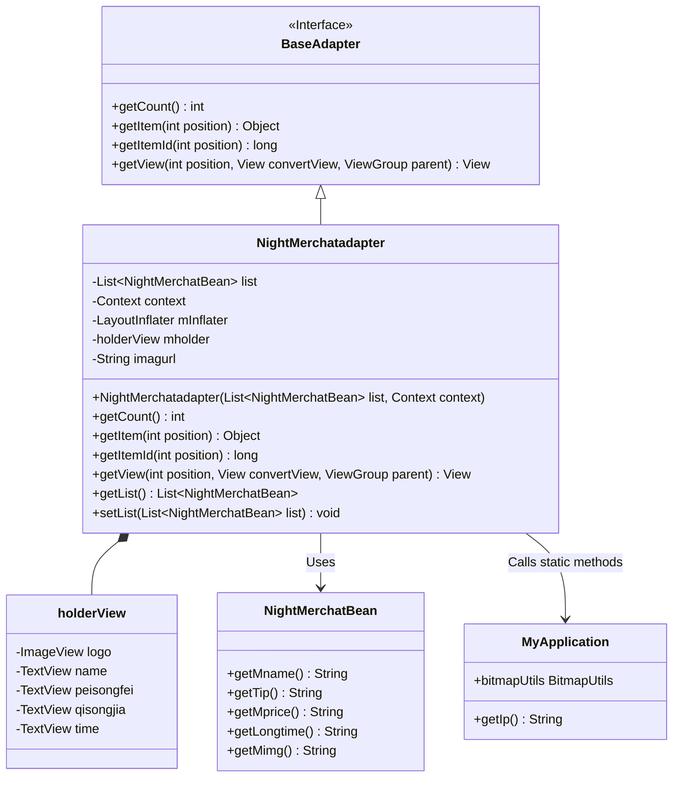
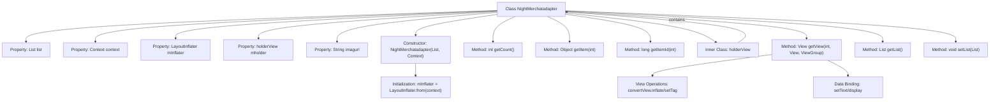

# Basic Information

|      |      |
|------|------|
| Name | NightMerchatadapter |
| Language | .java |
| Code Path | happycat/src/com/happycat/adapter/NightMerchatadapter.java |
| Package Name | com.happycat.adapter |
| Dependencies | ['java.util.List', 'com.example.happucat.R', 'com.happycat.Bean.DayMerchatBean', 'com.happycat.Bean.Goods', 'com.happycat.Bean.NightMerchatBean', 'com.happycat.adapter.DayMerchatadapter.holderView', 'com.happycat.util.MyApplication', 'android.R.integer', 'android.content.Context', 'android.util.Log', 'android.view.LayoutInflater', 'android.view.View', 'android.view.ViewGroup', 'android.widget.BaseAdapter', 'android.widget.ImageView', 'android.widget.TextView'] |
| Brief Description | The NightMerchantAdapter is an Android adapter class designed to display a list of nighttime merchants, including details such as merchant names, delivery fees, minimum order prices, and delivery times. It utilizes ViewHolder to optimize performance. |

# Description

The NightMerchatadapter is an adapter class that inherits from BaseAdapter, designed to manage the display of NightMerchatBean list data. It contains list data, context, and a layout inflater, utilizing holderView to cache view components for improved performance. The adapter implements methods to retrieve the count, position, and ID of list items, and handles view creation and data binding in getView, including the display of merchant names, delivery fees, minimum order prices, delivery times, and images. Image URLs are constructed by concatenating a base address with the image path. The adapter also provides methods to get and set list data.

# Class Summary

| Name   | Type  | Description |
|-------|------|-------------|
| NightMerchatadapter | class | The NightMerchantAdapter is an Android adapter class designed to display a list of nighttime merchants, including details such as merchant names, delivery fees, minimum order amounts, and delivery times. It optimizes list performance through holderView. |

## Class NightMerchatadapter

|      |      |
|------|------|
| Access Modifier | public |
| Type | class |
| Name | NightMerchatadapter |
| Description | The NightMerchantAdapter is an Android adapter class designed to display a list of nighttime merchants, including details such as merchant names, delivery fees, minimum order amounts, and delivery times. It optimizes list performance through holderView. |

### UML Class Diagram

Class Diagram Description:
This diagram illustrates the structure of an Android adapter class NightMerchatadapter, which inherits from the BaseAdapter interface and implements list view adaptation functionality. It includes an inner class holderView for view caching, retrieves data through NightMerchatBean, and relies on MyApplication for image loading. The adapter primarily manages the display of merchant list data, binding information such as delivery fees and minimum order prices, implementing typical ListView optimization patterns (ViewHolder pattern) and asynchronous network image loading capabilities.

### Internal Method Call Graph

This code represents an Android custom adapter class for displaying nighttime merchant list data in a ListView. The flowchart illustrates the class structure relationships, including properties, constructor, core method getView implementation logic, and the inner holderView class. The adapter loads layouts via LayoutInflater, optimizes performance using the ViewHolder pattern, binds data to list item view components, and finally loads network images through bitmapUtils. The entire process achieves efficient data-to-view mapping and display.

### Field List

| Name  | Type  | Description |
|-------|-------|------|
| list | List<NightMerchatBean> | Define a list named "list" with elements of type NightMerchatBean. |
| imagurl=" http://" + MyApplication.getIp()			+ ":8080//happycat/upimage/" | String | The code snippet defines a string variable `imagurl`, which generates a URL pointing to the image upload service of the happycat project by concatenating the protocol header, IP address, and path. |
| mholder | holderView | The variable holderView is declared as type mholder. |
| context | Context | Define a variable context of type Context. |
| mInflater | LayoutInflater | LayoutInflater is used to instantiate XML layout files into View objects. |

### Method List

| Name  | Type  | Description |
|-------|-------|------|
| getView | View | Custom list adapter methods, reuse views for performance optimization, dynamically set merchant names, delivery fees, minimum order amounts, delivery times, and logo images. |
| getItem | Object | The method `getItem` returns the element at the specified position in the list. The parameter is the position index, and it returns the corresponding element. |
| getCount | int | The method getCount returns the size of the list. |
| getItemId | long | Method override, returns the ID of the specified position by directly returning the position value. |
| getList | List<NightMerchatBean> | The method getList returns a list named list of type NightMerchantBean. |
| setList | void | The method `setList` takes a list parameter of type `NightMerchatBean` and assigns it to the `list` property of the current object. |

