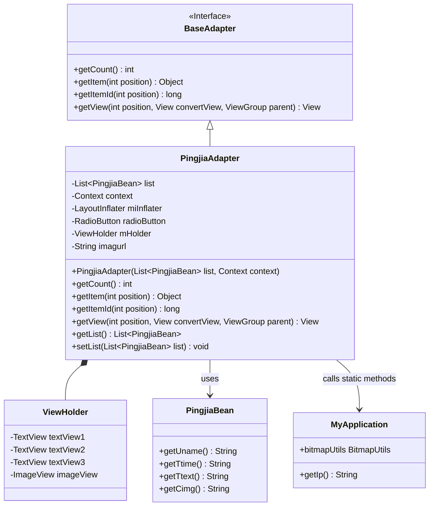

# Basic Information

|      |      |
|------|------|
| Name | PingjiaAdapter |
| Language | .java |
| Code Path | happycat/src/com/happycat/adapter/PingjiaAdapter.java |
| Package Name | com.happycat.adapter |
| Dependencies | ['java.util.List', 'com.example.happucat.R', 'com.happycat.Bean.PingjiaBean', 'com.happycat.util.MyApplication', 'android.content.Context', 'android.view.LayoutInflater', 'android.view.View', 'android.view.ViewGroup', 'android.widget.BaseAdapter', 'android.widget.ImageView', 'android.widget.RadioButton', 'android.widget.TextView'] |
| Brief Description | PingjiaAdapter is an Android list adapter designed to display a list of PingjiaBean data, including username, timestamp, content, and images, with ViewHolder optimization for performance. |

# Description

The PingjiaAdapter is a custom adapter class that inherits from BaseAdapter, designed to display evaluation list data in Android applications. This class includes an inner ViewHolder class for caching view components to enhance performance. The adapter receives a list of evaluation data and a context object through its constructor, utilizing LayoutInflater to load the layout. The getView method is responsible for binding data to list item views, including the username, time, evaluation content, and images. Images are loaded and displayed from specified URLs via MyApplication.bitmapUtils. The adapter also provides methods for getting and setting the data list.

# Class Summary

| Name   | Type  | Description |
|-------|------|-------------|
| PingjiaAdapter | class | PingjiaAdapter is an Android list adapter designed to display a list of evaluation data, including usernames, timestamps, content, and images, with ViewHolder optimization for performance enhancement. |

## Class PingjiaAdapter

|      |      |
|------|------|
| Access Modifier | public |
| Type | class |
| Name | PingjiaAdapter |
| Description | PingjiaAdapter is an Android list adapter designed to display a list of evaluation data, including usernames, timestamps, content, and images, with ViewHolder optimization for performance enhancement. |

### UML Class Diagram

This code demonstrates an Android custom adapter PingjiaAdapter, which inherits from BaseAdapter to display a list of evaluation data. The adapter internally uses the ViewHolder pattern for performance optimization, and retrieves network image URLs and image loading utilities through the MyApplication class. Key functionalities include data binding, view recycling, and asynchronous image loading, making it suitable for data display requirements in list views such as ListView or GridView.

### Internal Method Call Graph

```mermaid
graph TD
    A["Class PingjiaAdapter"]
    B["Property: List<PingjiaBean> list"]
    C["Property: Context context"]
    D["Property: LayoutInflater miInflater"]
    E["Property: RadioButton radioButton"]
    F["Property: ViewHolder mHolder"]
    G["Property: String imagurl"]
    H["Constructor: PingjiaAdapter(List<PingjiaBean>, Context)"]
    I["Method: int getCount()"]
    J["Method: Object getItem(int)"]
    K["Method: long getItemId(int)"]
    L["Inner Class: ViewHolder"]
    M["Method: View getView(int, View, ViewGroup)"]
    N["Method: List<PingjiaBean> getList()"]
    O["Method: void setList(List<PingjiaBean>)"]
    P["ViewHolder Structure"]
    Q["TextView textView1, textView2, textView3"]
    R["ImageView imageView"]

    A --> B
    A --> C
    A --> D
    A --> E
    A --> F
    A --> G
    A --> H
    A --> I
    A --> J
    A --> K
    A --> L
    A --> M
    A --> N
    A --> O
    L --> P
    P --> Q
    P --> R
    M -->|"convertView==null"| S["Initialize Layout"]
    M -->|"Reuse ViewHolder"| T["Get Existing Tag"]
    M --> U["Set Text Data"]
    M --> V["Load Network Image"]
```

This flowchart illustrates the complete structure of the PingjiaAdapter class, including 6 member properties, 1 constructor, and 5 core methods. It highlights the logical flow of the getView() method: first determining whether convertView is null to initialize or reuse the layout, then setting text content for three TextViews, and finally loading network images via the MyApplication utility class. The inner ViewHolder class contains three TextViews and one ImageView to implement the ListView's view recycling mechanism. The entire adapter is used to bind a list of PingjiaBean data to each item view in a ListView.

### Field List

| Name  | Type  | Description |
|-------|-------|------|
| miInflater | LayoutInflater | Declaration of layout loader instance. |
| radioButton | RadioButton | Declare a radio button variable radioButton. |
| imagurl="http://" + MyApplication.getIp()			+ ":8080/happycat/upimage/" | String | The code snippet defines a string variable `imagurl`, whose value is an HTTP image URL path concatenated based on the IP address obtained from `MyApplication.getIp()`, formatted as "http://[IP]:8080/happycat/upimage/". |
| mHolder | ViewHolder | Define the ViewHolder variable mHolder for optimizing list item view reuse. |
| context | Context | Define context variables. |
| list | List<PingjiaBean> | Define a list variable named `list` to store `PingjiaBean` objects. |

### Method List

| Name  | Type  | Description |
|-------|-------|------|
| getItem | Object | The method `getItem` returns the element at the specified position in the list. |
| getItemId | long | The method getItemId returns the ID at the specified position, with the default implementation directly returning the position value. |
| getCount | int | Rewrite the getCount method to return the size of the list. |
| getView | View | The ListView adapter's getView method reuses convertView to optimize performance, initializes or retrieves the ViewHolder, sets text and image content, and then returns the view. |
| getList | List<PingjiaBean> | The method returns a list of type PingjiaBean. |
| setList | void | The method `setList` takes a `List` parameter of type `PingjiaBean` and assigns it to the `list` property of the current object. |

