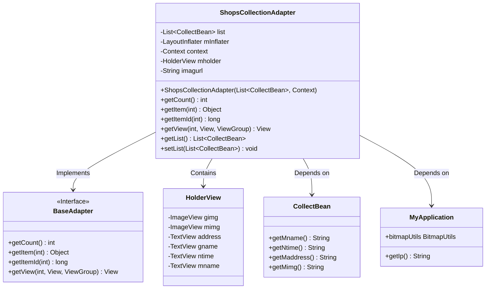

# Basic Information

|      |      |
|------|------|
| Name | ShopsCollectionAdapter |
| Language | .java |
| Code Path | happycat/src/com/happycat/adapter/ShopsCollectionAdapter.java |
| Package Name | com.happycat.adapter |
| Dependencies | ['java.util.List', 'com.example.happucat.R', 'com.happycat.Bean.CollectBean', 'com.happycat.util.MyApplication', 'android.content.Context', 'android.util.Log', 'android.view.LayoutInflater', 'android.view.View', 'android.view.ViewGroup', 'android.widget.BaseAdapter', 'android.widget.ImageView', 'android.widget.TextView'] |
| Brief Description | The ShopsCollectionAdapter is an Android adapter class designed to display a list of favorite shops, including data such as images, names, addresses, and timestamps. It utilizes ViewHolder to optimize performance and implements list view binding through BaseAdapter. |

# Description

ShopsCollectionAdapter is a custom adapter class that extends BaseAdapter, designed to display shop collection list data in Android applications. The class includes an inner class HolderView for caching view components such as ImageView and TextView. The adapter receives a data list and a context object through its constructor and overrides core methods like getCount, getItem, getItemId, and getView. The getView method implements view recycling logic, inflates layouts via LayoutInflater, and binds data to view components. Data binding involves setting shop names, addresses, time, and images, with image URLs generated by concatenating a base path and a relative path. Additionally, the class provides methods to get and set the data list.

# Class Summary

| Name   | Type  | Description |
|-------|------|-------------|
| ShopsCollectionAdapter | class | The ShopsCollectionAdapter is an Android adapter class designed to display a list of favorite shops, including images, names, addresses, and timestamps. It utilizes ViewHolder for performance optimization and supports data retrieval and configuration. |

## Class ShopsCollectionAdapter

|      |      |
|------|------|
| Access Modifier | public |
| Type | class |
| Name | ShopsCollectionAdapter |
| Description | The ShopsCollectionAdapter is an Android adapter class designed to display a list of favorite shops, including images, names, addresses, and timestamps. It utilizes ViewHolder for performance optimization and supports data retrieval and configuration. |

### UML Class Diagram

This code demonstrates an Android custom adapter `ShopsCollectionAdapter`, which extends `BaseAdapter` to manage the display of shop collection list data. The adapter internally uses the `HolderView` pattern to optimize list performance, retrieves data through `CollectBean`, and relies on `MyApplication` to obtain network image URLs and image loading utilities. The class diagram clearly illustrates the relationships between the adapter, data models, utility classes, and the internal structure of the view holder.

### Internal Method Call Graph

```mermaid
graph TD
    A["Class ShopsCollectionAdapter"]
    B["Property: List<CollectBean> list"]
    C["Property: LayoutInflater mInflater"]
    D["Property: Context context"]
    E["Property: HolderView mholder"]
    F["Property: String imagurl"]
    G["Constructor: ShopsCollectionAdapter(List<CollectBean>, Context)"]
    H["Method: int getCount()"]
    I["Method: Object getItem(int)"]
    J["Method: long getItemId(int)"]
    K["Inner Class: HolderView"]
    L["Method: View getView(int, View, ViewGroup)"]
    M["Method: List<CollectBean> getList()"]
    N["Method: void setList(List<CollectBean>)"]
    O["HolderView Property: ImageView gimg,mimg"]
    P["HolderView Property: TextView address,gname,ntime,mname"]
    Q["Operation: mInflater.inflate layout"]
    R["Operation: findViewById bind controls"]
    S["Operation: setText set text"]
    T["Operation: bitmapUtils.display load image"]

    A --> B
    A --> C
    A --> D
    A --> E
    A --> F
    A --> G
    A --> H
    A --> I
    A --> J
    A --> K
    A --> L
    A --> M
    A --> N
    K --> O
    K --> P
    L --> Q
    L --> R
    L --> S
    L --> T
```

This code represents a custom adapter class in Android development, extending BaseAdapter, primarily used for managing data display in a shop collection list. Core functionalities include implementing view recycling for list items via the getView method, optimizing performance with the ViewHolder pattern, dynamically loading network images, and encapsulating operations on CollectBean data collections. The adapter uses LayoutInflater to load layout files, binds data to various view controls of list items, and handles view recycling and reuse logic.

### Field List

| Name  | Type  | Description |
|-------|-------|------|
| mInflater | LayoutInflater | Private layout inflater mInflater |
| imagurl = " http://" + MyApplication.getIp() + ":8080/happycat/img/" | String | Define a string variable `imagurl` in the code, concatenating the HTTP protocol, application IP address, port 8080, and the path `/happycat/img/`. |
| list | List<CollectBean> | The private collection variable 'list' stores objects of type CollectBean. |
| mholder | HolderView | Define the variable mholder with the type HolderView. |
| context | Context | Context object, used to store environmental information during the runtime of an application or system. |

### Method List

| Name  | Type  | Description |
|-------|-------|------|
| getItemId | long | Rewrite the getItemId method to directly return the input parameter arg0. |
| getCount | int | This is a rewritten getCount method that returns the size of the list. |
| getItem | Object | Method override, returns the element at the specified position in the list. |
| getList | List<CollectBean> | Get a list of data of type CollectBean. |
| setList | void | The method `setList` accepts a list parameter of type `CollectBean` and assigns it to the `list` property of the current object. |
| getView | View | Rewrite the getView method, reuse convertView to optimize performance, initialize view controls and set data, including images, names, time, and addresses, then return the view. |

