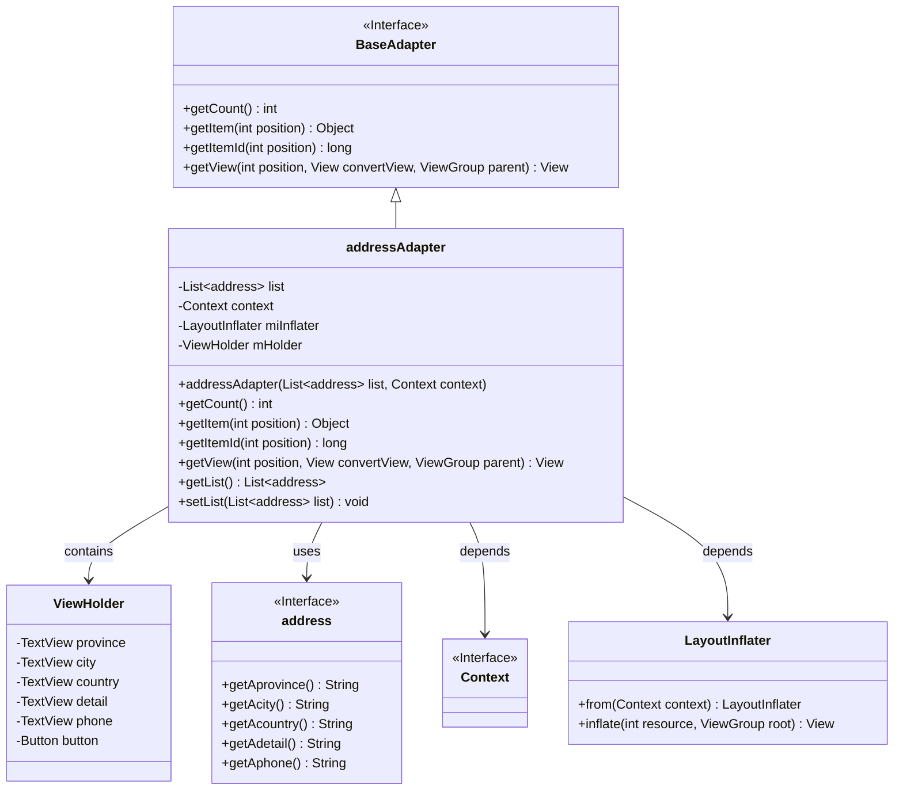
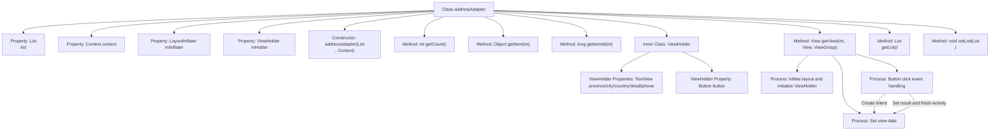

# Basic Information

|      |      |
|------|------|
| Name | addressAdapter |
| Language | .java |
| Code Path | happycat/src/com/happycat/adapter/addressAdapter.java |
| Package Name | com.happycat.adapter |
| Dependencies | ['java.util.List', 'com.example.happucat.R', 'com.happycat.AddressActivity', 'com.happycat.Bean.address', 'com.happycat.adapter.PingjiaAdapter.ViewHolder', 'android.app.Activity', 'android.content.Context', 'android.content.Intent', 'android.view.LayoutInflater', 'android.view.View', 'android.view.View.OnClickListener', 'android.view.ViewGroup', 'android.widget.BaseAdapter', 'android.widget.Button', 'android.widget.LinearLayout', 'android.widget.TextView'] |
| Brief Description | The addressAdapter is an Android adapter class used for managing the display of address lists. It includes ViewHolder to optimize view recycling and handles list item click events to return complete address information. |

# Description

The `addressAdapter` is a custom adapter class that inherits from `BaseAdapter`, designed to display address lists in Android applications. It contains a list of `address` objects and a context object, loading layouts via `LayoutInflater`. The adapter implements the `getCount`, `getItem`, and `getItemId` methods to support list operations. The inner class `ViewHolder` is used to cache view components, including `TextView` elements for province, city, district, detailed address, phone number, and a confirmation button. The `getView` method handles view initialization and data binding. When the button is clicked, it constructs an address string and returns the result via an `Intent`. The adapter also provides methods for getting and setting the list.

# Class Summary

| Name   | Type  | Description |
|-------|------|-------------|
| addressAdapter | class | This is an Android custom adapter class designed to display a list of addresses. It extends BaseAdapter, incorporating logic for binding list data, view recycling, and handling button click events, ultimately returning the selected address information. |

## Class addressAdapter

|      |      |
|------|------|
| Access Modifier | public |
| Type | class |
| Name | addressAdapter |
| Description | This is an Android custom adapter class designed to display a list of addresses. It extends BaseAdapter, incorporating logic for binding list data, view recycling, and handling button click events, ultimately returning the selected address information. |

### UML Class Diagram

This code demonstrates an Android custom adapter `addressAdapter` that inherits from the `BaseAdapter` interface, designed to manage the display of address list data. The adapter includes an inner `ViewHolder` class for view caching optimization, dynamically binds address data to UI components through the `getView()` method, and implements button click event handling. The class diagram clearly illustrates the adapter's dependency relationships with the data model (address), Android system components (Context/LayoutInflater), as well as the internal structure of the view holder.

### Internal Method Call Graph

This code represents an Android custom adapter class for managing address list display and interaction. The flowchart illustrates the class structure, property relationships, and core method call chains. The adapter extends BaseAdapter, incorporating key functionalities like data binding, view recycling, and click event handling. The ViewHolder pattern optimizes list performance, while the getView method implements view initialization and data population logic. Button clicks trigger address information return and close the current Activity. The entire design exemplifies a typical Android list adapter implementation pattern.

### Field List

| Name  | Type  | Description |
|-------|-------|------|
| mHolder | ViewHolder | Define the ViewHolder variable mHolder for list item view reuse optimization. |
| miInflater | LayoutInflater | Declaration of layout loader instance. |
| context | Context | Define the context variable context. |
| list | List<address> | Declare a variable named list as an address list. |

### Method List

| Name  | Type  | Description |
|-------|-------|------|
| getList | List<address> | The method returns a list of addresses. |
| getItemId | long | The method getItemId returns the ID of the list item, directly using the position parameter as the ID. |
| getItem | Object | This method returns the element at the specified position in the list. The parameter is the position index, and it returns the corresponding element. |
| getCount | int | This is a Java method override that returns the list size as the count result. |
| getView | View | Custom list adapter method, initializes the view and binds data, clicking the button returns address information. |
| setList | void | Set the address list property in the configuration object. |

