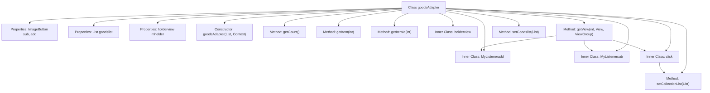

# Basic Information

|      |      |
|------|------|
| Name | goodsAdapter |
| Language | .java |
| Code Path | happycat/src/com/happycat/adapter/goodsAdapter.java |
| Package Name | com.happycat.adapter |
| Dependencies | ['java.util.ArrayList', 'java.util.List', 'com.example.happucat.R', 'com.happycat.MerchatDataActivity', 'com.happycat.Bean.Goods', 'com.happycat.global.GlobalContacts', 'com.happycat.util.MyApplication', 'com.lidroid.xutils.HttpUtils', 'com.lidroid.xutils.exception.HttpException', 'com.lidroid.xutils.http.RequestParams', 'com.lidroid.xutils.http.ResponseInfo', 'com.lidroid.xutils.http.callback.RequestCallBack', 'com.lidroid.xutils.http.client.HttpRequest.HttpMethod', 'android.annotation.SuppressLint', 'android.content.Context', 'android.util.Log', 'android.view.LayoutInflater', 'android.view.View', 'android.view.View.OnClickListener', 'android.view.ViewGroup', 'android.widget.BaseAdapter', 'android.widget.ImageButton', 'android.widget.TextView', 'android.widget.Toast'] |
| Brief Description | Product adapter class, used to display product lists, including increment/decrement buttons, favorite function, and shopping cart amount calculation. |

# Description

The code defines a class named `goodsAdapter`, which inherits from `BaseAdapter` and is used to manage the display and interaction of a product list. Its primary functionalities include: displaying product names, prices, sales volumes, and purchase quantities; adjusting purchase quantities via increment and decrement buttons while calculating the total amount and the difference from the minimum order threshold; supporting adding and removing products from favorites, with HTTP requests to synchronize the favorite status with the server. The adapter also checks the user's login status to ensure unlogged users cannot perform purchase-related actions. A custom `holderview` class is used to cache view components for improved performance. Overall, it implements dynamic product list display and user interaction features.

# Class Summary

| Name   | Type  | Description |
|-------|------|-------------|
| goodsAdapter | class | Product adapter class, manages product list display and interaction, including quantity adjustment, favorite function, and shopping cart amount calculation. |


## Class goodsAdapter

|      |      |
|------|------|
| Access Modifier | public |
| Type | class |
| Name | goodsAdapter |
| Description | Product adapter class, manages product list display and interaction, including quantity adjustment, favorite function, and shopping cart amount calculation. |


### UML Class Diagram

```mermaid
classDiagram
    class BaseAdapter {
        <<Interface>>
        +getCount() int
        +getItem(int position) Object
        +getItemId(int position) long
        +getView(int position, View convertView, ViewGroup parent) View
    }

    class goodsAdapter {
        -ImageButton sub
        -ImageButton add
        -List~Goods~ goodslist
        -holderview mholder
        -Context context
        -LayoutInflater mInflater
        -double chae
        -TextView buycat_jine
        -TextView buycat_chae
        -TextView geshu
        -TextView gname
        -TextView gprice
        -TextView nume
        -ImageButton imaggood
        -List~Goods~ gList
        -int count
        -int collection
        -String url1
        -HttpUtils httpUtils
        -MerchatDataActivity merchatDataActivity
        -List~Integer~ collectionList
        +goodsAdapter(List~Goods~ goodslist, Context context)
        +getCount() int
        +getItem(int position) Object
        +getItemId(int position) long
        +getView(int position, View convertView, ViewGroup parent) View
        +getGoodslist() List~Goods~
        +setGoodslist(List~Goods~ goodslist) void
        +setgList(List~Goods~ gList) void
        +setCollectionList(List~Integer~ collectionList) void
    }

    class holderview {
        -TextView buycat_jine
        -TextView buycat_chae
    }

    class MyListeneradd {
        -int mPosition
        -TextView textView
        +MyListeneradd(int inPosition, TextView t)
        +onClick(View v) void
    }

    class MyListenersub {
        -int mPosition
        -TextView textView
        +MyListenersub(int inPosition, TextView t)
        +onClick(View v) void
    }

    class click {
        -int mPosition
        -ImageButton imageButton
        +click(int inPosition, ImageButton image)
        +onClick(View arg0) void
        -getInsertFromServer(int id, int collection) void
    }

    class Goods {
        // Assume Goods class exists with the following fields
        -String gname
        -double price
        -int number
        -int gnum
        -int id
        +getGname() String
        +getPrice() double
        +getNumber() int
        +getGnum() int
        +setGnum(int gnum) void
        +getId() int
    }

    class MerchatDataActivity {
        +getBuycat_chae() TextView
        +getBuycat_jine() TextView
        +getMqsf() double
    }

    goodsAdapter --> BaseAdapter : implements
    goodsAdapter --> holderview : contains
    goodsAdapter --> MyListeneradd : creates
    goodsAdapter --> MyListenersub : creates
    goodsAdapter --> click : creates
    goodsAdapter --> Goods : operates
    goodsAdapter --> MerchatDataActivity : depends on
    MyListeneradd --> Goods : operates
    MyListenersub --> Goods : operates
    click --> Goods : operates
```

This code represents an Android adapter class `goodsAdapter` that extends `BaseAdapter`, designed to manage the display and interaction of a product list. Key functionalities include: product list display, shopping cart amount calculation, favorite status toggling, and product quantity adjustment operations. It utilizes the inner class `holderview` for view caching, `MyListeneradd` and `MyListenersub` to handle quantity increment/decrement logic, and `click` to manage favorite status toggling. The adapter interacts with `MerchatDataActivity` to obtain contextual data and synchronizes favorite status with the server via HTTP requests. The overall design follows the MVC pattern, separating data, view, and controller components.


### Internal Method Call Graph



This code represents an Android adapter class `goodsAdapter`, which extends `BaseAdapter` and is primarily used for displaying and interacting with product lists. The adapter manages the display of product data, including product names, prices, sales volumes, and other information, while handling user interactions such as increasing/decreasing product quantities and favoriting products. The inner class `holderview` caches view components, `MyListeneradd` and `MyListenersub` handle quantity adjustment logic, and `click` manages favorite status toggling and network requests. The overall workflow includes view initialization, data binding, user interaction handling, and network communication, enabling dynamic product list display and state management.

### Field List

| Name  | Type  | Description |
|-------|-------|------|
| gList | List<Goods> | Product list gList |
| mInflater | LayoutInflater | Layout loader, used for dynamically loading XML layout files into view objects. |
| goodslist | List<Goods> | Product List |
| mholder | holderview | Define the variable mholder with the type holderview. |
| add | ImageButton | Define two image button variables: sub and add. |
| collection | int | Declare two private integer variables: count and collection. |
| httpUtils | HttpUtils | Declaration of HttpUtils utility class instance. |
| geshu | TextView | Define the TextView variable geshu. |
| context | Context | Define a variable context of type Context. |
| collectionList = new ArrayList<Integer>() | List<Integer> | Create a dynamic array collection of integer type. |
| nume | TextView | Define the TextView variable nume. |
| buycat_chae | TextView | Two TextView variables are defined: buycat_jine and buycat_chae. |
| gprice | TextView | The TextView control gprice is used to display text content. |
| url1 | String | Declared a string variable url1. |
| imaggood | ImageButton | Define the image button control imaggood. |
| gname | TextView | Define the TextView variable gname. |
| chae | double | Variable declaration: double-precision floating-point variable chae. |
| merchatDataActivity | MerchatDataActivity | Private member variable merchatDataActivity, of type MerchatDataActivity. |

### Method List

| Name  | Type  | Description |
|-------|-------|------|
| setgList | void | This is a Java method used to set the goods list property gList in a class. The method takes a List parameter of type Goods and assigns it to the gList member variable of the current object. |
| setCollectionList | void | Method for setting integer list property, which assigns the input parameter to the class's collectionList member variable. |
| getGoodslist | List<Goods> | The method to obtain the product list returns the product collection goodslist. |
| getItem | Object | The method getItem returns the element at the specified position in the goodslist. |
| getCount | int | The method getCount returns the size of goodslist. |
| getItemId | long | The method getItemId returns the ID of the list item, and the default implementation directly returns the position parameter. |
| getView | View | Adapter getView method: Load the product list item layout, initialize view controls, set product information (name, price, sales volume, etc.), handle favorite status toggle, and bind events for quantity adjustment and favorite clicks. |
| setGoodslist | void | The method for setting the product list assigns the input product list to the product list property of the current object. |


