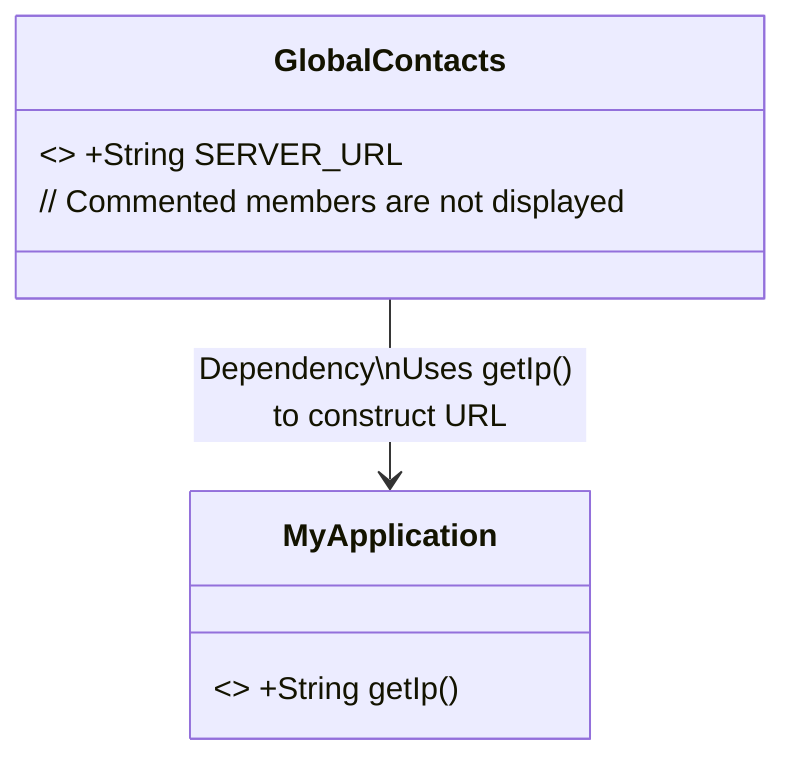
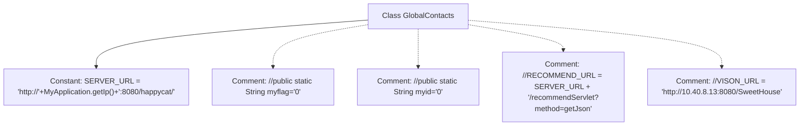

# Basic Information

|      |      |
|------|------|
| Name | GlobalContacts |
| Language | .java |
| Code Path | happycat/src/com/happycat/global/GlobalContacts.java |
| Package Name | com.happycat.global |
| Dependencies | ['android.view.ViewDebug.FlagToString', 'com.happycat.util.MyApplication'] |
| Brief Description | The GlobalContacts class defines a server URL constant, dynamically generated based on the IP of MyApplication, with port 8080 and the path as happycat. Other commented-out code is not enabled. |

# Description

The GlobalContacts class defines a global constant SERVER_URL, whose value is a dynamically concatenated HTTP address comprising the IP obtained from MyApplication.getIp(), a fixed port 8080, and the path /happycat/. Comments indicate that this class previously contained other static variables and URL constants, but they are currently commented out.

# Class Summary

| Name   | Type  | Description |
|-------|------|-------------|
| GlobalContacts | class | The GlobalContacts class defines the server URL, dynamically generated based on the IP of MyApplication, with port 8080 and the path as happycat. Other commented-out fields are unused. |

## Class GlobalContacts

|      |      |
|------|------|
| Access Modifier | public |
| Type | class |
| Name | GlobalContacts |
| Description | The GlobalContacts class defines the server URL, dynamically generated based on the IP of MyApplication, with port 8080 and the path as happycat. Other commented-out fields are unused. |

### UML Class Diagram

This class diagram illustrates the relationship between the GlobalContacts utility class and the MyApplication class. GlobalContacts contains an immutable static constant SERVER_URL, whose value is dynamically constructed by calling the MyApplication.getIp() method. Although the code includes multiple commented-out static members, only the actual effective SERVER_URL field is displayed according to the rules. This design pattern is commonly used for centralized management of global configurations, leveraging MyApplication to obtain the base IP address for constructing the complete server URL.

### Internal Method Call Graph

This flowchart illustrates the structure of the GlobalContacts class, with its core being the definition of a static constant SERVER_URL, whose value is dynamically generated by concatenating strings and invoking the MyApplication.getIp() method. The class also contains four commented-out member variables/constant definitions, including myflag, myid, RECOMMEND_URL, and VISON_URL. These comments may indicate disabled functionality or pending configuration items. The flowchart clearly distinguishes between active code and commented code, highlighting the currently effective server URL configuration.

### Field List

| Name  | Type  | Description |
|-------|-------|------|
| SERVER_URL = "http://"+MyApplication.getIp()+":8080/happycat/" | String | Define a static constant SERVER_URL with the value as a dynamically concatenated HTTP service address based on MyApplication.getIp(), port 8080, and path /happycat/. |

### Method List

| Name  | Type  | Description |
|-------|-------|------|

