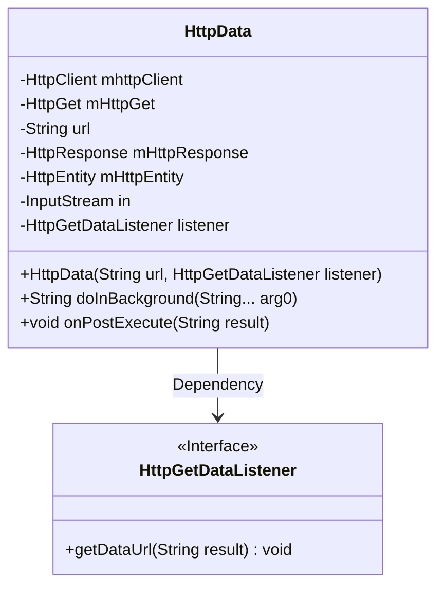
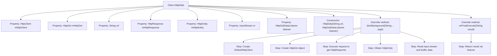

# Basic Information

|      |      |
|------|------|
| Name | HttpData |
| Language | .java |
| Code Path | happycat/src/com/happycat/tuling/HttpData.java |
| Package Name | com.happycat.tuling |
| Dependencies | ['java.io.BufferedReader', 'java.io.InputStream', 'java.io.InputStreamReader', 'org.apache.http.HttpEntity', 'org.apache.http.HttpResponse', 'org.apache.http.client.HttpClient', 'org.apache.http.client.methods.HttpGet', 'org.apache.http.impl.client.DefaultHttpClient', 'android.os.AsyncTask'] |
| Brief Description | The HttpData class inherits from AsyncTask, fetches URL data via HttpGet, reads the response content using BufferedReader, and finally returns the result through an interface. |

# Description

The HttpData class extends AsyncTask and is used for asynchronous HTTP GET requests. The constructor takes a URL and a listener. The doInBackground method creates HttpClient and HttpGet objects, executes the request, and reads the response data, which is read line by line via BufferedReader into a StringBuffer before being returned. The onPostExecute method returns the result through the listener interface. The exception handling section is empty.

# Class Summary

| Name   | Type  | Description |
|-------|------|-------------|
| HttpData | class | The HttpData class extends AsyncTask, asynchronously requests URL data via HttpGet, reads the response content using BufferedReader, and returns the result through an interface. |

## Class HttpData

|      |      |
|------|------|
| Access Modifier | public |
| Type | class |
| Name | HttpData |
| Description | The HttpData class extends AsyncTask, asynchronously requests URL data via HttpGet, reads the response content using BufferedReader, and returns the result through an interface. |

### UML Class Diagram

This code demonstrates an HttpData class based on Android AsyncTask for asynchronous HTTP data retrieval via HttpGet. The class encapsulates core HTTP components (HttpClient/HttpGet/HttpResponse, etc.) and implements three key AsyncTask methods (doInBackground and onPostExecute) to complete network requests and result callbacks. The asynchronous callback mechanism is achieved through the HttpGetDataListener interface, which returns the obtained string data to the caller. The overall design reflects a typical Android network request pattern, with attention required for edge cases like exception handling and resource closure.

### Internal Method Call Graph

This code represents an HttpData class inherited from AsyncTask, designed for asynchronous HTTP GET requests. The flowchart illustrates the class structure, property relationships, and the execution flow of core methods doInBackground and onPostExecute. The doInBackground method sequentially creates an HTTP client, initiates requests, processes response data, and finally reads returned content via BufferedReader. The onPostExecute method returns results to the caller through interface callback. The entire process achieves separation between network requests and UI threads, complying with Android asynchronous task handling specifications.

### Field List

| Name  | Type  | Description |
|-------|-------|------|
| mHttpResponse | HttpResponse | The private HttpResponse object mHttpResponse. |
| mHttpEntity | HttpEntity | The private HTTP entity object mHttpEntity. |
| mHttpGet | HttpGet | Declare a private HttpGet object variable mHttpGet. |
| mhttpClient | HttpClient | The private HttpClient instance variable mhttpClient. |
| in | InputStream | Private input stream variable `in` |
| listener | HttpGetDataListener | Private HttpGetDataListener instance. |
| url | String | The private string variable url is used to store the web address. |

### Method List

| Name  | Type  | Description |
|-------|-------|------|
| onPostExecute | void | After an Android asynchronous task is completed, the result data is returned through an interface callback. |
| doInBackground | String | Asynchronous HTTP request processing, using DefaultHttpClient to execute HttpGet, read the response content and return it as a string, returning null in case of an exception. |

