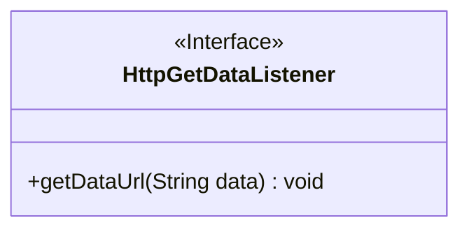
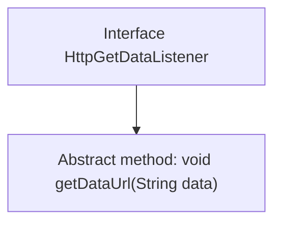

# Basic Information

|      |      |
|------|------|
| Name | HttpGetDataListener |
| Language | .java |
| Code Path | happycat/src/com/happycat/tuling/HttpGetDataListener.java |
| Package Name | com.happycat.tuling |
| Dependencies | [] |
| Brief Description | The interface HttpGetDataListener defines a method getDataUrl, which is used to receive a string-type data parameter data. |

# Description

The content defines a public interface named HttpGetDataListener, which includes an abstract method called getDataUrl. This method accepts a String-type parameter named data and returns no value. The interface is designed to handle callback operations after retrieving data via HTTP, allowing implementing classes to execute specific logic when data is obtained.

# Class Summary

| Name   | Type  | Description |
|-------|------|-------------|
| HttpGetDataListener | interface | The interface HttpGetDataListener defines a method getDataUrl, which is used to receive string data. |

## Class HttpGetDataListener

|      |      |
|------|------|
| Access Modifier | public |
| Type | interface |
| Name | HttpGetDataListener |
| Description | The interface HttpGetDataListener defines a method getDataUrl, which is used to receive string data. |

### UML Class Diagram

This code defines an interface named `HttpGetDataListener`, which contains an abstract method `getDataUrl` that takes a `String` parameter `data` and returns void. In the class diagram, the interface is marked with `<<Interface>>`, and methods are public by default, hence prefixed with `+`. This interface standardizes data retrieval behavior, requiring implementing classes to provide specific data processing logic. It is suitable for scenarios requiring callbacks for HTTP request results.

### Internal Method Call Graph

This flowchart illustrates the structure of the HttpGetDataListener interface, which defines an abstract method named getDataUrl that takes a String parameter 'data' and returns no value. As an interface, it enforces implementing classes to provide concrete implementations of this method, commonly used in callback mechanisms for HTTP data retrieval scenarios. The diagram clearly depicts the hierarchical relationship between the interface and its method, adhering to the object-oriented design principle where interfaces define behavioral contracts.

### Field List

| Name  | Type  | Description |
|-------|-------|------|

### Method List

| Name  | Type  | Description |
|-------|-------|------|
| getDataUrl | void | Define the method getDataUrl, which takes a string parameter data and has no return value. |

