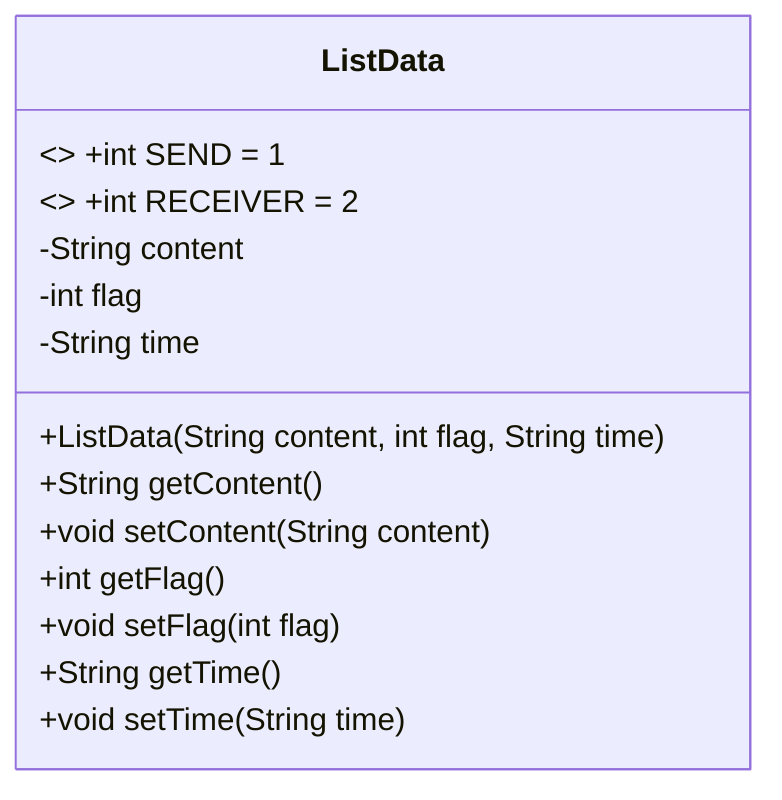
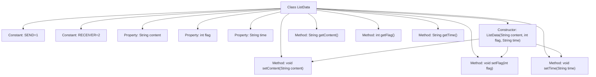

# Basic Information

|      |      |
|------|------|
| Name | ListData |
| Language | .java |
| Code Path | happycat/src/com/happycat/tuling/ListData.java |
| Package Name | com.happycat.tuling |
| Dependencies | [] |
| Brief Description | The ListData class is used to store message content, type (sent/received), and time, providing constructors and getter/setter methods. |

# Description

The ListData class is used to manage message data and contains three main attributes: content stores the message content, flag identifies the message type (1 for sent, 2 for received), and time records the message timestamp. The class provides constructor and getter/setter methods, supporting the initialization and modification of these three attributes.

# Class Summary

| Name   | Type  | Description |
|-------|------|-------------|
| ListData | class | The ListData class is used to store message content, type (sent/received), and time, providing constructors and getter/setter methods. |

## Class ListData

|      |      |
|------|------|
| Access Modifier | public |
| Type | class |
| Name | ListData |
| Description | The ListData class is used to store message content, type (sent/received), and time, providing constructors and getter/setter methods. |

### UML Class Diagram

This code defines a `ListData` class for representing message data. The class contains three main attributes: `content` represents the message content, `flag` identifies the message type (sent or received, distinguished by the constants `SEND` and `RECEIVER`), and `time` records the message timestamp. The class provides a complete constructor and getter/setter methods to encapsulate and manipulate these attributes. This is a typical data encapsulation class suitable for applications such as message lists that require distinguishing between sent and received scenarios.

### Internal Method Call Graph

This flowchart illustrates the complete structure of the ListData class, including two message-type constant definitions (SEND/RECEIVER), three core properties (content/flag/time), and related methods. The constructor initializes objects by calling setter methods, with each property having corresponding getter/setter methods for encapsulated access. Arrows clearly indicate the hierarchical relationships between class members and method invocation chains, particularly highlighting the internal calling logic of setters by the constructor.

### Field List

| Name  | Type  | Description |
|-------|-------|------|
| time | String | The private string variable `time` is used to store time information. |
| flag | int | private integer variable flag |
| SEND=1 | int | Define a static constant SEND with a value of 1. |
| RECEIVER=2 | int | Define a static constant RECEIVER with a value of 2. |
| content | String | Private string variable content. |

### Method List

| Name  | Type  | Description |
|-------|-------|------|
| setContent | void | Methods for setting content attributes, assigning the input string to the class variable content. |
| getContent | String | The method returns the value of the string-type variable content. |
| setTime | void | This is a Java method used to set the time property of an object, accepting a string parameter time. |
| setFlag | void | Methods for setting integer flag values. |
| getFlag | int | Common methods for obtaining flag values. |
| getTime | String | Methods to obtain time strings. |

