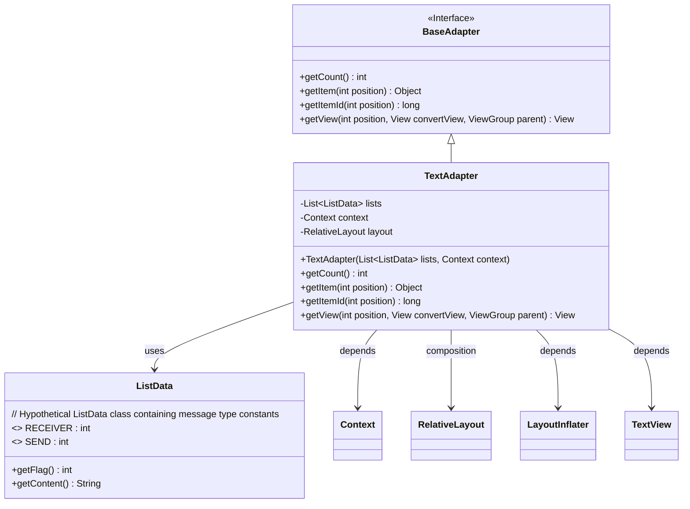
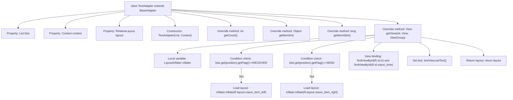

# Basic Information

|      |      |
|------|------|
| Name | TextAdapter |
| Language | .java |
| Code Path | happycat/src/com/happycat/tuling/TextAdapter.java |
| Package Name | com.happycat.tuling |
| Dependencies | ['java.util.List', 'com.example.happucat.R', 'android.content.Context', 'android.view.LayoutInflater', 'android.view.View', 'android.view.ViewGroup', 'android.widget.BaseAdapter', 'android.widget.RelativeLayout', 'android.widget.TextView'] |
| Brief Description | TextAdapter inherits from BaseAdapter and is used to display a message list. It loads different layouts based on the message type, sets the content and time, and returns the corresponding view. Key methods: getCount, getItem, getView. |

# Description

TextAdapter is an adapter class that inherits from BaseAdapter, designed to manage data lists of the ListData type. It contains two member variables, lists and context, which are initialized via the constructor. The adapter implements four key methods: getCount returns the size of the list, while getItem and getItemId retrieve the data item and ID at a specified position, respectively. The getView method dynamically loads different layouts (xiaoxi_item_left or xiaoxi_item_right) based on the Flag value (RECEIVER or SEND) of the data item, and sets the text content and time display.

# Class Summary

| Name   | Type  | Description |
|-------|------|-------------|
| TextAdapter | class | TextAdapter inherits from BaseAdapter, dynamically loading left and right layouts based on data flags to display message content and time. |

## Class TextAdapter

|      |      |
|------|------|
| Access Modifier | public |
| Type | class |
| Name | TextAdapter |
| Description | TextAdapter inherits from BaseAdapter, dynamically loading left and right layouts based on data flags to display message content and time. |

### UML Class Diagram

This class diagram illustrates that TextAdapter inherits from the BaseAdapter interface and implements its core methods. The TextAdapter manages a list of ListData type objects, dynamically loads different layouts (xiaoxi_item_left/right) based on message types (RECEIVER/SEND), and populates message content and timestamps. It depends on Android components such as Context, RelativeLayout, LayoutInflater, and TextView, demonstrating a typical Android list adapter pattern for displaying diversified message interfaces in ListView or RecyclerView.

### Internal Method Call Graph

This code represents an Android adapter class TextAdapter that extends BaseAdapter, used to display different types of message layouts in a ListView. The flowchart illustrates the class structure, properties, constructor, and four overridden key methods. The getView() method dynamically loads left/right message layouts (RECEIVER/SEND) based on data flags, binds views, sets text content, and finally returns the populated view. The entire process clearly reflects the data-view binding logic in the adapter pattern.

### Field List

| Name  | Type  | Description |
|-------|-------|------|
| context | Context | Declaration of Private Context Variables |
| layout | RelativeLayout | Private relative layout control variable `layout`. |
| lists | List<ListData> | Private list variable, storing multiple lists of type ListData. |

### Method List

| Name  | Type  | Description |
|-------|-------|------|
| getItem | Object | The method `getItem` returns the element at the specified position in the list. The parameter `position` is the index, and `lists` is the data source. |
| getCount | int | The method getCount returns the number of elements in the list lists. |
| getItemId | long | The method returns the ID of the list item, directly using the positional parameter as the ID value. |
| getView | View | This method dynamically loads the left or right chat layout based on data flags, sets the content, and returns the view. Key points: determining the flag, loading the corresponding layout, and populating the content. |

