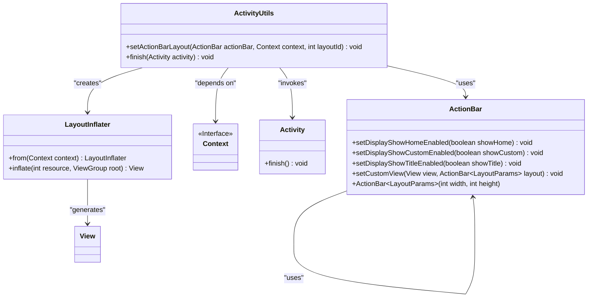
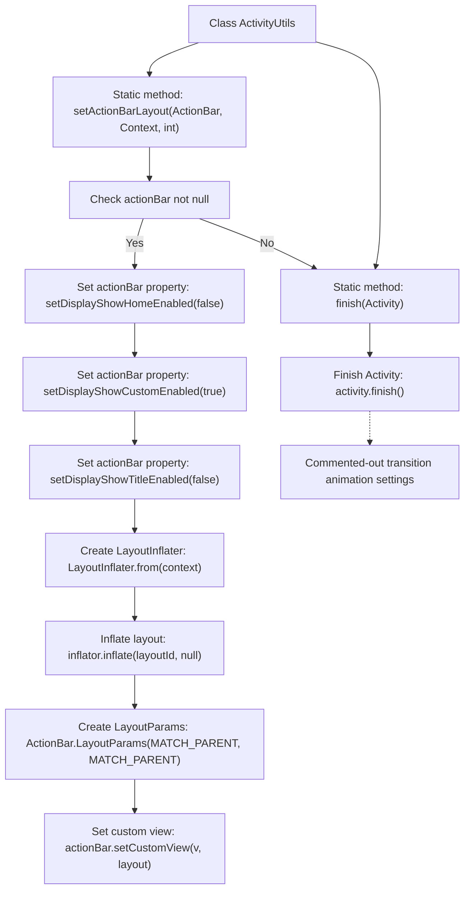

# Basic Information

|      |      |
|------|------|
| Name | ActivitiyUtils |
| Language | .java |
| Code Path | happycat/src/com/happycat/util/ActivitiyUtils.java |
| Package Name | com.happycat.util |
| Dependencies | ['android.app.ActionBar', 'android.app.Activity', 'android.app.ActionBar.LayoutParams', 'android.content.Context', 'android.view.LayoutInflater', 'android.view.View'] |
| Brief Description | The ActivityUtils class provides two static methods: setActionBarLayout for customizing the ActionBar layout, and finish for closing the Activity. |

# Description

The ActivityUtils class contains two static methods. The setActionBarLayout method is used to configure a custom layout for the ActionBar, including disabling default display options, loading a specified layout file via LayoutInflater, setting full-screen layout parameters, and applying the custom view. The finish method is used to terminate the current Activity, with commented-out code for page transition animations. Both methods include null safety checks or directly call system APIs.

# Class Summary

| Name   | Type  | Description |
|-------|------|-------------|
| ActivitiyUtils | class | The ActivityUtils class provides two static methods: setActionBarLayout for customizing the ActionBar layout, and finish for terminating an Activity. |

## Class ActivitiyUtils

|      |      |
|------|------|
| Access Modifier | public |
| Type | class |
| Name | ActivitiyUtils |
| Description | The ActivityUtils class provides two static methods: setActionBarLayout for customizing the ActionBar layout, and finish for terminating an Activity. |

### UML Class Diagram

Class diagram description: This diagram illustrates the structure of the ActivityUtils utility class and its associations. ActivityUtils provides two static methods: setActionBarLayout for customizing ActionBar layout (dependent on ActionBar, Context, and LayoutInflater), and finish for closing an Activity. ActionBar uses LayoutParams to configure custom view parameters, while LayoutInflater converts XML layouts into View objects. All classes are connected through clear dependency relationships, demonstrating a typical pattern for Android UI control.

### Internal Method Call Graph

This flowchart illustrates two core functionalities of the ActivityUtils utility class: 1) The configuration process for custom ActionBar layouts, including null checks, property settings, view inflation, and parameter configuration; 2) The Activity termination method and its commented-out transition animation settings. The diagram clearly presents conditional branches and sequential call relationships, particularly showcasing the complete procedure from parameter validation to final view setup in the setActionBarLayout method, as well as the simple call chain of the finish method.

### Field List

| Name  | Type  | Description |
|-------|-------|------|

### Method List

| Name  | Type  | Description |
|-------|-------|------|
| setActionBarLayout | void | Set a custom layout for the ActionBar, disable the default title and icon, enable the custom view, and inflate the specified layout. |
| finish | void | The static method `finish` is used to close the specified Activity, with the option to add transition animations (commented out in the example). |

