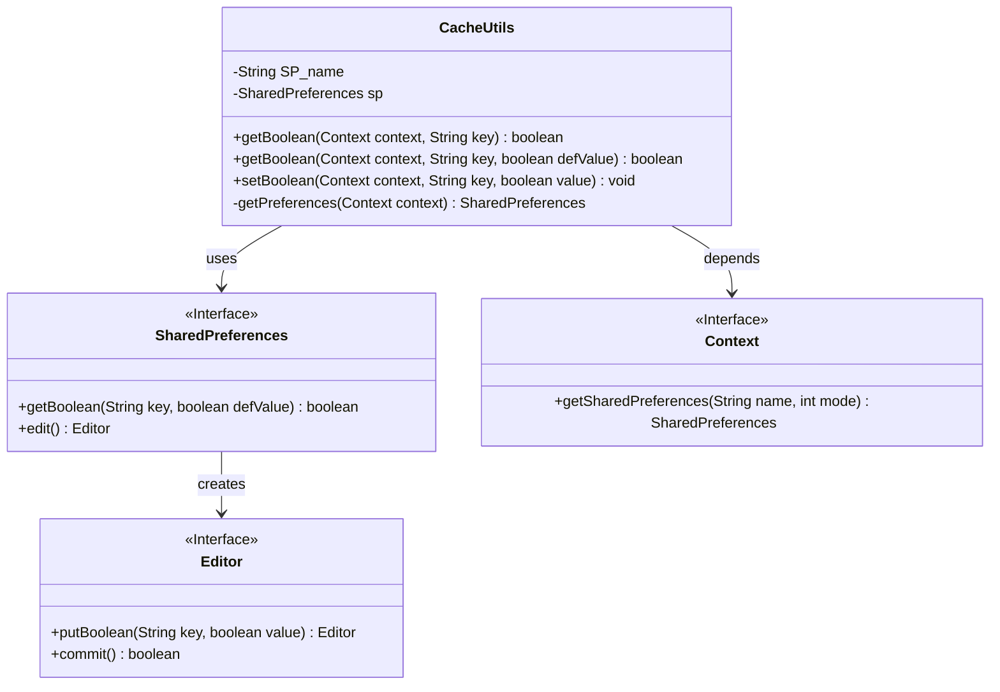
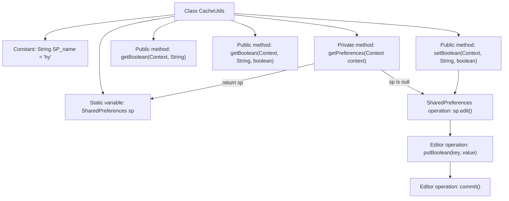

# Basic Information

|      |      |
|------|------|
| Name | CacheUtils |
| Language | .java |
| Code Path | happycat/src/com/happycat/util/CacheUtils.java |
| Package Name | com.happycat.util |
| Dependencies | ['android.content.Context', 'android.content.SharedPreferences', 'android.content.SharedPreferences.Editor'] |
| Brief Description | The CacheUtils class encapsulates SharedPreferences operations, providing methods to get and set boolean-type cache values with support for default value settings. |

# Description

This is a utility class named CacheUtils, designed for managing SharedPreferences caching operations in Android applications. The class includes a static constant SP_name as the SharedPreferences file name and a static SharedPreferences object sp. It provides methods for retrieving and storing Boolean-type cached data: the getBoolean method has two overloaded versions, allowing specification of a default value or omitting it (defaulting to false); the setBoolean method is used to store Boolean values. All methods obtain the SharedPreferences instance through the getPreferences method, ensuring a singleton pattern. Setting operations are performed via Editor and immediately committed.

# Class Summary

| Name   | Type  | Description |
|-------|------|-------------|
| CacheUtils | class | The CacheUtils class provides read and write functionality for boolean values in SharedPreferences, supports default value settings, and optimizes performance through the singleton pattern. |

## Class CacheUtils

|      |      |
|------|------|
| Access Modifier | public |
| Type | class |
| Name | CacheUtils |
| Description | The CacheUtils class provides read and write functionality for boolean values in SharedPreferences, supports default value settings, and optimizes performance through the singleton pattern. |

### UML Class Diagram

This code demonstrates an Android caching utility class CacheUtils, which implements storage and retrieval of boolean data through the SharedPreferences interface. The class diagram includes the core CacheUtils class and its dependent Android system interfaces: SharedPreferences for data access, Editor for data modification, and Context for obtaining SharedPreferences instances. CacheUtils employs a singleton pattern to manage SharedPreferences instances, providing overloaded getBoolean methods and setBoolean method that support default value setting and boolean value storage functionality.

### Internal Method Call Graph

This code demonstrates an Android utility class CacheUtils for managing boolean-type data caching via SharedPreferences. The core logic consists of three layers: 1) Class structure includes constant and static variable declarations; 2) Singleton initialization of SharedPreferences through the getPreferences method; 3) Provision of two getBoolean method sets (with/without default values) and setBoolean method for data read/write operations. All methods obtain SharedPreferences instances via getPreferences, with setBoolean additionally involving Editor's putBoolean and commit operations. The flowchart clearly illustrates class member relationships and method invocation chains.

### Field List

| Name  | Type  | Description |
|-------|-------|------|
| sp | SharedPreferences | private static SharedPreferences sp. |
| SP_name = "hy" | String | private static final String SP_name = "hy"; |

### Method List

| Name  | Type  | Description |
|-------|-------|------|
| setBoolean | void | The static method `setBoolean` is used to store a boolean value in SharedPreferences, accepting parameters such as context, key name, and boolean value, and submitting the changes via an editor. |
| getBoolean | boolean | Read a boolean value from SharedPreferences, returning false by default. |
| getBoolean | boolean | Read a boolean value from SharedPreferences, returning defValue by default. |
| getPreferences | SharedPreferences | Get the SharedPreferences singleton instance, creating and returning a private mode instance if uninitialized. |

