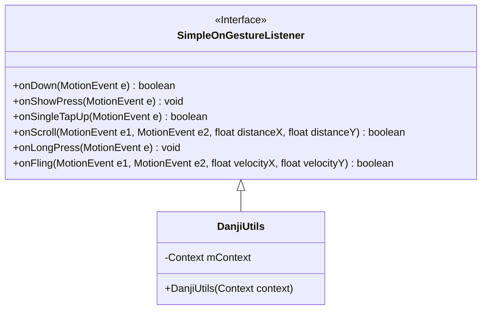

# Basic Information

|      |      |
|------|------|
| Name | DanjiUtils |
| Language | .java |
| Code Path | happycat/src/com/happycat/util/DanjiUtils.java |
| Package Name | com.happycat.util |
| Dependencies | ['android.content.Context', 'android.view.MotionEvent', 'android.view.GestureDetector.SimpleOnGestureListener', 'android.widget.Toast'] |
| Brief Description | The DanjiUtils class extends SimpleOnGestureListener and includes various gesture event handlers such as single-click, double-click, long-press, scrolling, etc., displaying the action type via Toast. |

# Description

The DanjiUtils class inherits from SimpleOnGestureListener and is used to handle gesture events. This class initializes with a Context parameter. The annotations provide detailed descriptions of various gesture trigger conditions and corresponding behaviors, including basic gestures such as single-click, short press, release, scroll, long press, and swipe, as well as double-click listener interfaces like double-tap, double-tap event, and single-tap confirmation. All annotated methods display the current action type via Toast, with some methods returning a boolean value to indicate whether the event is consumed.

# Class Summary

| Name   | Type  | Description |
|-------|------|-------------|
| DanjiUtils | class | The DanjiUtils class inherits from SimpleOnGestureListener to handle gesture events such as single-click, double-click, scrolling, etc., and displays the action type via Toast. |

## Class DanjiUtils

|      |      |
|------|------|
| Access Modifier | public |
| Type | class |
| Name | DanjiUtils |
| Description | The DanjiUtils class inherits from SimpleOnGestureListener to handle gesture events such as single-click, double-click, scrolling, etc., and displays the action type via Toast. |

### UML Class Diagram

This code demonstrates an Android gesture utility class DanjiUtils, which inherits from the SimpleOnGestureListener interface. The class is primarily designed to handle various touch events such as single tap, double tap, long press, swipe, etc., though currently all gesture handling methods are commented out. It contains a Context member variable for displaying Toast notifications, initialized via the constructor. While all concrete implementations are commented, the class structure clearly outlines its basic framework as a gesture listener, preserving the signatures of all potential gesture event handling methods.

### Internal Method Call Graph

```mermaid
graph TD
    A["Class DanjiUtils"]
    B["Inherits: SimpleOnGestureListener"]
    C["Property: Context mContext"]
    D["Constructor: DanjiUtils(Context context)"]
    E["Commented method: onDown(MotionEvent e)"]
    F["Commented method: onShowPress(MotionEvent e)"]
    G["Commented method: onSingleTapUp(MotionEvent e)"]
    H["Commented method: onScroll(MotionEvent e1, e2, distanceX, distanceY)"]
    I["Commented method: onLongPress(MotionEvent e)"]
    J["Commented method: onFling(MotionEvent e1, e2, velocityX, velocityY)"]
    K["Commented method: onDoubleTap(MotionEvent e)"]
    L["Commented method: onDoubleTapEvent(MotionEvent e)"]
    M["Commented method: onSingleTapConfirmed(MotionEvent e)"]

    A --> B
    A --> C
    A --> D
    A -.-> E
    A -.-> F
    A -.-> G
    A -.-> H
    A -.-> I
    A -.-> J
    A -.-> K
    A -.-> L
    A -.-> M
```

This code illustrates an Android gesture utility class DanjiUtils, which inherits from SimpleOnGestureListener. The class contains a Context property and a constructor, while multiple gesture callback methods (such as single-tap, double-tap, long-press, scrolling, etc.) are commented out. All gesture handling methods are commented, indicating the current class does not implement specific gesture logic but retains a potential gesture handling framework. Each commented method corresponds to a specific gesture event, displaying the action type via Toast.

### Field List

| Name  | Type  | Description |
|-------|-------|------|
| mContext | Context | The private context variable mContext. |

### Method List

| Name  | Type  | Description |
|-------|-------|------|

