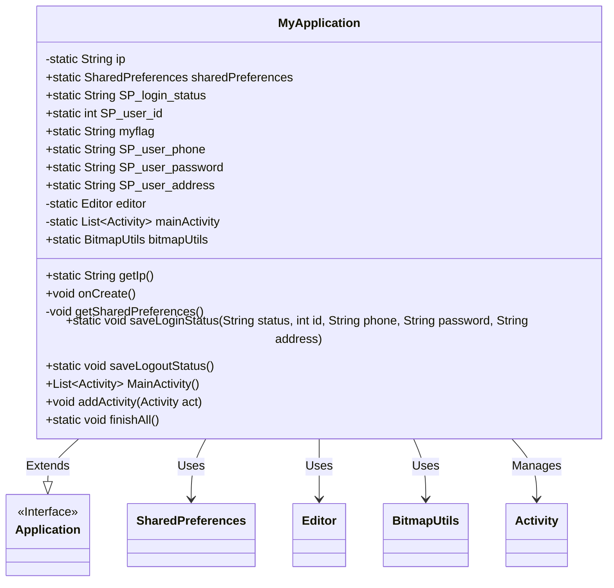

# Basic Information

|      |      |
|------|------|
| Name | MyApplication |
| Language | .java |
| Code Path | happycat/src/com/happycat/util/MyApplication.java |
| Package Name | com.happycat.util |
| Dependencies | ['java.util.ArrayList', 'java.util.List', 'com.example.happucat.R', 'com.lidroid.xutils.BitmapUtils', 'android.app.Activity', 'android.app.Application', 'android.content.SharedPreferences', 'android.content.SharedPreferences.Editor'] |
| Brief Description | The MyApplication class extends Application, managing global variables such as IP, user login status, ID, phone number, etc. It uses SharedPreferences to store data, provides methods for saving login and logout states, and manages the Activity lifecycle. |

# Description

The code defines a class named MyApplication, which inherits from the Application class and is used to manage global application states. Its main functionalities include: storing a static IP address (192.168.191.1); managing user login status, ID, phone number, password, and address via SharedPreferences; providing initialization configuration for the image loading utility BitmapUtils; maintaining an activity list and implementing batch closing functionality. It includes methods for saving login status and logout status, persisting user data through SharedPreferences.

# Class Summary

| Name   | Type  | Description |
|-------|------|-------------|
| MyApplication | class | The MyApplication class extends Application, managing global data such as IP, user login status, ID, and phone number. It utilizes SharedPreferences for storage and provides functionalities for saving login/logout states and activity management. |


## Class MyApplication

|      |      |
|------|------|
| Access Modifier | public |
| Type | class |
| Name | MyApplication |
| Description | The MyApplication class extends Application, managing global data such as IP, user login status, ID, and phone number. It utilizes SharedPreferences for storage and provides functionalities for saving login/logout states and activity management. |


### UML Class Diagram



Class Diagram Description:
The MyApplication class extends the Application interface and serves as a global context class for an Android application. It manages static fields such as the application's IP address, user login status (SP_login_status), user ID (SP_user_id), phone number (SP_user_phone), etc., persisting these data through SharedPreferences. The class includes BitmapUtils for image loading and maintains an Activity list (mainActivity) to uniformly manage the lifecycle of Activities within the application. It provides methods for saving login/logout status, adding/destroying Activities, making it a typical global state management class for applications.


### Internal Method Call Graph

```mermaid
graph TD
    A["Class MyApplication"]
    B["Static Property: String ip"]
    C["Static Property: SharedPreferences sharedPreferences"]
    D["Static Property: String SP_login_status"]
    E["Static Property: int SP_user_id"]
    F["Static Property: String myflag"]
    G["Static Property: String SP_user_phone"]
    H["Static Property: String SP_user_password"]
    I["Static Property: String SP_user_address"]
    J["Static Property: Editor editor"]
    K["Static Property: List<Activity> mainActivity"]
    L["Static Property: BitmapUtils bitmapUtils"]
    M["Method: static String getIp()"]
    N["Override Method: void onCreate()"]
    O["Private Method: void getSharedPreferences()"]
    P["Static Method: saveLoginStatus(String,int,String,String,String)"]
    Q["Static Method: saveLogoutStatus()"]
    R["Method: List<Activity> MainActivity()"]
    S["Method: void addActivity(Activity)"]
    T["Static Method: void finishAll()"]

    A --> B
    A --> C
    A --> D
    A --> E
    A --> F
    A --> G
    A --> H
    A --> I
    A --> J
    A --> K
    A --> L
    A --> M
    A --> N
    N --> O
    N --> L
    N --> "super.onCreate()"
    O --> C
    O --> J
    O --> "Read SP_login_status"
    O --> "Read SP_user_id"
    O --> "Read SP_user_phone"
    O --> "Read SP_user_password"
    O --> "Read SP_user_address"
    A --> P
    P --> "Update SP_login_status"
    P --> "Update SP_user_id"
    P --> "Update SP_user_phone"
    P --> "Update SP_user_password"
    P --> "Update SP_user_address"
    P --> "editor.commit()"
    A --> Q
    Q --> "Reset login status"
    Q --> "editor.clear()"
    Q --> "editor.commit()"
    A --> R
    A --> S
    S --> "mainActivity.add(act)"
    A --> T
    T --> "Iterate mainActivity"
    T --> "act.finish()"
    T --> "mainActivity=null"
```

This code represents a foundational Android application class that inherits from the Application class. Its primary functionalities include managing global variables (such as IP address and user login status), initializing the image loading utility BitmapUtils, handling SharedPreferences data storage, and managing Activity lifecycles. Through static methods and properties, it enables global state management—including saving/clearing login status and managing Activity collections—ensuring application data remains accessible and persistent across the entire scope.

### Field List

| Name  | Type  | Description |
|-------|-------|------|
| SP_user_phone | String | The static string variable SP_user_phone is used to store user phone information. |
| mainActivity = new ArrayList<Activity>() | List<Activity> | Private static List<Activity> mainActivity, storing objects of type Activity. |
| editor | Editor | Private static editor instance. |
| SP_user_id=0 | int | The static integer variable SP_user_id has an initial value of 0. |
| sharedPreferences | SharedPreferences | Define a static SharedPreferences object named sharedPreferences. |
| SP_login_status | String | The static string variable SP_login_status is used to store the login status. |
| myflag="0" | String | The static string variable myflag has an initial value of "0". |
| SP_user_address | String | Static string variable, storing user address information. |
| ip = "192.168.191.1" | String | The private static string variable ip stores the IP address 192.168.191.1. |
| bitmapUtils | BitmapUtils | Declare a static BitmapUtils class instance variable named bitmapUtils. |
| SP_user_password = "SP_user_password" | String | Static string constant, storing the user password key name. |

### Method List

| Name  | Type  | Description |
|-------|-------|------|
| getSharedPreferences | void | Retrieve the login status, user ID, phone number, password, and address information stored in SharedPreferences. |
| onCreate | void | Initialize BitmapUtils when the application starts, set default loading and failure images, and call the parent class's onCreate and obtain SharedPreferences. |
| saveLoginStatus | void | Methods for saving login status: Store status, ID, phone number, password, and address in shared preferences. |
| saveLogoutStatus | void | Save logout status: Set the login status to logout, clear the user ID and password, retain the user's phone number, and submit the changes. |
| MainActivity | List<Activity> | The method to obtain the main activity list returns the member variable mainActivity. |
| addActivity | void | The method `addActivity` adds the passed `Activity` object to the `mainActivity` collection. |
| finishAll | void | Terminate all unclosed activities and clear the main activity list. |
| getIp | String | Static methods for obtaining IP addresses. |


