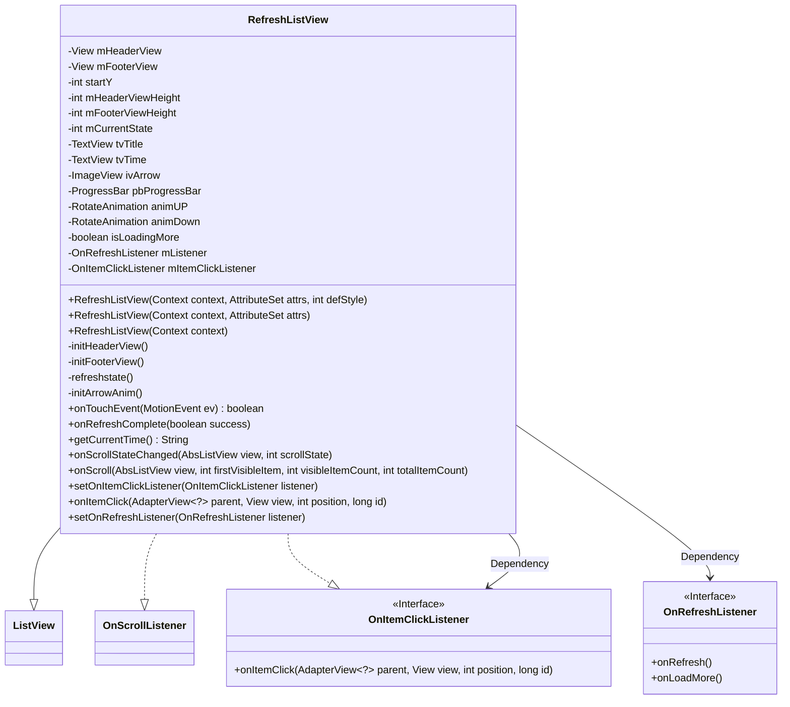
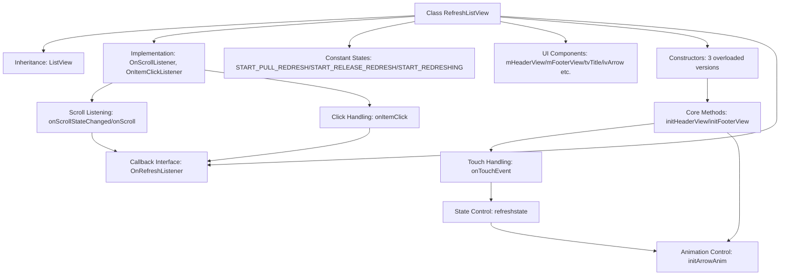

# Basic Information

|      |      |
|------|------|
| Name | RefreshListView |
| Language | .java |
| Code Path | happycat/src/com/happycat/util/RefreshListView.java |
| Package Name | com.happycat.util |
| Dependencies | ['java.text.SimpleDateFormat', 'java.util.Date', 'com.example.happucat.R', 'android.content.Context', 'android.util.AttributeSet', 'android.view.MotionEvent', 'android.view.View', 'android.view.animation.Animation', 'android.view.animation.RotateAnimation', 'android.widget.AbsListView', 'android.widget.AbsListView.OnScrollListener', 'android.widget.AdapterView', 'android.widget.ImageView', 'android.widget.ListView', 'android.widget.ProgressBar', 'android.widget.TextView'] |
| Brief Description | A customizable ListView component with pull-to-refresh and load-more functionality, including state management, animation effects, and event listener interfaces. |

# Description

This is a custom RefreshListView class that inherits from ListView and implements scroll and click listeners. It supports pull-to-refresh and load-more functionality. The class defines three states: pull to refresh, release to refresh, and refreshing in progress. It includes a header layout and a footer layout for displaying refresh and load-more content respectively. The pull-down operation is handled through touch events, with animation effects to switch arrow directions, and provides interface callbacks to handle refresh and load logic. It also includes features such as time display and automatic loading when scrolling to the bottom, making it a fully functional pull-to-refresh list control.

# Class Summary

| Name   | Type  | Description |
|-------|------|-------------|
| RefreshListView | class | A customizable ListView control with pull-to-refresh and pull-to-load functionality, including header and footer layouts, supporting state switching, animation effects, and refresh callback interfaces. |

## Class RefreshListView

|      |      |
|------|------|
| Access Modifier | public |
| Type | class |
| Name | RefreshListView |
| Description | A customizable ListView control with pull-to-refresh and pull-to-load functionality, including header and footer layouts, supporting state switching, animation effects, and refresh callback interfaces. |

### UML Class Diagram

This code implements a custom ListView component supporting pull-to-refresh and load-more functionality. The class diagram shows RefreshListView inheriting from ListView while implementing OnScrollListener and OnItemClickListener interfaces, along with defining the OnRefreshListener callback interface. By managing the display states of header and footer layouts combined with touch event handling and scroll monitoring, the component achieves complete refresh/load functionality with three state transitions (pull-to-refresh, release-to-refresh, refreshing) and animation effects.

### Internal Method Call Graph

This flowchart illustrates the core structure and interaction logic of RefreshListView. The class inherits from ListView and implements two listener interfaces, initializing header/footer views through three constructors. Key functionalities include touch event handling (onTouchEvent), state switching (refreshstate), and animation control (initArrowAnim), with refresh/load callbacks implemented via the OnRefreshListener interface. Both scroll listening and click events ultimately trigger interface callbacks, forming a complete interaction loop. All UI components and state constants collectively support the pull-to-refresh and load-more features.

### Field List

| Name  | Type  | Description |
|-------|-------|------|
| mFooterViewHeight | int | Define two private integer variables to record the heights of the header and footer views respectively. |
| tvTime | TextView | Define two TextView variables: tvTitle and tvTime. |
| START_REDRESHING = 2 | int | Define a private static constant START_REFRESHING with a value of 2, used to control the initial state of the refresh operation. |
| mItemClickListener | OnItemClickListener | Define the project click listener variable mItemClickListener. |
| animUP | RotateAnimation | Private rotation animation object animUP |
| animDown | RotateAnimation | Rotate the animated object (rotate downward) |
| ivArrow | ImageView | Private image view control ivArrow. |
| isLoadingMore | boolean | Boolean variable indicating whether more data is being loaded. |
| mListener | OnRefreshListener | Callback interface mListener for monitoring refresh events. |
| mFooterView | View | Declare two private view variables: mHeaderView and mFooterView. |
| startY = -1 | int | The private integer variable startY is initialized to -1. |
| START_PULL_REDRESH = 0 | int | Define the static constant START_PULL_REFRESH with an initial value of 0. |
| mCurrentState = START_PULL_REDRESH | int | The current state variable is initialized to the start pull-down refresh state. |
| START_RELEASE_REDRESH = 1 | int | The static constant START_RELEASE_REDRESH, with a value of 1, is used to control the starting point of release refresh. |
| pbProgressBar | ProgressBar | Private progress bar control pbProgressBar. |

### Method List

| Name  | Type  | Description |
|-------|-------|------|
| initHeaderView | void | Initialize the pull-down refresh header view, including the title, time, arrow icon, and progress bar. Set the initial height and hidden state, and initialize the arrow animation and default refresh time. |
| getCurrentTime | String | Get the current time and format it as a string in "yyyy-MM-dd HH:mm:ss". |
| onTouchEvent | boolean | Handling touch events to implement pull-to-refresh functionality: Record the starting position, calculate the offset, adjust the header view's padding and refresh state based on the movement distance, and trigger a refresh or hide the header upon release. |
| onScroll | void | Scroll listener method, parameters include view, first item position, number of visible items, and total item count. |
| onScrollStateChanged | void | Sliding monitoring method: when scrolling stops or during inertial sliding, if the bottom of the list is reached and no loading is in progress, the bottom view is displayed and the load more callback is triggered. |
| onItemClick | void | Rewrite the onItemClick method, so that when a list item is clicked, if the listener exists, its onItemClick method is called, and the position parameter is adjusted. |
| refreshstate | void | Refresh status control method: Set the title, arrow icon, and progress bar display based on the current state, and execute the corresponding animation or refresh operation. |
| setOnItemClickListener | void | Rewrite the setOnItemClickListener method to call the parent class to set the listener and save the externally passed listener. |
| setOnRefreshListener | void | Set the refresh listener and assign the incoming syJsActivity to mListener. |
| initFooterView | void | Initialize the bottom list view, set up the loading layout and measure its height, hide the view initially, and add a scroll listener. |
| initArrowAnim | void | Initialize arrow animation: Create an upward rotation of 180 degrees and a downward reset animation, each lasting 200 milliseconds, maintaining the state after animation completion. |
| onRefreshComplete | void | Refresh completion handling: If loading more, hide the bottom view; otherwise reset the top refresh state, update the title and arrow display, hide the progress bar and header view, and update the refresh time upon success. |

