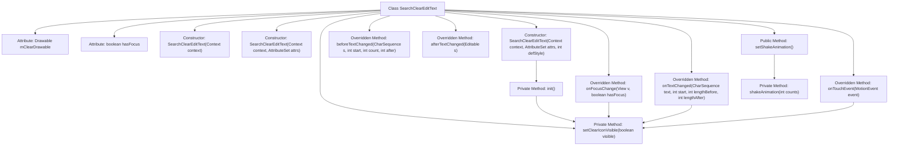

# Basic Information

|      |      |
|------|------|
| Name | SearchClearEditText |
| Language | .java |
| Code Path | happycat/src/com/happycat/util/SearchClearEditText.java |
| Package Name | com.happycat.util |
| Dependencies | ['com.example.happucat.R', 'android.content.Context', 'android.graphics.drawable.Drawable', 'android.text.Editable', 'android.text.TextWatcher', 'android.util.AttributeSet', 'android.widget.EditText', 'android.view.MotionEvent', 'android.view.View', 'android.view.View.OnFocusChangeListener', 'android.view.animation.Animation', 'android.view.animation.CycleInterpolator', 'android.view.animation.TranslateAnimation'] |
| Brief Description | Customize the EditText control to implement a clear button function, support focus change listeners and text change listeners, and allow setting of shake animations. |

# Description

SearchClearEditText is a custom EditText control that implements focus change listeners and text change listeners. It features a clear icon functionality, displaying the icon when focused and containing non-empty text, with a click action to clear the text. During initialization, it sets the right-side icon and binds listeners. Touch events handle click area detection for the icon, while text changes dynamically control the icon's visibility. It also provides a shake animation effect, achieved through TranslateAnimation for horizontal wobbling. Overall, it implements common interactive functionalities for search boxes.

# Class Summary

| Name   | Type  | Description |
|-------|------|-------------|
| SearchClearEditText | class | Custom EditText control with clear button visibility logic, supporting touch-to-clear text and focus change listeners, including shake animation effects. |


## Class SearchClearEditText

|      |      |
|------|------|
| Access Modifier | public |
| Type | class |
| Name | SearchClearEditText |
| Description | Custom EditText control with clear button visibility logic, supporting touch-to-clear text and focus change listeners, including shake animation effects. |


### UML Class Diagram

```mermaid
classDiagram
    class SearchClearEditText {
        -Drawable mClearDrawable
        -boolean hasFocus
        +SearchClearEditText(Context context)
        +SearchClearEditText(Context context, AttributeSet attrs)
        +SearchClearEditText(Context context, AttributeSet attrs, int defStyle)
        -init()
        +onTouchEvent(MotionEvent event) boolean
        -setClearIconVisible(boolean visible)
        +onFocusChange(View v, boolean hasFocus)
        +beforeTextChanged(CharSequence s, int start, int count, int after)
        +afterTextChanged(Editable s)
        +onTextChanged(CharSequence text, int start, int lengthBefore, int lengthAfter)
        +setShakeAnimation()
        -shakeAnimation(int counts) Animation
    }
    <<Interface>> OnFocusChangeListener
    <<Interface>> TextWatcher
    SearchClearEditText --|> EditText
    SearchClearEditText ..|> OnFocusChangeListener : Implements
    SearchClearEditText ..|> TextWatcher : Implements
```

This code defines a custom EditText control named SearchClearEditText, which extends EditText and implements the OnFocusChangeListener and TextWatcher interfaces. Its main functionalities include: 1) Displaying a clear icon on the right side; 2) Dynamically showing/hiding the clear icon based on focus state and text content; 3) Clearing text when the clear icon is clicked; 4) Supporting shake animation effects. The class contains private member variables mClearDrawable and hasFocus, as well as methods for initialization, event handling, and animation-related operations.


### Internal Method Call Graph



This code implements a custom EditText control with text-clearing and animation features. The flowchart illustrates the class structure, including three constructors, the initialization method init(), touch event handling onTouchEvent(), clear icon visibility control setClearIconVisible(), focus change handling onFocusChange(), text change listener methods, and shake animation-related methods. The core logic involves monitoring focus and text changes to control the display of the clear icon, while implementing text-clearing functionality through touch events.

### Field List

| Name  | Type  | Description |
|-------|-------|------|
| mClearDrawable | Drawable | Private member variable mClearDrawable, of type Drawable. |
| hasFocus | boolean | The variable `hasFocus` indicates whether it has focus, and its type is boolean. |

### Method List

| Name  | Type  | Description |
|-------|-------|------|
| afterTextChanged | void | This is an empty method override in Android, used to listen for actions after text changes, with no specific logic currently implemented. |
| setClearIconVisible | void | The method `setClearIconVisible` controls the visibility of the clear icon. When the parameter `visible` is true, it sets the right-side icon to `mClearDrawable`; otherwise, it sets it to empty. The icons in other directions remain unchanged. |
| init | void | Initialization method: Obtain the icon on the right; if not available, use the search icon. Set the icon boundaries, hide by default, and add listeners for focus and text changes. |
| onTextChanged | void | Rewrite the onTextChanged method to display the clear icon when the input box has focus and the text length is greater than 0. |
| onFocusChange | void | Rewrite the focus change method to display the clear icon based on text length when there is focus, and hide the clear icon when there is no focus. |
| shakeAnimation | Animation | Create a horizontal shake animation with an amplitude of 10 pixels, adjustable loop count, lasting 1 second. |
| setShakeAnimation | void | The method setShakeAnimation calls shakeAnimation(5) to set the shake animation effect. |
| onTouchEvent | boolean | Check if the right icon area is clicked when touch is released, and clear the text if yes. |
| beforeTextChanged | void | Rewrite the beforeTextChanged method to handle operations before text changes, with parameters including the character sequence, start position, number of characters before the change, and number of characters after the change. |


