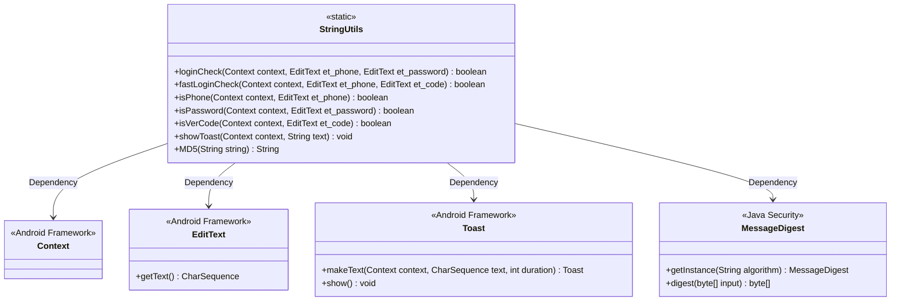
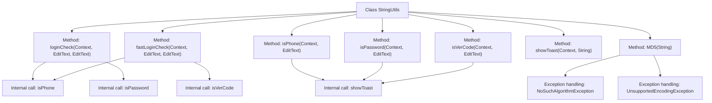

# Basic Information

|      |      |
|------|------|
| Name | StringUtils |
| Language | .java |
| Code Path | happycat/src/com/happycat/util/StringUtils.java |
| Package Name | com.happycat.util |
| Dependencies | ['java.io.UnsupportedEncodingException', 'java.security.MessageDigest', 'java.security.NoSuchAlgorithmException', 'android.content.Context', 'android.util.Config', 'android.widget.EditText', 'android.widget.Toast'] |
| Brief Description | The StringUtils class provides login verification functionality, including format checks for phone numbers, passwords, and verification codes, supports MD5 encryption, and contains Toast notification methods. |

# Description

The code defines a utility class named StringUtils, which contains multiple static methods for validating user input. The main functionalities include: the loginCheck method validates phone number and password formats, while the fastLoginCheck method verifies phone number and verification code formats. The isPhone method checks that the phone number is non-empty and conforms to a specified format, the isPassword method ensures the password length is between 6 and 16 characters, and the isVerCode method validates a 4-digit verification code. If any validation fails, a prompt message is displayed via the showToast method. Additionally, an MD5 method is provided for string encryption, handling exceptions and returning the encrypted hexadecimal string.

# Class Summary

| Name   | Type  | Description |
|-------|------|-------------|
| StringUtils | class | The StringUtils class provides login verification functionality, including phone number, password, and verification code validation, supporting MD5 encryption and Toast prompts. |

## Class StringUtils

|      |      |
|------|------|
| Access Modifier | public |
| Type | class |
| Name | StringUtils |
| Description | The StringUtils class provides login verification functionality, including phone number, password, and verification code validation, supporting MD5 encryption and Toast prompts. |

### UML Class Diagram

This code demonstrates an Android utility class `StringUtils`, which primarily provides static methods for login validation. The class diagram clearly illustrates its dependencies on Android framework classes (`Context`, `EditText`, `Toast`) and Java security class (`MessageDigest`). The class includes format validation methods for phone numbers/passwords/verification codes, Toast notification functionality, and MD5 encryption. All methods are static, reflecting the typical characteristics of a utility class. Validation methods retrieve input content via EditText and perform regular expression matching, displaying error messages through Toast when validation fails.

### Internal Method Call Graph

This code demonstrates a utility class named StringUtils, primarily used for string-related validation and encryption operations. The flowchart clearly illustrates the invocation relationships between various methods within the class, including login validation, quick login validation, phone number validation, password validation, verification code validation, Toast notifications, and MD5 encryption. The loginCheck and fastLoginCheck methods rely on isPhone/isPassword and isPhone/isVerCode for validation respectively, with all validation methods calling showToast to display error messages upon failure. The MD5 method includes exception handling logic for string encryption. The entire class structure is compact and functionally well-defined, making it suitable for general string processing scenarios in Android applications.

### Field List

| Name  | Type  | Description |
|-------|-------|------|

### Method List

| Name  | Type  | Description |
|-------|-------|------|
| isPhone | boolean | Check if the phone number is empty and whether the format is correct. If the number is empty or the format is incorrect, prompt a message and return false; otherwise, return true. |
| loginCheck | boolean | The static method `loginCheck` verifies the phone number and password, returning a boolean value. If any verification fails, it returns `false`; otherwise, it returns `true`. |
| fastLoginCheck | boolean | The static method `fastLoginCheck` validates the phone number and verification code, returning a boolean value to indicate whether the check is passed. |
| isVerCode | boolean | Check if the verification code is empty or not a 4-digit number, display a prompt, and return the verification result. |
| isPassword | boolean | Check if the password is empty or its length is not between 6-16 characters, then return the verification result with a prompt. |
| showToast | void | This is a static method used to display a short Toast message in Android, which takes context and text parameters. |
| MD5 | String | This method is used to perform MD5 encryption on a string, generating a hexadecimal hash value. It returns null in case of an exception, or a 32-character lowercase hash string upon success. |

