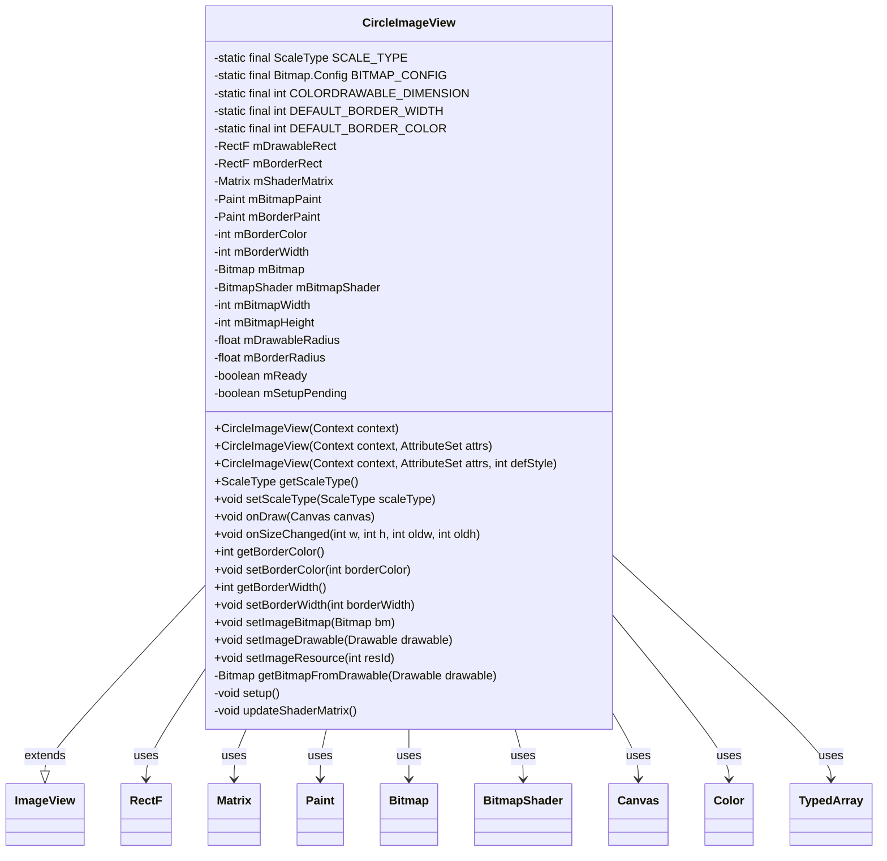
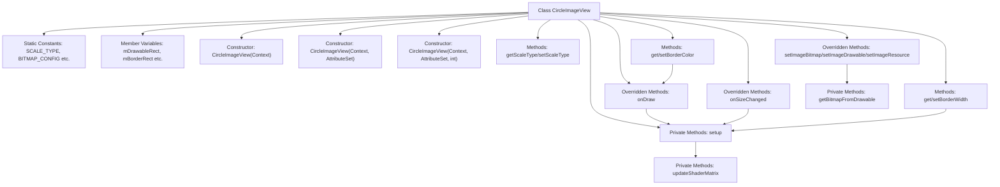

# Basic Information

|      |      |
|------|------|
| Name | CircleImageView |
| Language | .java |
| Code Path | happycat/src/com/happycat/view/CircleImageView.java |
| Package Name | com.happycat.view |
| Dependencies | ['com.example.happucat.R', 'android.content.Context', 'android.content.res.TypedArray', 'android.graphics.Bitmap', 'android.graphics.BitmapShader', 'android.graphics.Canvas', 'android.graphics.Color', 'android.graphics.Matrix', 'android.graphics.Paint', 'android.graphics.RectF', 'android.graphics.Shader', 'android.graphics.drawable.BitmapDrawable', 'android.graphics.drawable.ColorDrawable', 'android.graphics.drawable.Drawable', 'android.util.AttributeSet', 'android.widget.ImageView'] |
| Brief Description | CircleImageView is a custom circular image control that inherits from ImageView, supporting border settings. It achieves circular cropping through BitmapShader, fixes the ScaleType as CENTER_CROP, includes border color and width attributes, and automatically adapts to image dimensions. |

# Description

CircleImageView is a custom circular image view class that inherits from ImageView. It enforces the CENTER_CROP scale type and supports configurable border width and color. The core implementation includes: rendering circular images via BitmapShader, adjusting image scale and position using Matrix, and maintaining two circular drawing regions (image area and border area). The class handles various image setting methods (Bitmap/Drawable/Resource) and automatically recalculates layouts during size changes. It ensures circular image display quality through anti-aliased drawing and matrix transformations, while providing dynamic modification capabilities for border color and width.

# Class Summary

| Name   | Type  | Description |
|-------|------|-------------|
| CircleImageView | class | Circular image view class, inherits from ImageView, supports border settings, achieves circular cropping via BitmapShader, fixes ScaleType to CENTER_CROP, includes border color and width attributes. |

## Class CircleImageView

|      |      |
|------|------|
| Access Modifier | public |
| Type | class |
| Name | CircleImageView |
| Description | Circular image view class, inherits from ImageView, supports border settings, achieves circular cropping via BitmapShader, fixes ScaleType to CENTER_CROP, includes border color and width attributes. |

### UML Class Diagram

### Internal Method Call Graph

This code implements a circular image view control that inherits from the ImageView class. Main functionalities include: initializing view attributes through constructors, converting different types of image resources into Bitmap, achieving circular clipping effects using BitmapShader, and supporting custom border width and color. The core logic is concentrated in the setup() method for calculating drawing parameters, with the updateShaderMatrix() method adjusting image scaling and positioning. The entire class maintains multiple rectangular regions and radius parameters, combined with Canvas drawing to implement circular image display functionality.

### Field List

| Name  | Type  | Description |
|-------|-------|------|
| mBitmap | Bitmap | The private bitmap variable mBitmap. |
| DEFAULT_BORDER_WIDTH = 0 | int | Define the static constant DEFAULT_BORDER_WIDTH with a default border width of 0. |
| mSetupPending | boolean | The variable mSetupPending is of Boolean type, indicating whether the setup is pending. |
| mBitmapPaint = new Paint() | Paint | Declare a private immutable Paint object mBitmapPaint and initialize it. |
| mShaderMatrix = new Matrix() | Matrix | The private immutable matrix variable mShaderMatrix is initialized as a new Matrix object. |
| mBorderRect = new RectF() | RectF | Declare an immutable rectangle region object mBorderRect to store border coordinates. |
| mBitmapHeight | int | Private integer variable storing the bitmap height. |
| mBitmapShader | BitmapShader | The private bitmap shader variable mBitmapShader. |
| mDrawableRect = new RectF() | RectF | Defined an immutable rectangular area object mDrawableRect for drawing graphics. |
| SCALE_TYPE = ScaleType.CENTER_CROP | ScaleType | Define the static constant SCALE_TYPE with the value CENTER_CROP, indicating center-crop image scaling. |
| COLORDRAWABLE_DIMENSION = 1 | int | Define the constant COLORDRAWABLE_DIMENSION with a value of 1. |
| mReady | boolean | The private boolean variable mReady indicates the readiness status. |
| mBitmapWidth | int | Private integer variable storing the bitmap width. |
| DEFAULT_BORDER_COLOR = Color.BLACK | int | Define a static constant DEFAULT_BORDER_COLOR with a default value of black. |
| mBorderWidth = DEFAULT_BORDER_WIDTH | int | The private integer variable mBorderWidth, with a default value of DEFAULT_BORDER_WIDTH, is used to store the border width. |
| mBorderPaint = new Paint() | Paint | Declare an immutable Paint object mBorderPaint and initialize it. |
| BITMAP_CONFIG = Bitmap.Config.ARGB_8888 | Bitmap.Config | Define the static constant BITMAP_CONFIG using the ARGB_8888 bitmap configuration. |
| mDrawableRadius | float | Private floating-point variable indicating the radius of a drawable object. |
| mBorderRadius | float | Private floating-point variable indicating the border corner radius. |
| mBorderColor = DEFAULT_BORDER_COLOR | int | The private integer variable mBorderColor has a default value of DEFAULT_BORDER_COLOR. |

### Method List

| Name  | Type  | Description |
|-------|-------|------|
| onSizeChanged | void | Rewrite the view size change callback, perform initialization operations after calling the superclass method. |
| getBorderWidth | int | Methods to obtain the border width, returning the value of the integer variable mBorderWidth. |
| onDraw | void | Custom drawing method: returns if no image is present; otherwise, draws two concentric circles at the center of the canvas using the bitmap brush and border brush respectively. |
| getBorderColor | int | Methods to obtain the border color value, returning the member variable mBorderColor. |
| setBorderWidth | void | Method for setting border width: If the new width is the same as the original value, return directly; otherwise, update the width and call setup(). |
| setImageBitmap | void | Rewrite the setImageBitmap method, save the Bitmap after calling the parent class method, and perform the setup initialization. |
| setImageDrawable | void | Rewrite the setImageDrawable method, update the bitmap and initialize settings after calling the parent class method. |
| setImageResource | void | Rewrite the setImageResource method, after calling the parent class to set the image resource, update the bitmap and initialize the settings. |
| getBitmapFromDrawable | Bitmap | Convert Drawable to Bitmap: If it's a BitmapDrawable, directly retrieve it; otherwise, create a Bitmap of corresponding size and draw the content, returning null if out of memory. |
| setScaleType | void | Rewrite the setScaleType method to only support specific scale types, otherwise throw an exception. |
| getScaleType | ScaleType | Java method override, returning the constant SCALE_TYPE of type ScaleType. |
| setBorderColor | void | Method to set the border color. If the color remains unchanged, return directly; otherwise, update the color and redraw. |
| setup | void | The method `setup` initializes the bitmap shader and border drawing parameters. It checks `mReady` and `mBitmap`, sets anti-aliasing, color, width, and other attributes, calculates the dimensions of the border and drawing area, updates the shader matrix, and triggers a redraw. |
| updateShaderMatrix | void | This method calculates the scaling value based on the ratio of the bitmap to the drawing area, adjusts the displacement to center the bitmap, and applies matrix transformations to the shader. |

